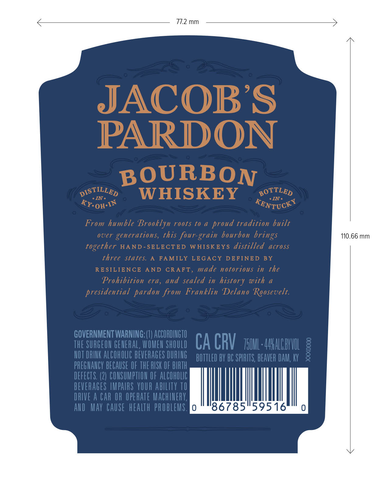
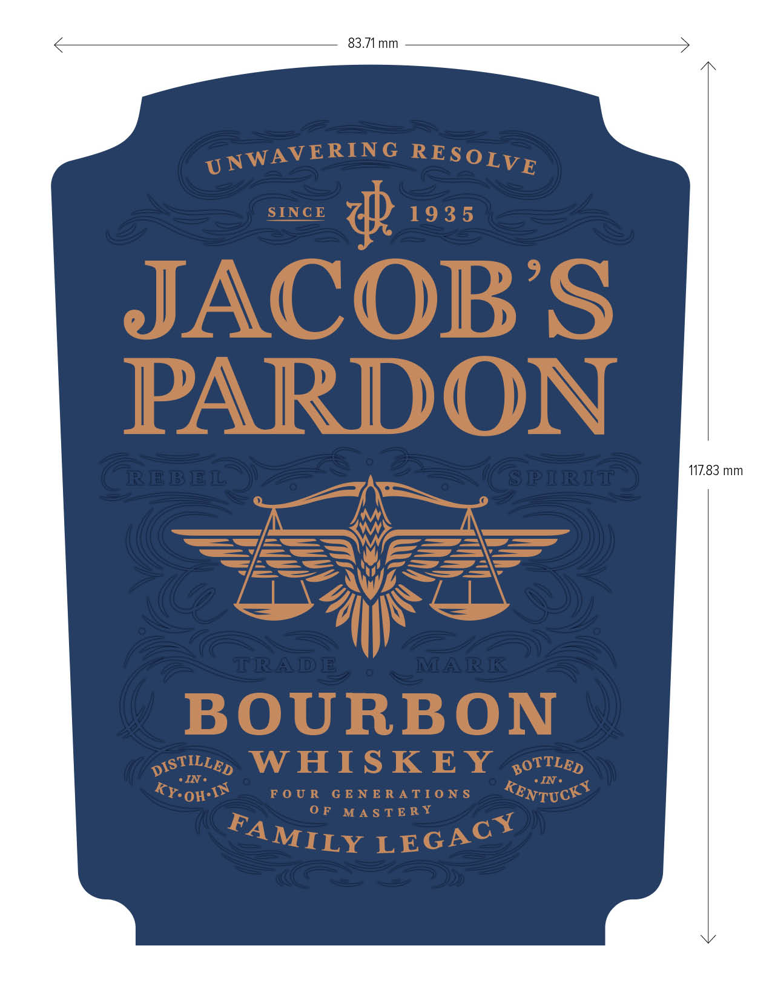
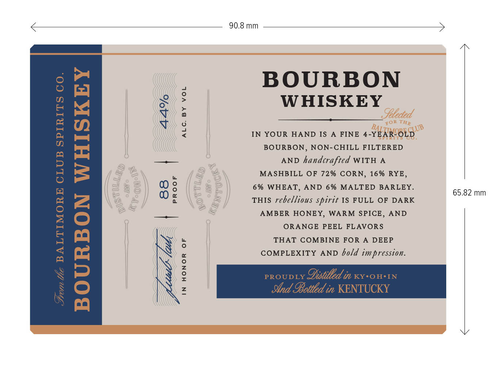

# TTB COLA Label Images - TTBID 26026001000521

**Brand Name:** JACOB'S PARDON

**Issue Date:** 01/27/2026

**Origin Code:** 22

**Product Class/Type:** 141

**Source:** [TTB Public COLA Registry](https://ttbonline.gov/colasonline/viewColaDetails.do?action=publicFormDisplay&ttbid=26026001000521)

## Label Images

### Back Label

### Front Label

### Label 3

## Extracted Label Text

*Text extracted via OCR - may contain errors*

*2 image(s) excluded: text did not meet readability threshold*

### Label 3

90.8 mm

| BOURBON
| WHISKEY

| a4 nD
IN YOUR HAND IS A FINE 4-YEARSOLD.
| BOURBON, NON-CHILL FILTERED

AND handcrafted WITH A
MASHBILL OF 72% CORN, 16% RYE,
6% WHEAT, AND 6% MALTED BARLEY.
THIS rebe/lious spirit 1S FULL OF DARK
AMBER HONEY, WARM SPICE, AND

| ORANGE PEEL FLAVORS
| THAT COMBINE FOR A DEEP
| COMPLEXITY AND o/d impression.

ALC. BY VOL

65.82 mm

IN HONOR OF
