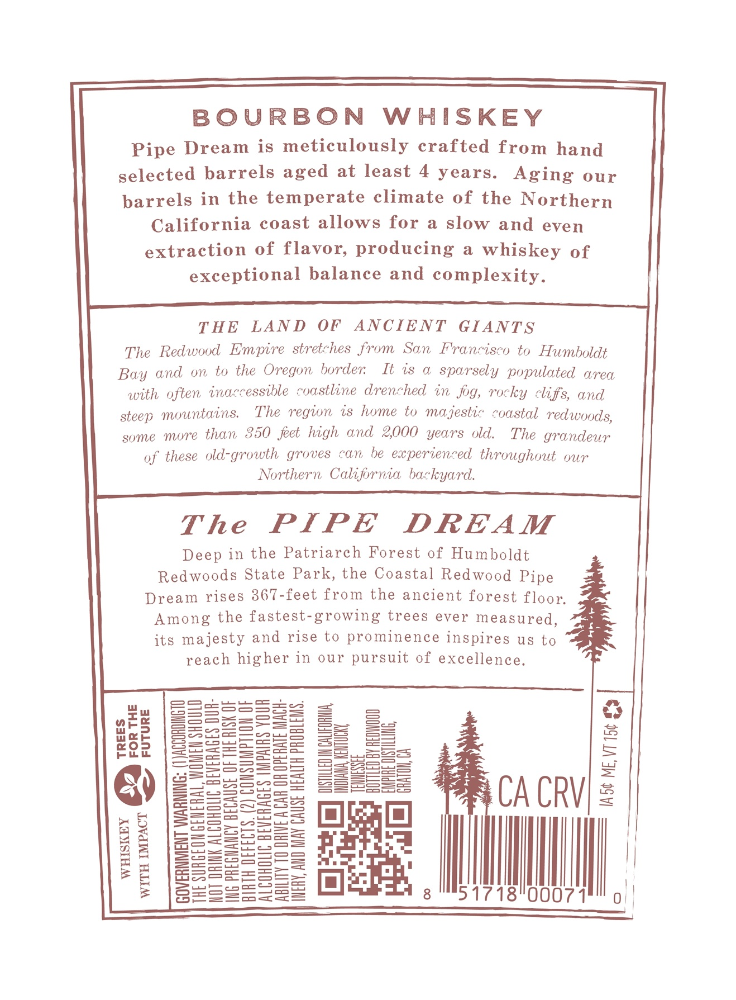
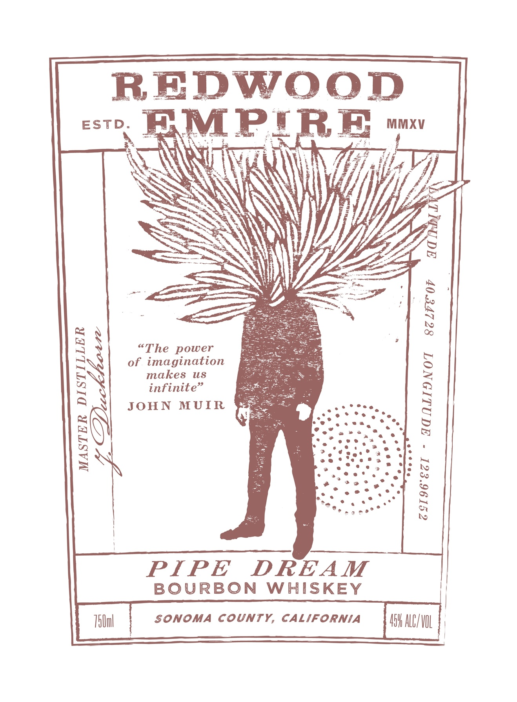
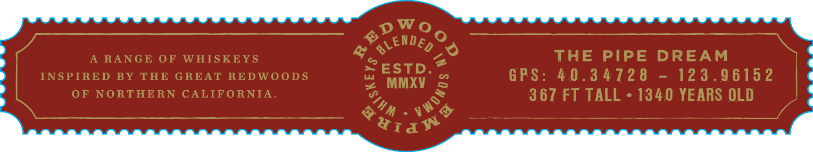

# TTB COLA Label Images - TTBID 26026001000598

**Brand Name:** REDWOOD EMPIRE

**Fanciful Name:** PIPE DREAM

**Issue Date:** 01/27/2026

**Origin Code:** 01

**Product Class/Type:** 141

**Source:** [TTB Public COLA Registry](https://ttbonline.gov/colasonline/viewColaDetails.do?action=publicFormDisplay&ttbid=26026001000598)

## Label Images

### Back Label

### Front Label

### Label 3

## Extracted Label Text

*Text extracted via OCR - may contain errors*

*1 image(s) excluded: text did not meet readability threshold*

**Detected Age:** 4 Years

### Back Label

BOURBON
W HISKEY
Pipe Dream
is meticulously crafted from hand
selected barrels
at least
4 years.
Aging our
barrels in the temperate climate of the Northern
California coast allows for
a
slow and even
extraction
of flavor; producing
a
whiskey of
exceptional balance and complexity_
T HE
LAN D
OF
ANC IE NT
GIANT S
The   Redwood  Empire stretches from
San   Francisco
to  Humboldt
Bay
On
to the Oregon border:
It is
sparsely populated
area
with often inaccessible coastline drenchec in  fig, rocky cliffs, and
steep mountains:
The region is
hme to
majestic coastal redwoods,
some
more than 350 feet high and 2,000 years   old.
The   grandear
these old-growth groves can be experienced throughout our
Northern Califrnia backyard.
The
PIPE
DREAM
Deep in the Patriarch Forest of Humboldt
Redwoods State Park, the Coastal Redwood Pipe
Dream rises 367-feet from the ancient forest floor
Among the fastest-growing trees
ever measured,
its majesty and rise to prominence inspires U8 to
higher in
our
pursuit of excellence-
3
=3==
A
1
0
1
4
k
0
3
3
2
3
CA CRVI=
V
Be
3
E
8
E=
CS
3
3
8
51718"0007
aged
and
reach

### Front Label

REDwOOD
ESTD
BMPIRE
MMXV
1
1
sThe power
N
of inakeination
uS
JoinNnitUIR
1
1
1
PIPE
DREAM
BOURBON
WHISKEY
75Uml
SONOMA
county,
CALIFORNIA
45H ALCIVUL
