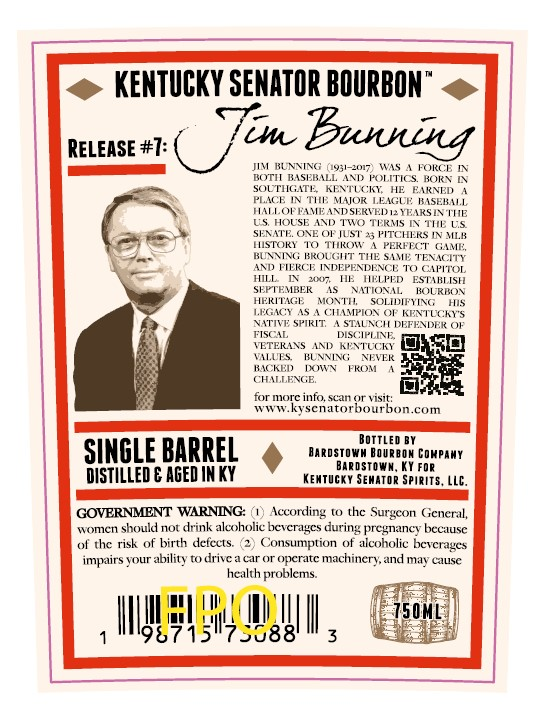
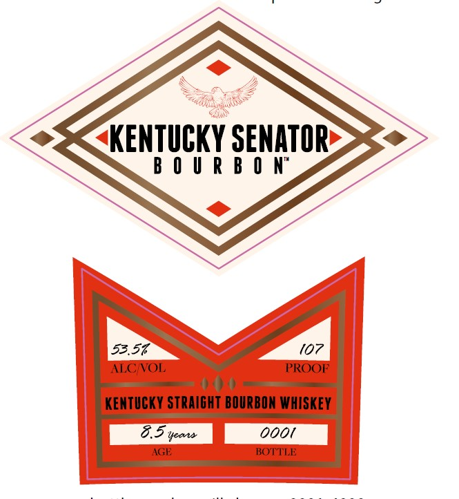

# TTB COLA Label Images - TTBID 26026001000661

**Brand Name:** KENTUCKY SENATOR BOURBON

**Issue Date:** 01/27/2026

**Origin Code:** 22

**Product Class/Type:** 101

**Source:** [TTB Public COLA Registry](https://ttbonline.gov/colasonline/viewColaDetails.do?action=publicFormDisplay&ttbid=26026001000661)

## Label Images

### Back Label

### Front Label

### Label 3

## Extracted Label Text

*Text extracted via OCR - may contain errors*

*1 image(s) excluded: text did not meet readability threshold*

### Back Label

-@ KENTUCKY SENATOR BOURBON" <>
Tew

JIM _BUNNING (31307) WAS A FORTE IN
ROTH BASHIALE AND POLITICS, BOR IN
SOUTHGATE KENTUCKY. HE EARNED
Puce IN Tite MAJOR TEAGLt BASE
HANLOF PaMit ANDSERVED a YEARS IN AE
US'HOUSE AND TWO THR TE CS
SENATE ONE OF JUST 35 PPTCHRS EW
Thigrok\ 0 ‘THROW A PERPDCT. CaM
BENNING BROUGHT THe suMe TENSITY
SND TIERCE INDEPENDENCE To CAPITOL
MLL!'IN' soon, HE HELPED eStannist
SHPTHMIBE is "NATIONAL. ‘BOURDON
HeRMAGE MONTH, SOLIDIPYING us
LEGACY AS {CHAMPION OF KENTUCKY
Navive SPIRIT A'STAUNCHE DEFENDEOF
scat Disc vt

VETEIEANS AND PNTUCH jo}
NAILTS. BLAMING NEVER

RACKED BOWS FROM
CHALLENGE

for more info, scan or visit:
www-kysenatorbourbon.com

SSS SE Sy
SINGLEBARREL Saaasrowe Have cnrany

ROSTOWN, KY FOR

DISTILLED & AGED IN KY KENTUCKY SEMATOR SPIRITS, LLC,
Ee

GOVERNMENT WARNING: (1) According to the Surgeon General,

women should not drink alcoholic beverages during pregnancy because

of the risk of birth defects. (2) Consumption of alcoholic beverages

impairs your ability to drive car or operate machinery, and may cause
health problems.

UNS

### Front Label

POS

eNTUKY SEMTOR

aoe

ALG/VOL

PROOP

(07 |

KENTUCKY STRAIGHT BOURBON WHISKEY

oid

8.5 yoore

2001

AGE

BOTTLE

ta
