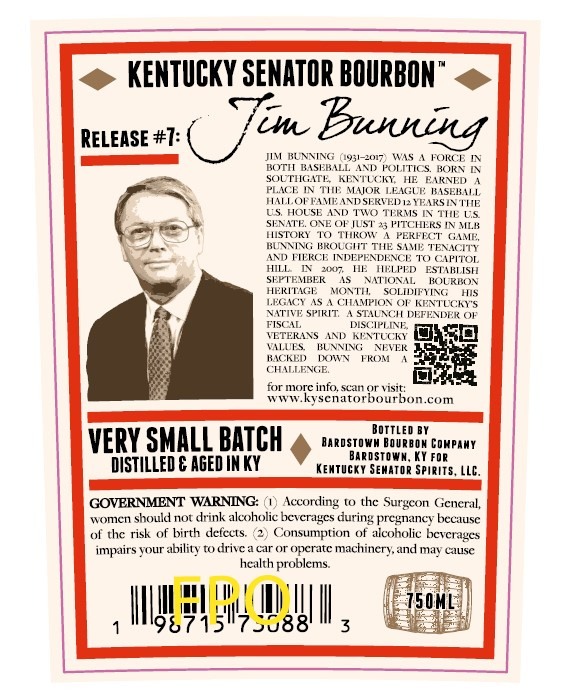

# TTB COLA Label Images - TTBID 26026001000669

**Brand Name:** KENTUCKY SENATOR BOURBON

**Issue Date:** 01/27/2026

**Origin Code:** 22

**Product Class/Type:** 101

**Source:** [TTB Public COLA Registry](https://ttbonline.gov/colasonline/viewColaDetails.do?action=publicFormDisplay&ttbid=26026001000669)

## Label Images

### Back Label

### Front Label

### Label 3

## Extracted Label Text

*Text extracted via OCR - may contain errors*

*1 image(s) excluded: text did not meet readability threshold*

### Back Label

<@ KENTUCKY SENATOR BOURBON” <>

ye

(217 e)

RELEASE #1

Be

JIM BENNING

w31-2017) WAS A FORCE IN

U

BOTH BASEBALL AND POLITICS, BORN IN

SOUTHGATE

KENTUCKY, HE EARNED.

PLACE IN THE MAIOR LEAGUE. BASEBALL

HALLOP FAME ANDSERVED 1a YEARSIN THE

S_HOUSE AND TWO TERMS IN THE US.

—

HISTORY TO THROW A. PERFECT GAME

SENATE, ONE OF JUST 35 PITCHERS IN ML

fas

BUNNING BROUGHT THE SAME TENACITY

AND FIERCE INDEPENDENCE TO. CAPITOL

HILL

TN. 2007, Uk

TIELPED. ESTABLISH

SEPTEMBER

as

NATIONAL

BOURBON

HERITAGE

MONTH,

SOLIDIEVING

HS

NATIVE SPIRIT. A STAUNCH DE

LEGACY AS A CHAMPION OF KENTUCKY'S,

NDEK OF

FISCAL

DISCIPLINE

VETERANS AND_KENTUCK

Io

VALUES. HUNNING

NEVER

BACKED DOWN” FROM

CHALLENGE

for more info, scan or visit:

www.kysenatorbourbon.com

Borrien BY

Hanosrowy Haun conPany

VERY SMALL BATCH

BARDSTOWN, KY FoR

DISTILLED & AGED IN KY

KENTUCKY SENATOR SPIRITS, LLC.

GOVERNMENT WARNING: (1

Accord

to the Surgeon General,

L,

‘women should not drink alcoholic beverages during pregnancy because

of the risk of birth defects

2

2

Consumption of alcoholic beverages

impairs your ability to drive a car or operate machinery, and may cause

health problems.

F

I

4

if

Wg i

### Front Label

POS

eNTUKY SEMTOR

aoe

ALG/VOL

PROOP

(07 |

KENTUCKY STRAIGHT BOURBON WHISKEY

oid

8.5 yoore

2001

AGE

BOTTLE

ta
