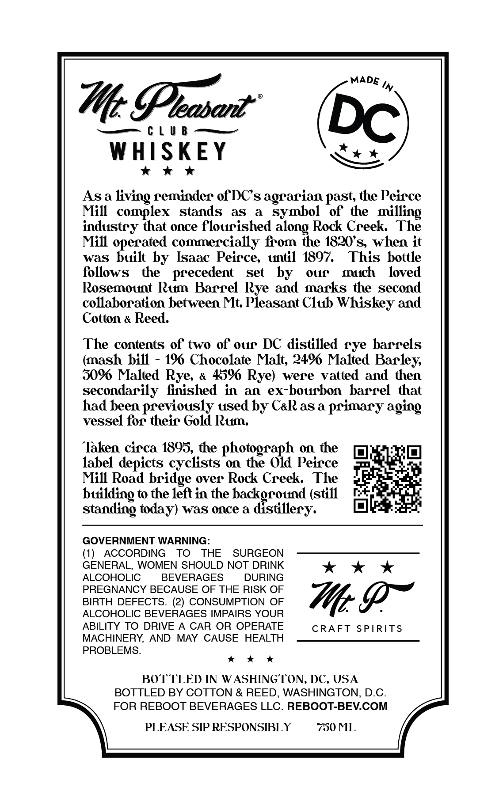
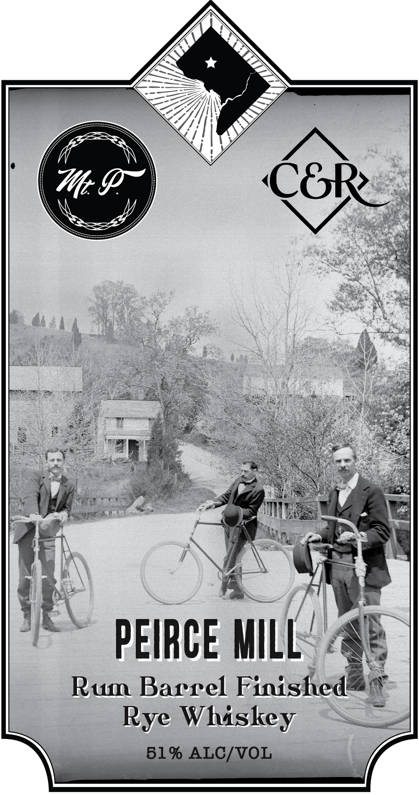
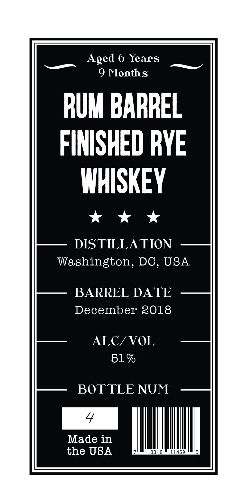
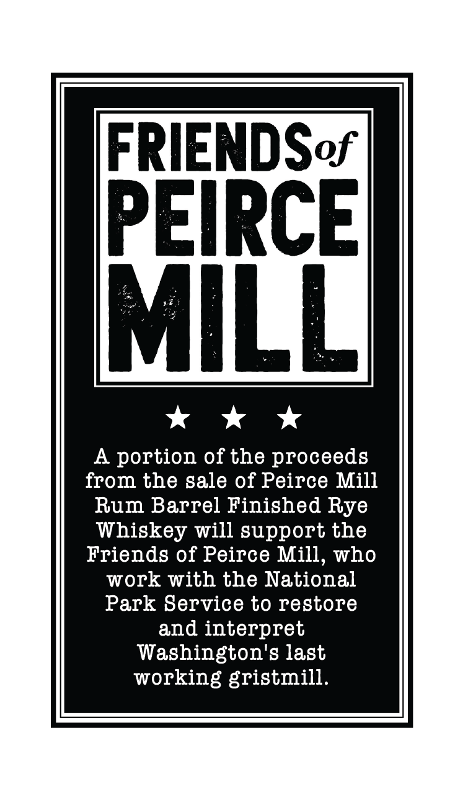
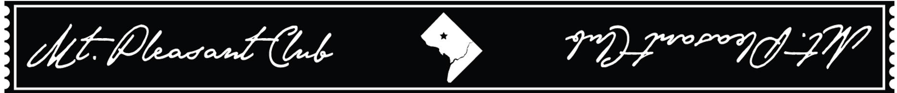

# TTB COLA Label Images - TTBID 26026001000689

**Brand Name:** PEIRCE MILL

**Issue Date:** 02/06/2026

**Origin Code:** 4K

**Product Class/Type:** 142

**Source:** [TTB Public COLA Registry](https://ttbonline.gov/colasonline/viewColaDetails.do?action=publicFormDisplay&ttbid=26026001000689)

## Label Images

### Back Label

### Label 1

### Label 2

### Label 3

### Label 5

## Extracted Label Text

*Text extracted via OCR - may contain errors*

*2 image(s) excluded: text did not meet readability threshold*

### Back Label

MADE In

Me

CUO Li

—

WHISKEY

es

kkk

Asa living reminder of DCs agrarian past, the Peirce

Mill complex stands as a symbol of the milli

industry that once flourished along Rock Creek. The

Mill operated commercially from the 1820's, when it

was built by Isaac Peirce, until 1897. This bottle

follows the precedent set by our much loved

Rosemount Rum Barrel Rye and marks the second

collaboration between Mt. Pleasant Club Whiskey and

Cotton « Reed.

The contents of two of our DC distilled rye barrels

(mash bill - 19% Chocolate Malt, 249% Malted Barley,

50% Malted Rye, « 459 Rye) were vatted and then

secondarily finished in an ex-bourbon barrel that

had been previously used by CaR as a primary aging

vessel for their Gold Rum.

Taken circa 1895, the photograph on the

rat

par

label depicts cyclists on the Old Peirce

Filet

Mill Road bridge over Rock Creek. The

re |

building to the left in the background (still

standing today) was once a distillery.

GOVERNMENT WARNING:

GENERAL, WOMEN SHOULD NOT DRINK

(1) ACCORDING TO THE SURGEON

ALCOHOLIC

BEVERAGES

DURING

kk *

PREGNANCY BECAUSE OF THE RISK OF

BIRTH DEFECTS. (2) CONSUMPTION OF

ALCOHOLIC BEVERAGES IMPAIRS YOUR

Me Pr

ABILITY TO DRIVE A CAR OR OPERATE

CRAFT SPIRITS

MACHINERY, AND MAY CAUSE HEALTH

PROBLEMS.

xk k& *

BOTTLED IN WASHINGTON, DC, USA

BOTTLED BY COTTON & REED, WASHINGTON, D.C.

FOR REBOOT BEVERAGES LLC. REBOOT-BEV.COM

PLEASE SIP RESPONSIBLY

750 ML

r

### Label 2

Aged 6 Years

9 Months

RUM BARREL

FINISHED RYE

WHISKEY

kk *

DISTILLATION

Washington, DC, USA

BARREL DATE

December 2018

ALC/VOL

51%

BOTTLE NUM

Made in

the USA

### Label 3

FRIENDSor
kkk
A portion of the proceeds
from the sale of Peirce Mill
Rum Barrel Finished Rye
Whiskey will support the
Friends of Peirce Mill, who
work with the National
Park Service to restore
and interpret
Washington's last
working gristmill.
