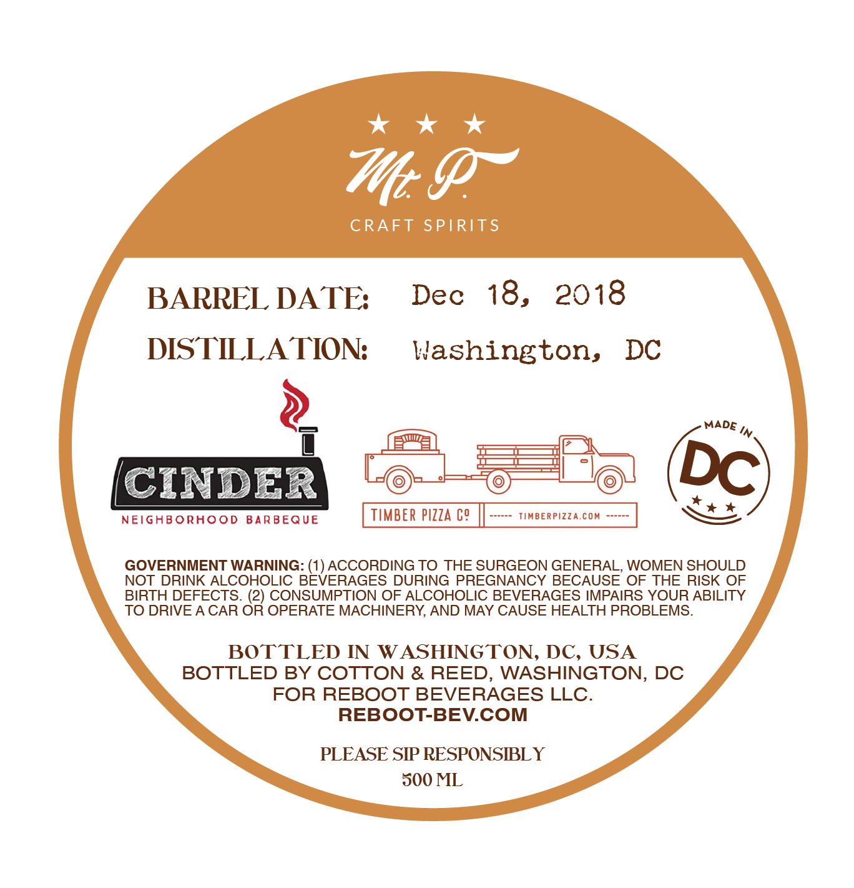
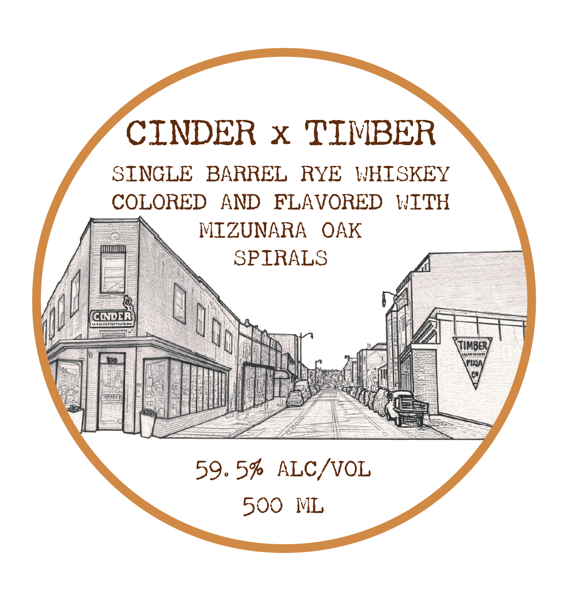

# TTB COLA Label Images - TTBID 26026001000695

**Brand Name:** CINDER X TIMBER

**Issue Date:** 02/27/2026

**Origin Code:** 4K

**Product Class/Type:** 142

**Source:** [TTB Public COLA Registry](https://ttbonline.gov/colasonline/viewColaDetails.do?action=publicFormDisplay&ttbid=26026001000695)

## Label Images

### Back Label

### Front Label

## Extracted Label Text

*Text extracted via OCR - may contain errors*

**Detected Proof:** 119

### Back Label

kkk

Me Pr

CRAFT SPIRITS

BARREL DATE; Dec 18, 2018

DISTILLATION:

Washington,

DC

—

MADE Wy.

——

ANDER

| ‘6

—s

=

NEIGHBORHOOD BARBEQUE

TIMBER PIZZA C9

TIMBERPIZZA.COM

Dc)

GOVERNMENT WARNING: (1) ACCORDING TO THE SURGEON GENERAL, WOMEN SHOULD

NOT DRINK ALCOHOLIC BEVERAGES DURING PREGNANCY BECAUSE OF THE RISK OF

TO DRIVE A CAR OR OPERATE MACHINERY, AND MAY CAUSE HEALTH PROBLEMS.

BIRTH DEFECTS. (2) CONSUMPTION OF ALCOHOLIC BEVERAGES IMPAIRS YOUR ABILITY

BOTTLED IN WASHINGTON, DC, USA

BOTTLED BY COTTON & REED, WASHINGTON, DC

FOR REBOOT BEVERAGES LLC.

REBOOT-BEV.COM

PLEASE SIP RESPONSIBLY

500 ML

### Front Label

CINDER x TIMBER

SINGLE BARREL RYE WHISKEY
COLORED AND FLAVORED WITH
MIZUNARA OAK
SPIRALS

59.5% ALC/VOL
500 ML
