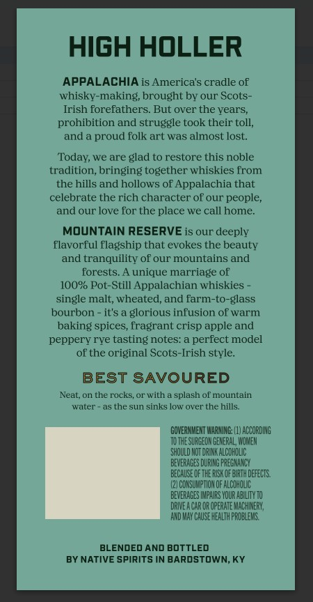
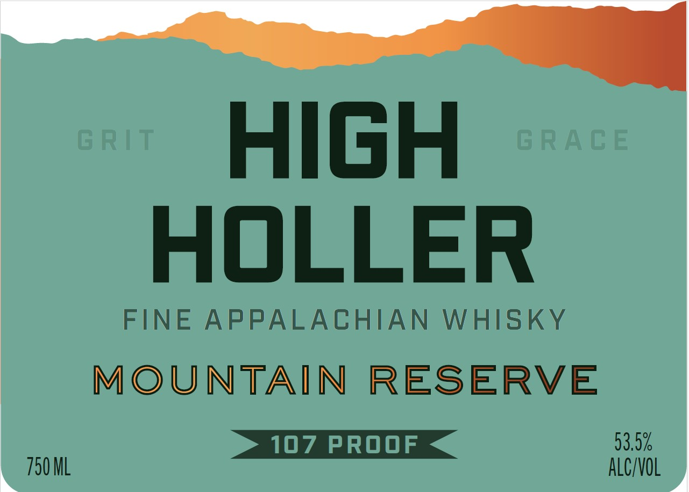

# TTB COLA Label Images - TTBID 26026001000713

**Brand Name:** HIGH HOLLER

**Issue Date:** 02/09/2026

**Origin Code:** 22

**Product Class/Type:** 140

**Source:** [TTB Public COLA Registry](https://ttbonline.gov/colasonline/viewColaDetails.do?action=publicFormDisplay&ttbid=26026001000713)

## Label Images

### Back Label

### Front Label

## Extracted Label Text

*Text extracted via OCR - may contain errors*

### Back Label

HIGH HOLLER

APPALACHIA is America's cradle of

whisky-making, brought by our Scots-

Irish forefathers. But over the years,

prohibition and struggle took their toll,

and a proud folk art was almost lost.

‘Today, we are glad to restore this noble

tradition, bringing together whiskies from

the hills and hollows of Appalachia that

celebrate the rich character of our people,

and our love for the place we call home.

MOUNTAIN RESERVE is our deeply

flavorful flagship that evokes the beauty

and tranquility of our mountains and

forests. A unique marriage of

100% Pot-Still Appalachian whiskies -

single malt, wheated, and farm-to-glass

bourbon - it's a glorious infusion of warm

baking spices, fragrant crisp apple and

peppery rye tasting notes: a perfect model

of the original Scots-Irish style.

BEST SAVOURED

‘Neat, on the rocks, or with a splash of mountain

water as the sun sinks low over the hills.

CGHOVERNOENT WARNING (1) ACCORDING

TOTHE SURGEON GENERAL, WOMEN

SHOULD NOT DRINK ALOOROLIC

‘BEVERAGES DURING PREGNANCY

BEOAISE OF THE RIK OF BRT DEEDS.

(2}OONSUMPTION OF ALCOHOL

BEVERAGES NPM YOUR ABLITYT0

‘DRIVEACAR OR OPERATE MACHINERY,

‘AND MAY CASE HEALTH PROBLEMS

BLENDED AND BOTTLED

BY NATIVE SPIRITS IN BARDSTOWN, KY

### Front Label

HIGH

HOLLER

FINE APPALACHIAN WHISKY

MOUNTAIN RESERVE

93.0%

q

790 ML

ALC/VOL
