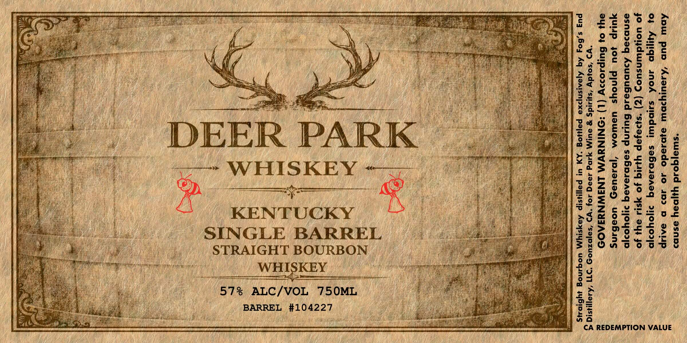

# TTB COLA Label Images - TTBID 26027001000004

**Brand Name:** DEER PARK WHISKEY

**Issue Date:** 02/04/2026

**Origin Code:** 01

**Product Class/Type:** 101

**Source:** [TTB Public COLA Registry](https://ttbonline.gov/colasonline/viewColaDetails.do?action=publicFormDisplay&ttbid=26027001000004)

## Label Images

### Back Label

## Extracted Label Text

*Text extracted via OCR - may contain errors*

### Back Label

ox

o

=

a

oY

“

ie

ub

oe

a

Miz

Pai hy

_

23

'G

he

ae

ase

by

Hf

ry

a)

ows

i

fd

a

%

-_ oo ry

Wee

som

xt:

ro

ee

u¢

a=

ss

M0

Me

ff

hj

14

-_

i,

v,

ut

ey

f

i)

a0

B

iM

ee

re

ii

ip

a eh

25

ae

rh:

nY

~c

_

=4

<c

on

es

rua

en

Zak

=

¥

ii

vs

eo

aw

oo

i“

6

ee

on

oo

hy

gc. 2

dt eal

ih

% 0

7

5

y

mY

Tey

ide

o£

-_

Aa

0

tne

ee

fie

iy

asZz

oo

is

y,

=~

ope eee

DEER PARK

¢ re

*

ck

0 ©

dr

o 2

$e

Os

is

WHISKEY

=

=»

;

3)

Bs

LET ee

~ {GP

x

x

Ne

=°

Oy

oh

Pi

ba

=

UC =

yy

fs)

fs

4

-_

-_

KENTUCKY

A

ws

A

yy)

7

Ba

ithe

x

SINGLE BARREL

See

-_

29

v=

iN

er

Wee

"5

I

SN

Ou

Sots

Mi

‘|

STRAIGHT BOURBON

90

ihe i

ui,

ERY;

Ips,

Prat

a

Ney

ae

oe

fil

a

Tht

ou

ih

yy

pe

ve

As

‘ie

pad

57% ALC/VOL 750ML

ah

tera ey

i 5

a

vy

age &

=

iD

Ldecbaail

os

a)

abhi

‘nthe.

bi

BARREL EN eae

wi

4%

se

CA REDEMPTION VALUE
