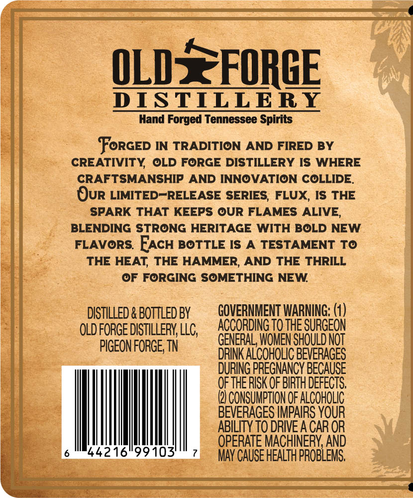
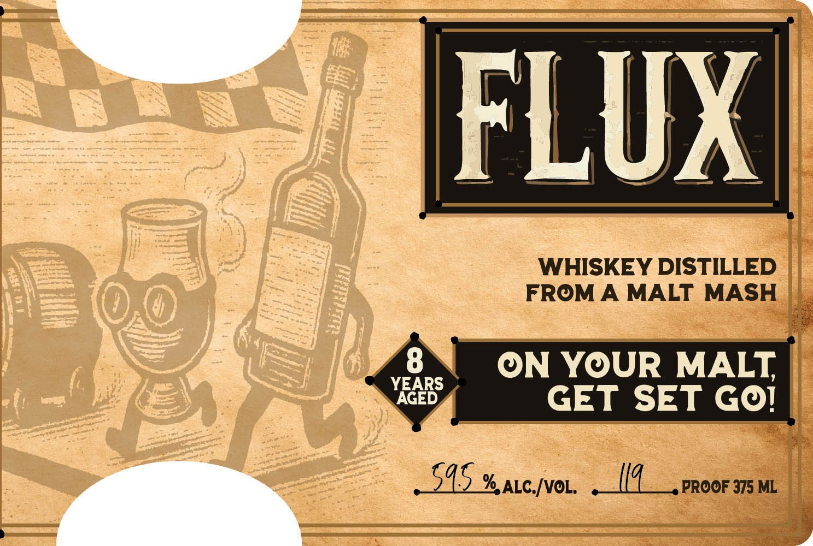

# TTB COLA Label Images - TTBID 26027001000112

**Brand Name:** FLUX

**Issue Date:** 02/05/2026

**Origin Code:** 43

**Product Class/Type:** 140

**Source:** [TTB Public COLA Registry](https://ttbonline.gov/colasonline/viewColaDetails.do?action=publicFormDisplay&ttbid=26027001000112)

## Label Images

### Back Label

### Label 1

### Label 3

## Extracted Label Text

*Text extracted via OCR - may contain errors*

*1 image(s) excluded: text did not meet readability threshold*

### Back Label

OLD3EFORGE

DISTILLERY

Hand Forged Tennessee Spirits

Forcep IN TRADITION AND FIRED BY

CREATIVITY, OLD FORGE DISTILLERY IS WHERE

CRAFTSMANSHIP AND INNOVATION COLLIDE.

Our LIMITED“RELEASE SERIES, FLUX, IS THE

SPARK THAT KEEPS OUR FLAMES ALIVE,

BLENDING STRONG HERITAGE WITH BOLD NEW

FLAVORS. Eacu BOTTLE IS A TESTAMENT TO

THE HEAT, THE HAMMER, AND THE THRILL

OF FORGING SOMETHING NEW.

DISTILLED & BOTTLED BY

GOVERNMENT WARNING: (1)

OLD FORGE DISTILLERY, LLC,

ACCORDING T0 THE SURGEON

PIGEON FORGE, TN

ENERAL, WOMEN SHOULD NOT

DURING PREGNANCY BECAUSE

DRINK ALCOHOLIC BEVERAGES

OF THE RISK OF BIRTH DEFECTS.

ae

ABILITY TO DRIVE A CAR OR

OPERATE MACHINERY, AND

4421699103 "7

MAY CAUSE HEALTH PROBLEMS,

### Label 1

L

—

F

WHISKEY DISTILLED ||

FROM A MALT MASH |.

z

ON YOUR MALT

YEARS

AGED

GET SET GO!

es

945 % atcver. sai PROOF 375 ML

= a

4
