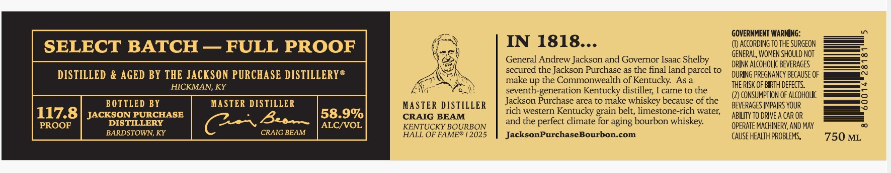

# TTB COLA Label Images - TTBID 26027001000189

**Brand Name:** JACKSON PURCHASE DISTILLERY

**Issue Date:** 01/28/2026

**Origin Code:** 22

**Product Class/Type:** 101

**Source:** [TTB Public COLA Registry](https://ttbonline.gov/colasonline/viewColaDetails.do?action=publicFormDisplay&ttbid=26027001000189)

## Label Images

### Label 1

### Label 2

## Extracted Label Text

*Text extracted via OCR - may contain errors*

*1 image(s) excluded: text did not meet readability threshold*

### Label 1

DISTILLED & AGED BY THE JACKSON PU

HI

BOTTLED BY
JACKSON PURCHASE
DISTILLERY
BARDSTOWN, KY

MAN, KY
MASTER DISTILLER
Caen

CRAIG BEAM

MASTER DISTILLER
CRAIG BEAM

KENTUCKY BOURBON
HALL OF FAME® 12025

IN 1818...

General Andrew Jackson and Governor Isaac Shelby
secured the Jackson Purchase as the final land parcel to
make up the Commonwealth of Kentucky. As a
seventh-generation Kentucky distiller, I came to the
Jackson Purchase area to make whiskey because of the
rich western Kentucky grain belt, limestone-rich water,
and the perfect climate for aging bourbon whiskey.
JacksonPurchaseBourbon.com

GOVERNMENT WARNING:

(1) ACCORDING T0 THE SURGEON
GENERAL, WOMEN SHOULD NOT
DRINK ALCOHOLIC BEVERAGES
DURING PREGNANCY BECAUSE OF
THE RISK OF BIRTH DEFECTS.

(2 CONSUMPTION OF ALCOHOLIC
BEVERAGES IMPAIRS YOUR
ABILITY TO DRIVE A CAR OR
OPERATE MACHINERY, AND MAY
CAUSE HEALTH PROBLEMS.
