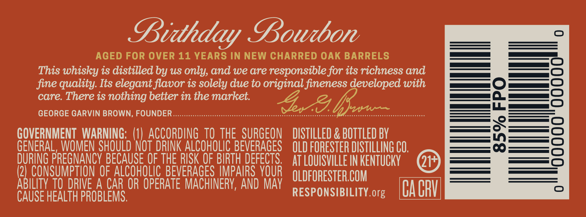
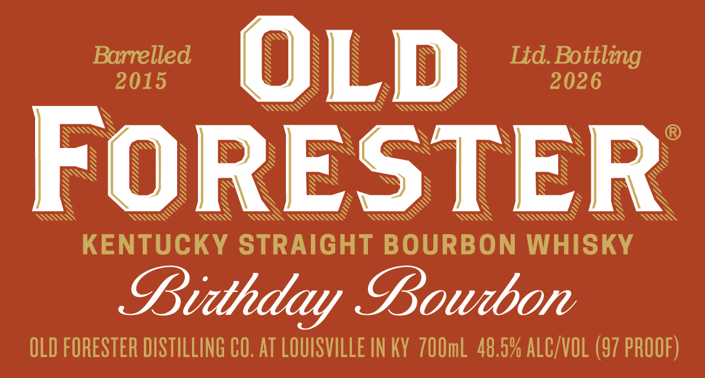
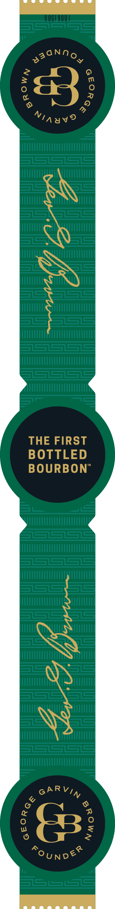
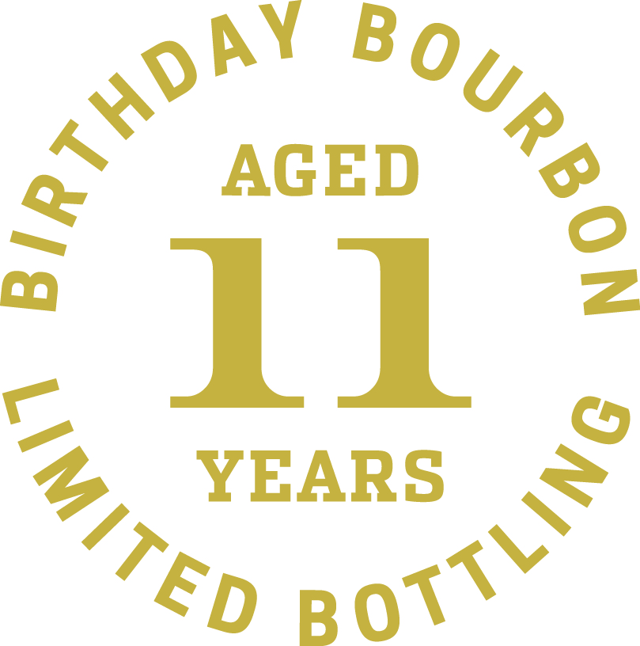

# TTB COLA Label Images - TTBID 26027001000219

**Brand Name:** OLD FORESTER

**Fanciful Name:** BIRTHDAY BOURBON 2026

**Issue Date:** 01/28/2026

**Origin Code:** 22

**Product Class/Type:** 101

**Source:** [TTB Public COLA Registry](https://ttbonline.gov/colasonline/viewColaDetails.do?action=publicFormDisplay&ttbid=26027001000219)

## Label Images

### Back Label

### Front Label

### Label 3

### Label 4

### Label 5

## Extracted Label Text

*Text extracted via OCR - may contain errors*

*3 image(s) excluded: text did not meet readability threshold*

### Back Label

Bidhday Lourbon

AGED FOR OVER 11 YEARS IN NEW CHARRED OAK BARRELS
This whisky is distilled by us only, and we are responsible for its richness and
fine quality. Its elegant flavor is solely due to original fineness developed with
care. There is nothing better in the market.
GEORGE GARVIN BROWN, FOUNDER ........-sscsssssssssssssesssssessssessssse cranes OL een

GOVERNMENT WARNING: (1) ACCORDING 10 THE SURGEON DISTILLED & BOTTLED BY
GENERAL WOMEN SHOULD NOT DRINK ALCOHOLIC BEVERAGES OLD FORESTER DISTLLNG CO,

DURING PREGNANCY BECAUSE OF THE RISK OF BIRTH DEFECTS, AT LOUISVLLEIN KENTUCKY. (QP)
(2) CONSUNBTION OF ALCOHOLIC BEVERAGES IMPAIRS YOUR roRESTERCOM

PRLSE ASSLT re a OR OPERATE MACHINERY, AND MAY RESPONSIBILITY org CA CRY

### Front Label

©)»
Barrelled “Ny A “A —-—«sUd. Botiling
2015 ws N sa S 2026
ESSS Way SAI

Z

WILL tty
Wttttttt hy

UULIIITLMS
Uf

>
SS
S$

S
SSs7 Aare

Uy

SS
SSsgq Ws?

KENTUCKY STRAIGHT BOURBON WHISKY

LBiihday Lourbon

OLD FORESTER DISTILLING CO. AT LOUISVILLE IN KY 700mL 48.5% ALC/VOL (97 PROOF)
