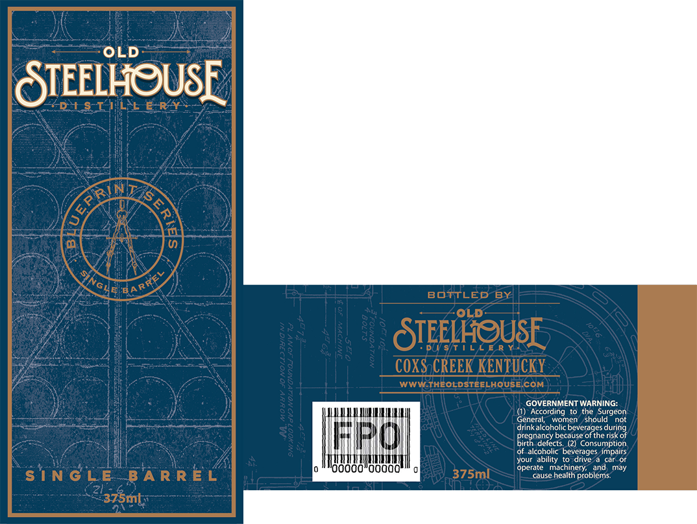
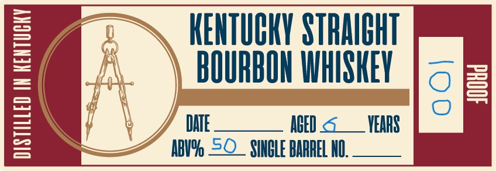

# TTB COLA Label Images - TTBID 26027001000243

**Brand Name:** OLD STEELHOUSE DISTILLERY BLUEPRINT SERIES

**Fanciful Name:** SINGLE BARREL

**Issue Date:** 01/28/2026

**Origin Code:** 22

**Product Class/Type:** 101

**Source:** [TTB Public COLA Registry](https://ttbonline.gov/colasonline/viewColaDetails.do?action=publicFormDisplay&ttbid=26027001000243)

## Label Images

### Front Label

### Label 2

### Label 3

## Extracted Label Text

*Text extracted via OCR - may contain errors*

*1 image(s) excluded: text did not meet readability threshold*

### Front Label

OLD

STEELHOUSE

GOVERNMENT WARNING:
() According to the Surgeon
General, women’ should not
drink alcoholic beverages during
pregnancy because of the risk of
birth. defects. (2) Consumption,
Of alcoholic beverages impairs
your ability to drive a car_or
‘Operate machinery, and, may
‘use health problems:

### Label 3

==

KENTUCKY STRAIGHT

BOURBON WHISKEY

J

i——}

ABV% = SINGLE BARREL NO

AGED

YEARS
