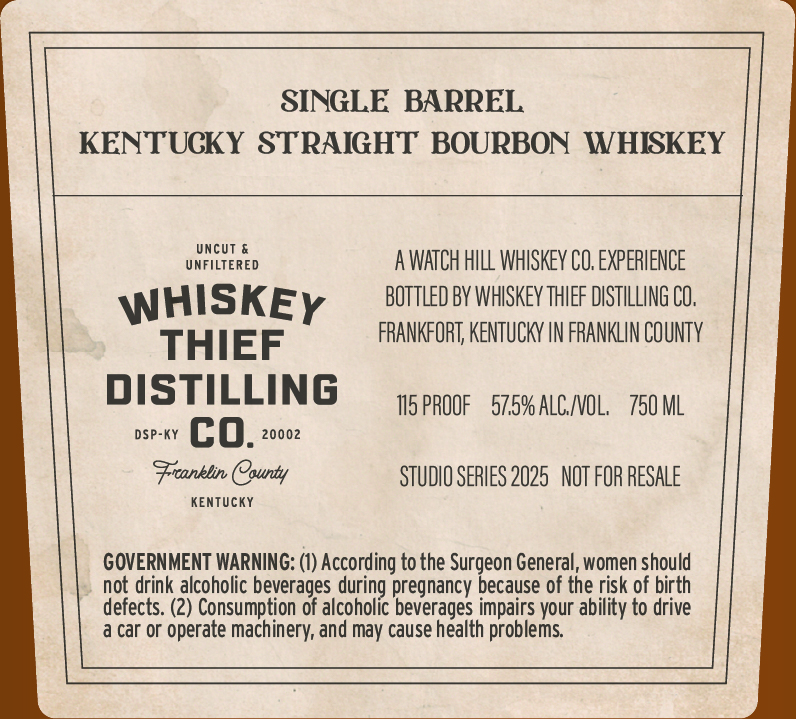
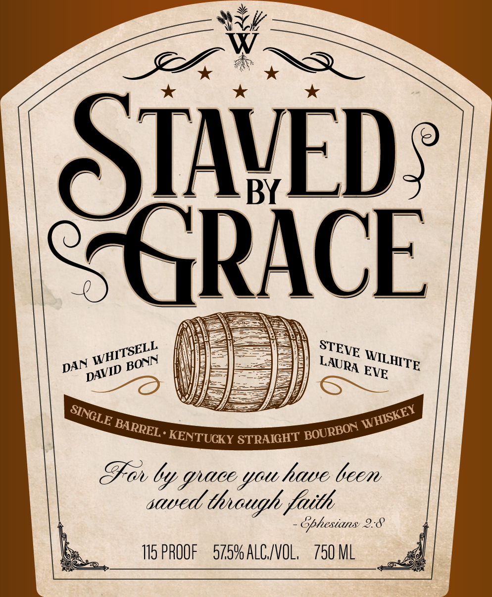

# TTB COLA Label Images - TTBID 26027001000248

**Brand Name:** WHISKEY THIEF DISTILLING CO.

**Fanciful Name:** STAVED BY GRACE

**Issue Date:** 01/28/2026

**Origin Code:** 22

**Product Class/Type:** 101

**Source:** [TTB Public COLA Registry](https://ttbonline.gov/colasonline/viewColaDetails.do?action=publicFormDisplay&ttbid=26027001000248)

## Label Images

### Back Label

### Front Label

## Extracted Label Text

*Text extracted via OCR - may contain errors*

*1 image(s) excluded: text did not meet readability threshold*

### Back Label

SINGLE BARREL
KENTUCKY STRAIGHT BOURBON WHISKEY

uNtltrEReD AWATCH HILL WHISKEY CO. EXPERIENCE
WHISKEy BOTTLED BY WHISKEY THIEF DISTILLING CO.
THIEF FRANKFORT, KENTUCKY IN FRANKLIN COUNTY
DISTILLING TISPROOF S75%ALC/VOL. 750 ML
DSP-KY [Es 0. 20002
Franklin County STUDIO SERIES 2025 NOT FOR RESALE

KENTUCKY

GOVERNMENT WARNING: (1) According to the Surgeon General, women should
not drink alcoholic beverages during pregnancy because of the risk of birth
defects. (2) Consumption of alcoholic beverages impairs your ability to drive
a car or operate machinery, and may cause health problems.
