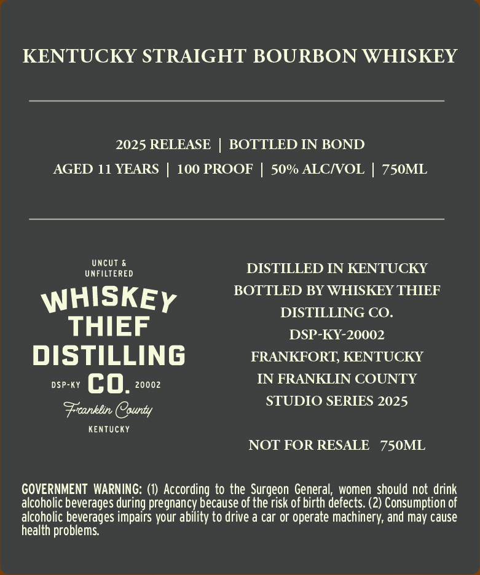
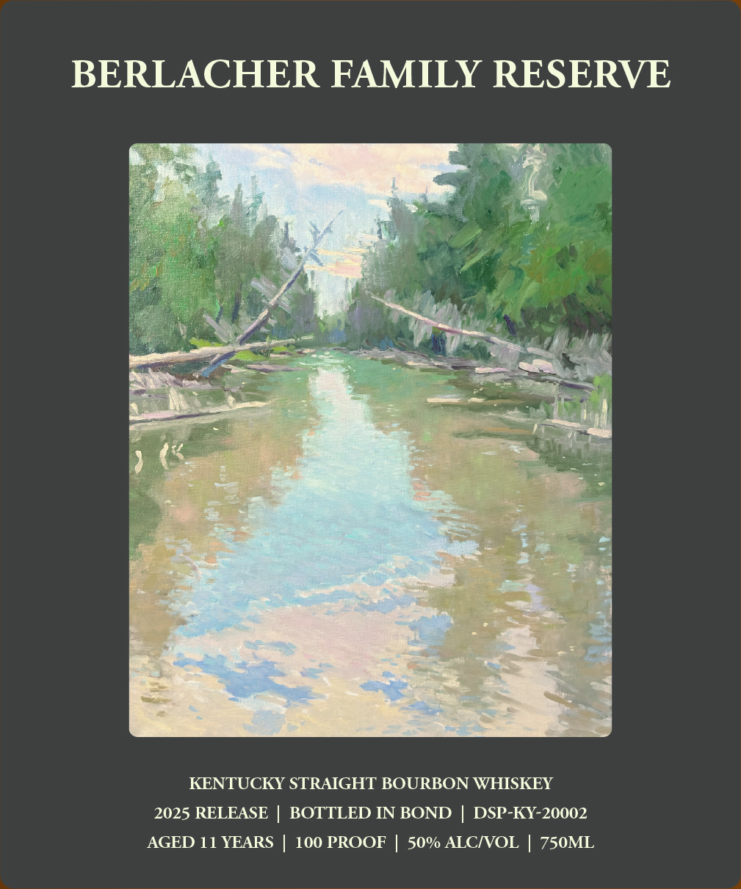
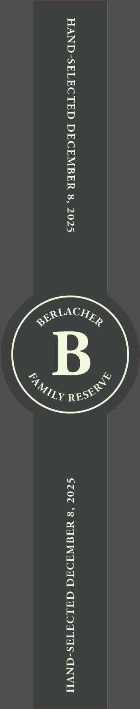

# TTB COLA Label Images - TTBID 26027001000268

**Brand Name:** WHISKEY THIEF DISTILLING CO.

**Fanciful Name:** BERLACHER FAMILY RESERVE BOTTLED IN BOND

**Issue Date:** 01/28/2026

**Origin Code:** 22

**Product Class/Type:** 101

**Source:** [TTB Public COLA Registry](https://ttbonline.gov/colasonline/viewColaDetails.do?action=publicFormDisplay&ttbid=26027001000268)

## Label Images

### Back Label

### Front Label

### Label 3

## Extracted Label Text

*Text extracted via OCR - may contain errors*

*1 image(s) excluded: text did not meet readability threshold*

### Back Label

KENTUCKY STRAIGHT BOURBON WHISKEY

2025 RELEASE | BOTTLED IN BOND
AGED 11 YEARS | 100 PROOF | 50% ALC/VOL | 750ML

iKghia DISTILLED IN KENTUCKY
HISKE Y BOTTLED BY WHISKEY THIEF
DISTILLING CO.

THIEF DSP-KY-20002
DISTILLING FRANKFORT, KENTUCKY

osery GQ, 20002 IN FRANKLIN COUNTY
STUDIO SERIES 2025
Franklin, County

KENTUCKY

NOT FOR RESALE 750ML

GOVERNMENT WARNING: (1) According to the Surgeon General, women should not drink
alcoholic beverages during pregnancy because of the risk of birth defects. (2) Consumption of
alcoholic beverages impairs your ability to drive a car or operate machinery, and may cause
health problems.

### Front Label

BERLACHER FAMILY RESERVE

KENTUCKY STRAIGHT BOURBON WHISKEY
2025 RELEASE | BOTTLED IN BOND | DSP-KY-20002
AGED 11 YEARS | 100 PROOF | 50% ALC/VOL | 750ML
