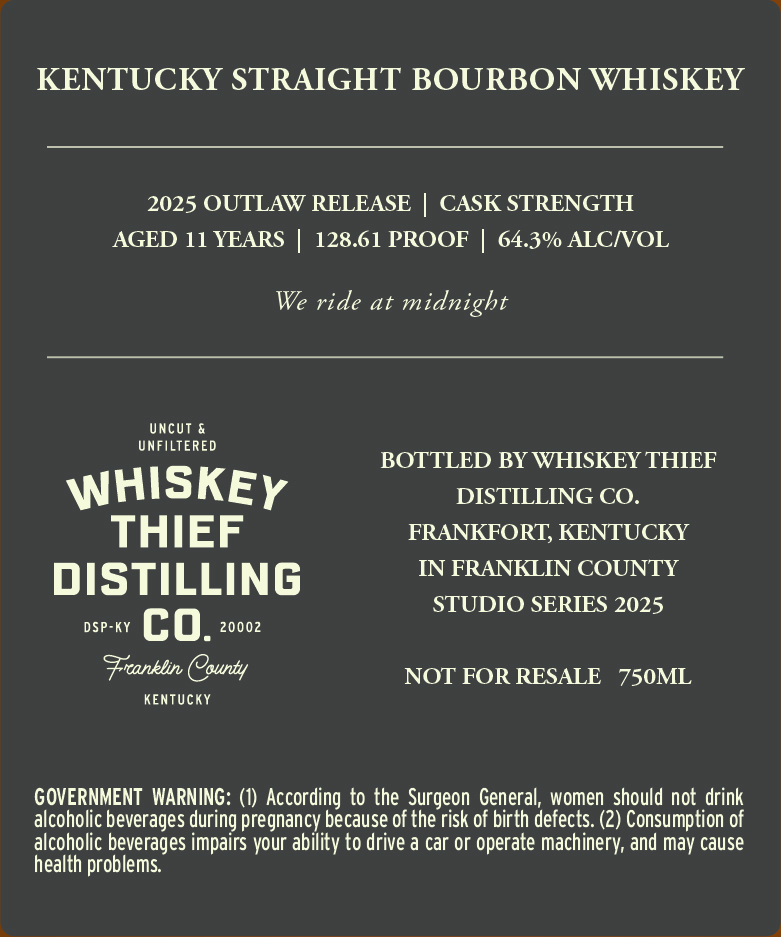
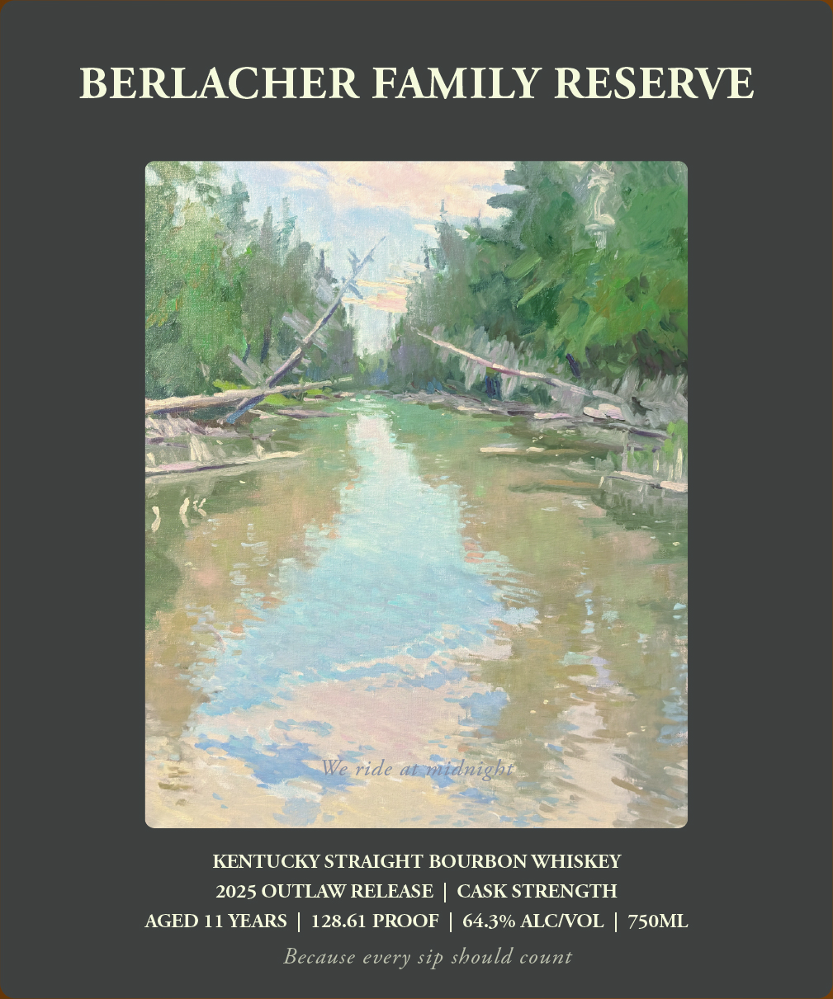

# TTB COLA Label Images - TTBID 26027001000272

**Brand Name:** WHISKEY THIEF DISTILLING CO.

**Fanciful Name:** BERLACHER FAMILY RESERVE CASK STRENGTH

**Issue Date:** 01/28/2026

**Origin Code:** 22

**Product Class/Type:** 101

**Source:** [TTB Public COLA Registry](https://ttbonline.gov/colasonline/viewColaDetails.do?action=publicFormDisplay&ttbid=26027001000272)

## Label Images

### Back Label

### Front Label

### Label 2

## Extracted Label Text

*Text extracted via OCR - may contain errors*

*1 image(s) excluded: text did not meet readability threshold*

### Back Label

KENTUCKY STRAIGHT BOURBON WHISKEY

2025 OUTLAW RELEASE | CASK STRENGTH
AGED 11 YEARS | 128.61 PROOF | 64.3% ALC/VOL

We ride at midnight

UNCUT &
UNFILTERED

BOTTLED BY WHISKEY THIEF
W HISK E y DISTILLING CoO.
THIEF FRANKFORT, KENTUCKY

DISTILLING IN FRANKLIN COUNTY

STUDIO SERIES 2025
DSP-KY co. 20002

Franklin County NOT FOR RESALE 750ML

KENTUCKY

GOVERNMENT WARNING: (1) According to the Surgeon General, women should not drink
alcoholic beverages during pregnancy because of the risk of birth defects. (2) Consumption of
alcoholic beverages impairs your ability to drive a car or operate machinery, and may cause
health problems.

### Front Label

BERLACHER FAMILY RESERVE

KENTUCKY STRAIGHT BOURBON WHISKEY
2025 OUTLAW RELEASE | CASK STRENGTH
AGED 11 YEARS | 128.61 PROOF | 64.3% ALC/VOL | 750ML

Because every sip should count
