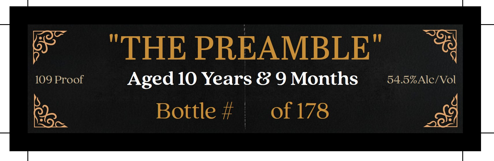
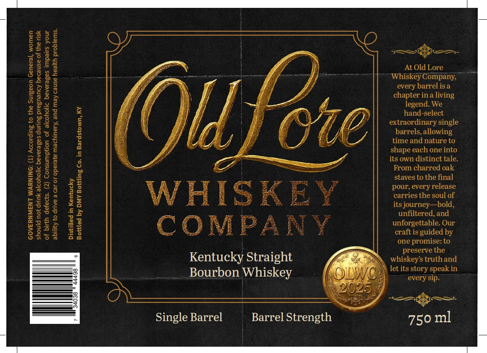
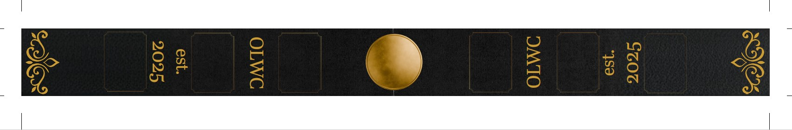

# TTB COLA Label Images - TTBID 26027001000276

**Brand Name:** OLD LORE

**Issue Date:** 01/28/2026

**Origin Code:** 22

**Product Class/Type:** 101

**Source:** [TTB Public COLA Registry](https://ttbonline.gov/colasonline/viewColaDetails.do?action=publicFormDisplay&ttbid=26027001000276)

## Label Images

### Back Label

### Front Label

### Label 3

## Extracted Label Text

*Text extracted via OCR - may contain errors*

### Back Label

on

“THE PREAMBLE"

a

109 Proof

Aged 10 Years & 9 Months

54.5% Alc/Vol

Re

Bottle #

of 178

i

### Front Label

=~

S12

ge

S2

25

——'

<=

.

a

qo

X¢

e2

gs

At old Lore

Whiskey Company,

every barrel isa

J

chapter ina living

i

legend. We

Se

hand-select

g

7

oN

extraordinary single

barrels, allowing

time and nature to

shape each one into

=

its own distinct tale.

eZ

From charred oak

=o

staves to the final

26

a

Sx

Sa

Za

pour, every release

=e

gs

gH

carries the soul of

aus

<a

f

ay

its journey—bold,

Sous

ais

unfiltered, and

Zuf

roo

23

S35

%

unforgettable. Our

$2.5

aa

CoO

fi P

craft is guided by

one promise: to

preserve the

Kentucky Straight

whiskey’s truth and

let its story speak in

Bourbon Whiskey

>

every sip.

SAE

Single Barrel

Barrel Strength

750 ml

### Label 3

&

&

@

on

e

S
