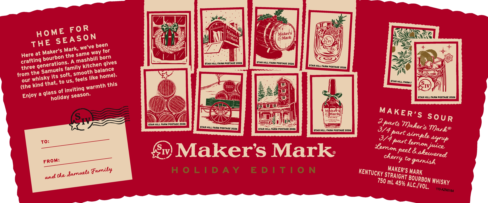
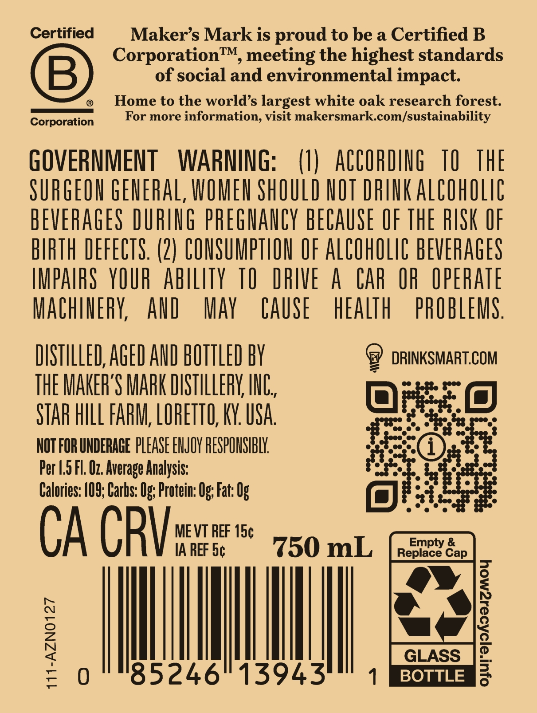

# TTB COLA Label Images - TTBID 26027001000341

**Brand Name:** MAKER'S MARK

**Issue Date:** 01/28/2026

**Origin Code:** 22

**Product Class/Type:** 101

**Source:** [TTB Public COLA Registry](https://ttbonline.gov/colasonline/viewColaDetails.do?action=publicFormDisplay&ttbid=26027001000341)

## Label Images

### Label 1

### Label 2

## Extracted Label Text

*Text extracted via OCR - may contain errors*

### Label 1

bi)

(5

=

E FOR

axer'd )

Ke

YF We

HO

NE

ty

rie

Ss

ANS

THE S

EASON

‘ve been

oy

sg Mark,

way for

ff

Wz

Here at

ourbo! th

Z |

SF

~ a

crafting

bill born

—!

‘STAR HILL FARI wa

STAR HILL FARM P¢ —

S55

J 5

«three gener

els

y kit

chen gives

STAR HILL Fs ioe

the

fh balance

ws

our whis!

ky its oft,

is like home.

mre HILL FARM F

(the kind that,

alee

Ny

IV,

ss of i

nviting warmth this

a

Enjoy 2 gia

holiday season.

es

hx.

‘STAR HILL FARM POSTAGE 2026

(

fies

SS.

MAKER:

Gx,

Gi,

Ss SOUR

— OSTAGE 2026

Makor

STAR HILL FARM Po: a

ued STAGE 2026

‘STAR HILL FARM POSTAGE 2026

Vark®

o/4 és

es thenon

Yup

TO

Sv) Maker's Mark.

peel & skewwersof

FROM

Gy

Co gamish,

KENTUCKy ST

AKER"

A

ands the Barrels Family

RAIGHT

BouRB

50 mL 45H

ALC./y

0

Lt Misay

DEED EE SSS TE

### Label 2

Certified

Maker’s Mark is proud to be a Certified B

Corporation™, meeting the highest standards

of social and environmental impact

—E=

B)

@ Home to the world’s largest white oak research forest.

Corporati

For more information, visit makersmark.com/sustainability

GOVERNMENT WARNING

(1) ACCORDING TQ THE

SURGEON GENERAL, WOMEN SHOULD NOT DRINK ALCOHOLIC

BEVERAGES DURING PREGNANCY BECAUSE OF THE RISK OF

BIRTH DEFECTS. (2) CONSUMPTION OF ALCOHOLIC BEVERAGES

IMPAIRS YOUR ABILITY 10 DRIVE A CAR OR OPERATE

MACHINERY, AND MAY CAUSE HEALTH PROBLEMS

DISTILLED, AGED AND BOTTLED BY

9 DRINKSMART.COM

THE MAKER'S MARK DISTILLERY, INC

Olea

STAR HILL FARM, LORETTO, KY. USA

“is

NOT FOR UNDERAGE PLEASE ENJOY RESPONSIBLY.

fie

Per 1.5 Fl. Oz. Average Analysis:

ie

Calories: 109; Carhs: Og: Protein: Og: Fat: Og

ME VT REF 15¢

UA CRY

IA REF ]

j| mL

i

Ih]

85246

I

BOTTLE
