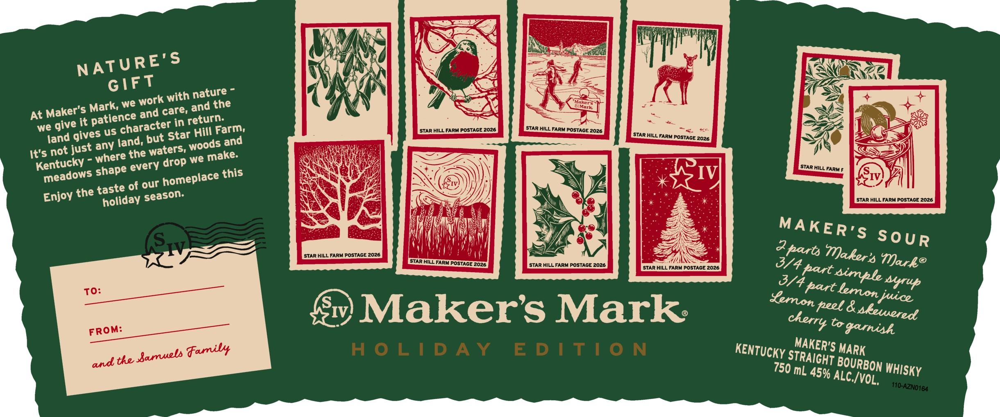

# TTB COLA Label Images - TTBID 26027001000345

**Brand Name:** MAKER'S MARK

**Issue Date:** 01/28/2026

**Origin Code:** 22

**Product Class/Type:** 101

**Source:** [TTB Public COLA Registry](https://ttbonline.gov/colasonline/viewColaDetails.do?action=publicFormDisplay&ttbid=26027001000345)

## Label Images

### Label 1

### Label 2

## Extracted Label Text

*Text extracted via OCR - may contain errors*

### Label 1

NS SEP

WAI

4s

QJ

r

}

Aa

NATURE s

}

LZ

Ze

“

Ni 4

GIFT

fi

<<

Mark,

rk W

ith nature ~

\

a

EY,

Caer}

ia

zai

At Mak

e, and the

SS

Im

we giv’ it

es us ©

patien'

cter in

Hill Farm,

‘STAR HILL FARM POSTAGE 2026

STARHILL Fan PostAgE 2026

IF

i

fand giv’

woods an

STAR HILL FARM POSTAGE 2026

it's not just am

the waters:

e make:

Wey

——

p

Kentu

hape eve

i

STAR HILL FARM F

A

y

meadow

our home!

place this

~

BX

IV,

IV,

season.

ae

(

Enjoy the fre fiday

\

‘STAR HILL FARM POSTAGE 2026

i

MAKER:

iy

I

I

S SOuR

STAR HILL FARM POSTAGE 2026

Ny

\f

A parts

STAR HILL FARM POSTAGE 2026

STAR HILL FARM POSTAGE 2026

‘STAR HILL FARM POSTAGE 2026

WF par

hers Nar ge

V4 part lerrion 1?

re

ov) Maker’s Mark:

Peel & shevuoredl

FROM

We

Co garnish

KENTUCKY sr,

RAIGHT

AKER'S

and the serrate @

ML 45%

BOURB

ON WHIsKy

ALC/y

OL,

### Label 2

Certified

Maker’s Mark is proud to be a Certified B

Corporation™, meeting the highest standards

of social and environmental impact

—E=

B)

@ Home to the world’s largest white oak research forest.

Corporati

For more information, visit makersmark.com/sustainability

GOVERNMENT WARNING

(1) ACCORDING TQ THE

SURGEON GENERAL, WOMEN SHOULD NOT DRINK ALCOHOLIC

BEVERAGES DURING PREGNANCY BECAUSE OF THE RISK OF

BIRTH DEFECTS. (2) CONSUMPTION OF ALCOHOLIC BEVERAGES

IMPAIRS YOUR ABILITY 10 DRIVE A CAR OR OPERATE

MACHINERY, AND MAY CAUSE HEALTH PROBLEMS

DISTILLED, AGED AND BOTTLED BY

9 DRINKSMART.COM

THE MAKER'S MARK DISTILLERY, INC

Olea

STAR HILL FARM, LORETTO, KY. USA

“is

NOT FOR UNDERAGE PLEASE ENJOY RESPONSIBLY.

fie

Per 1.5 Fl. Oz. Average Analysis:

ie

Calories: 109; Carhs: Og: Protein: Og: Fat: Og

ME VT REF 15¢

UA CRY

IA REF ]

j| mL

i

Ih]

85246

I

BOTTLE
