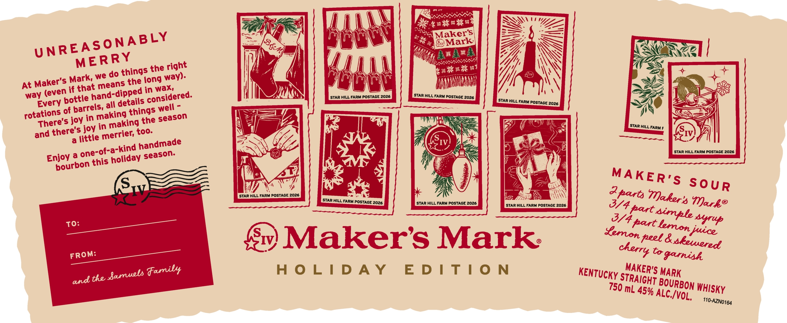

# TTB COLA Label Images - TTBID 26027001000352

**Brand Name:** MAKER'S MARK

**Issue Date:** 01/28/2026

**Origin Code:** 22

**Product Class/Type:** 101

**Source:** [TTB Public COLA Registry](https://ttbonline.gov/colasonline/viewColaDetails.do?action=publicFormDisplay&ttbid=26027001000352)

## Label Images

### Label 1

### Label 2

## Extracted Label Text

*Text extracted via OCR - may contain errors*

### Label 1

{|

Li

\

Pore anes

Z

ZZ

=

4p.

‘a

\

Maker's

Swe

Se

ar

ZY

FF Wz

UNR

EASONABLY

}

WS

INS

ERRY

My}

\

a

SW

ings t

he right

Ath

WN

Maker's M Ks

fhe (ong way

HAINAUT

yy

j

as

=

ri

Noe

y (eve

thi

ON

scan wu rarurostast 2025

STAR HILL FARM POSTAGE 2026

(;

me

)

=>

Ev

pottie

etails cons

idered

—

STAR HILL FARM POSTAGE 2026

t )

rotations of barr

els,

gs

fi

QS

The

king the season

-F

v/

too

l=,

STAR HILL FARM F

IV,

and there’ tle merrief,

=)

IV

ye]

- -a-kind

handmade

‘STAR HILL FARM POSTAGE 2026

Enjoy @

o ‘this holiday

seaso!

ry

pourb’

x

4

(S..)

WV

S SOUR

i ILL FARM POSTAGE 2026

STAR HILL FARM POSTAGE 2026

STAR HILL FARM POSTAGE 2026

L FARM POSTAGE 2026

9

WY: F part.

Vark®

syrup

Sv) Maker’s Mark:

FROM

F

Co garnish

HOLIDAY EDITION

MAKER"

KENTUCKy g

A

TRAIGHT B

OURB

ON WHIsky

750 mL 45%

ALC/y

OL.

T10-AZNO164

### Label 2

Certified

Maker’s Mark is proud to be a Certified B

Corporation™, meeting the highest standards

of social and environmental impact

—E=

B)

@ Home to the world’s largest white oak research forest.

Corporati

For more information, visit makersmark.com/sustainability

GOVERNMENT WARNING

(1) ACCORDING TQ THE

SURGEON GENERAL, WOMEN SHOULD NOT DRINK ALCOHOLIC

BEVERAGES DURING PREGNANCY BECAUSE OF THE RISK OF

BIRTH DEFECTS. (2) CONSUMPTION OF ALCOHOLIC BEVERAGES

IMPAIRS YOUR ABILITY 10 DRIVE A CAR OR OPERATE

MACHINERY, AND MAY CAUSE HEALTH PROBLEMS

DISTILLED, AGED AND BOTTLED BY

9 DRINKSMART.COM

THE MAKER'S MARK DISTILLERY, INC

Olea

STAR HILL FARM, LORETTO, KY. USA

“is

NOT FOR UNDERAGE PLEASE ENJOY RESPONSIBLY.

fie

Per 1.5 Fl. Oz. Average Analysis:

ie

Calories: 109; Carhs: Og: Protein: Og: Fat: Og

ME VT REF 15¢

UA CRY

IA REF ]

j| mL

i

Ih]

85246

I

BOTTLE
