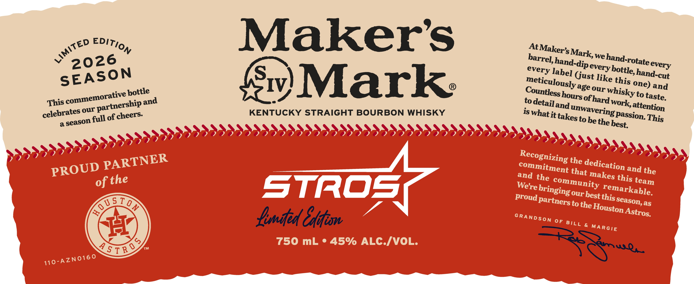
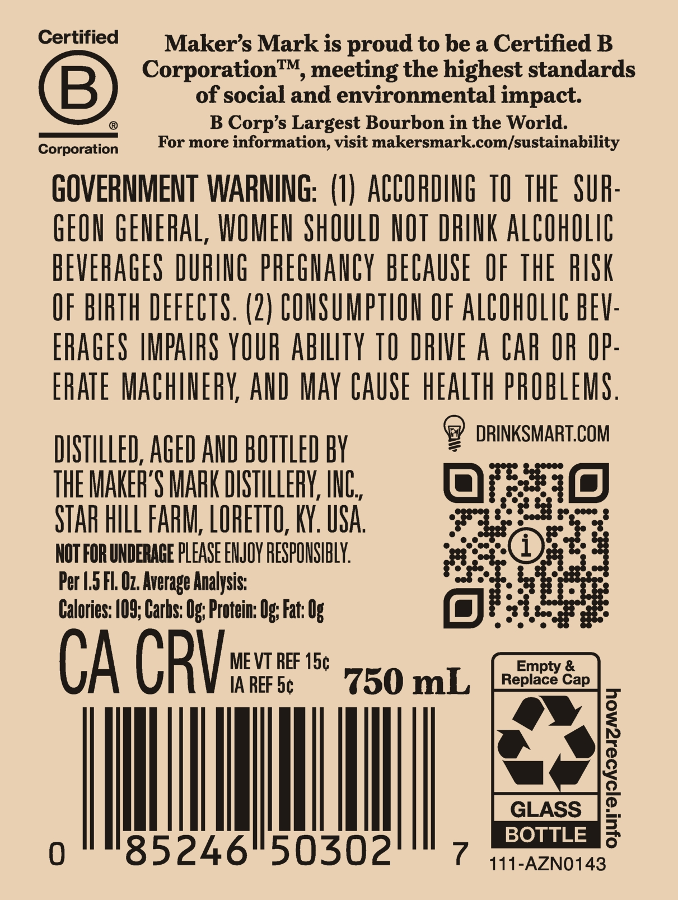

# TTB COLA Label Images - TTBID 26027001000355

**Brand Name:** MAKER'S MARK

**Issue Date:** 01/28/2026

**Origin Code:** 22

**Product Class/Type:** 101

**Source:** [TTB Public COLA Registry](https://ttbonline.gov/colasonline/viewColaDetails.do?action=publicFormDisplay&ttbid=26027001000355)

## Label Images

### Label 1

### Label 2

## Extracted Label Text

*Text extracted via OCR - may contain errors*

### Label 1

Maker's

At Maker

‘arrel, h,

k, we hand-

2026

tate eve

every lab

ust lik

Pevery bo e,

hand-cyt

SEASON

Meticulous

S One) ang

Ountless ho

Se our whi

orative pottle

{w)M ark:

sky to taste

This comme

artnership a™

oan attentio

celebrates o

KENTUCKY STRAIGHT BOURBON WHISKY

8 Passion Thi

full of cheers-

is what it takes to be, e

Lemited Eifion

Ee.

### Label 2

Certified

Maker’s Mark is proud to be a Certified B

Corporation™, meeting the highest standards

of social and environmental impact.

8)

®

B Corp’s Largest Bourbon in the World.

Corporation

For more information, visit makersmark.com/sustainability

GOVERNMENT WARNING: (1) ACCORDING 10 THE SUR-

GEON GENERAL, WOMEN SHOULD NOT DRINK ALCOHOLIC

BEVERAGES DURING PREGNANCY BECAUSE OF THE RISK

OF BIRTH DEFECTS. (2) CONSUMPTION OF ALCOHOLIC BEV-

ERAGES IMPAIRS YOUR ABILITY TO DRIVE A CAR OR OP-

ERATE MACHINERY, AND MAY CAUSE WEALTH PROBLEMS.

cs) DRINKSMART.COM

DISTILLED, AGED AND BOTTLED BY

THE MAKER'S MARK DISTILLERY, INC.

Ole #10)

8 TEE sepceee

STAR HILL FARM, LORETTO, KY. USA.

NOT FOR UNDERAGE PLEASE ENJOY RESPONSIBLY.

Per 1.5 Fl. O7. Average Analysis:

Calories: 109; Carhs: Og; Protein: Og; Fat: 0

osha

CA CRY

MEVT REF 15¢

IA REF 5¢

750 mL

ll

AM

6°50302

BOTTLE

¢ 111-AZN0143
