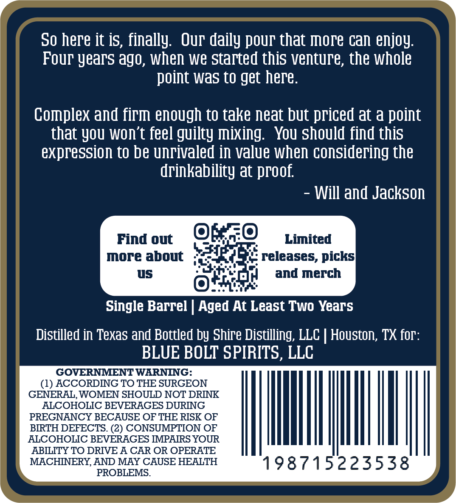
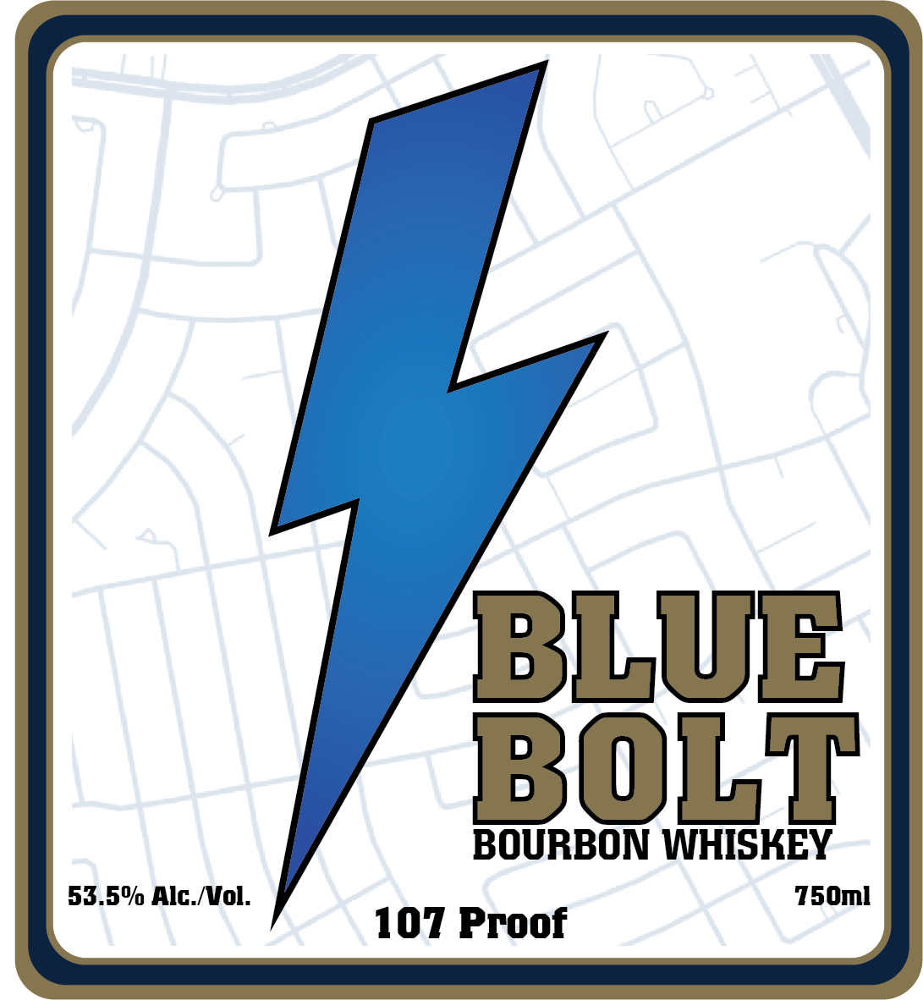

# TTB COLA Label Images - TTBID 26027001000468

**Brand Name:** BLUE BOLT BOURBON WHISKEY

**Issue Date:** 02/09/2026

**Origin Code:** 44

**Product Class/Type:** 141

**Source:** [TTB Public COLA Registry](https://ttbonline.gov/colasonline/viewColaDetails.do?action=publicFormDisplay&ttbid=26027001000468)

## Label Images

### Back Label

### Front Label

## Extracted Label Text

*Text extracted via OCR - may contain errors*

*1 image(s) excluded: text did not meet readability threshold*

### Back Label

So here it is, finally. Our daily pour that more can enjoy.
Four years ago, when we started this venture, the whole
point was to get here.

Complex and firm enough to take neat but priced at a point
that you won't feel guilty mixing. You should find this
expression to be unrivaled in value when considering the
drinkability at proof.

- Will and Jackson
rindo OSE sama
more about ;' eae releases, picks
us asin it] and merch
Ofna
Single Barrel | Aged At Least Two Years
Distilled in Texas and Bottled by Shire Distilling, LLC | Houston, TX for:
BLUE BOLT SPIRITS, LLC
GOVERNMENT WARNING:
ee | ill | | | | |
GENERAL, WOMEN SHOULD NOT DRINK
ALCOHOLIC BEVERAGES DURING
PREGNANCY BECAUSE OF THE RISK OF
BIRTH DEFECTS. (2) CONSUMPTION OF
ALCOHOLIC BEVERAGES IMPAIRS YOUR
ABILITY TO DRIVE A CAR OR OPERATE
MACHINERY, AND MAY CAUSE HEALTH
AND MAY C: 198715223538
