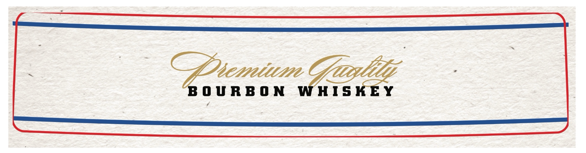
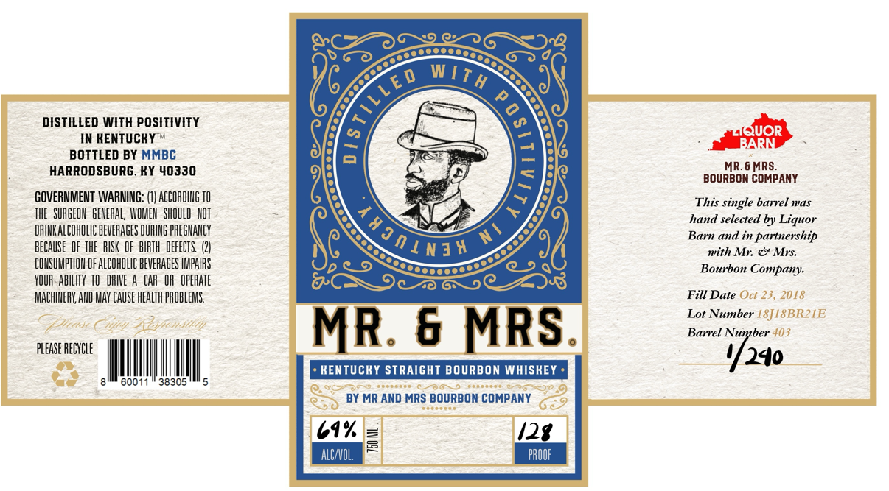

# TTB COLA Label Images - TTBID 26027001000511

**Brand Name:** MR. & MRS.

**Issue Date:** 02/25/2026

**Origin Code:** 22

**Product Class/Type:** 101

**Source:** [TTB Public COLA Registry](https://ttbonline.gov/colasonline/viewColaDetails.do?action=publicFormDisplay&ttbid=26027001000511)

## Label Images

### Back Label

### Front Label

## Extracted Label Text

*Text extracted via OCR - may contain errors*

*1 image(s) excluded: text did not meet readability threshold*

### Front Label

DISTILLED WITH POSITIVITY
IN RENTUCRY™
BOTTLED BY MMBC
HARRODSBURG. KY 40330

GOVERNMENT WARNING: (1) ACCORDING 10
THE SURGEON GENERAL, WOMEN SHOULD NOT
DRINKALCOHOLIC BEVERAGES DURING PREGNANCY
BECAUSE OF THE RISK OF BIRTH DEFECTS. (2)
CONSUMPTION OF ALCOHOLIC BEVERAGES IMPAIRS
YOUR-ABILITY TO DRIVE A CAR OR OPERATE
MACHINERY, AND MAY CAUSE HEALTH PROBLEMS.

A,

60011" 38305

PLEASE RECYCLE

MR. 6 MRS.

» RENTUCKY STRAIGHT BOURBON WHISKEY -

BY MR AND MRS BOURBON COMPANY

61% /2g
pwc |

TOML

aD.

MR.6MRS.
BOURBON COMPANY
This single barrel was
hand selected by Liquor
Barn and in partnership
with Mr. & Mrs.
Bourbon Company.

Fill Date Oct 23, 2018

Lot Number (8]18BR21E
Barrel Number 403

4/240
