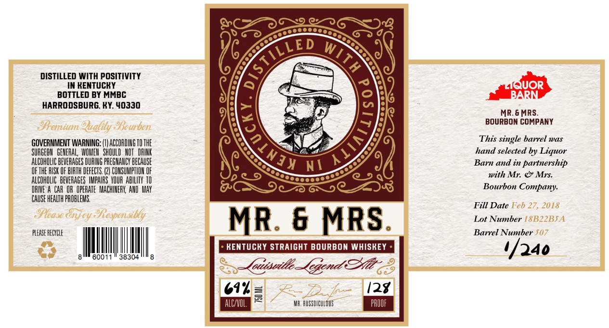
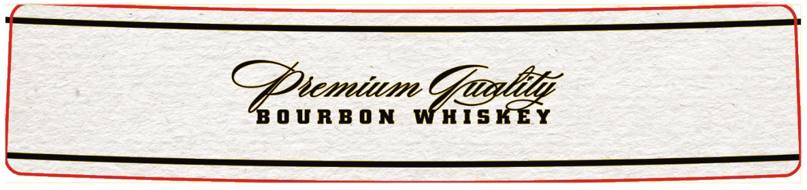

# TTB COLA Label Images - TTBID 26027001000526

**Brand Name:** MR. & MRS.

**Fanciful Name:** LOUISVILLE LEGEND ALT

**Issue Date:** 02/25/2026

**Origin Code:** 22

**Product Class/Type:** 101

**Source:** [TTB Public COLA Registry](https://ttbonline.gov/colasonline/viewColaDetails.do?action=publicFormDisplay&ttbid=26027001000526)

## Label Images

### Front Label

### Label 2

### Label 3

## Extracted Label Text

*Text extracted via OCR - may contain errors*

*2 image(s) excluded: text did not meet readability threshold*

### Front Label

ea)

GSD

vc o

qessccece

eX

/¢

V LED Ww,

A

AS

DISTILLED WITH POSITIVITY

IN KENTUCKY

=

SS \e'

BOTTLED BY MMBC

Me

oy.

HARRODSBURG. KY, 40330

Cc——_

at

*)\el

eo] >

R.6 MRS.

~ Je,

BOURBON COMPANY

This single barrel was

GOVERNMENT WARNING: (}) ACCORDING TO THE

w

ae)

SURGEON GENERAL, WOMEN SHOULD NOT ORINK

<4

hand selected by Liquor

ALCOHOLIC BEVERAGES DURING PREGNANCY BECAUSE

NG

Jy ys

ah

Barn and in partnership

OFTHE RISK OF BIRTH DEFECTS. (2) CONSUMPTION OF

PII)

moon

e534

with Mr. & Mrs.

ALCOHOLIC BEVERAGES IMPAIRS YOUR ABILITY TO

DRIVE A CAR OR OPERATE MACHINERY, AND MAY

C9

G0C ZZ)

Bourbon Company.

(CAUSE HEALTH PROBLEMS.

Fill Date

Lot Number

MR. & MRS.

Barrel Number

I

|

- KENTUCKY STRAIGHT BOURBON WHISKEY +

PLEASE ECC

|

60011

38304

,

4/240

—Ceisaile jen Ze:

12%

WA. RUSSDICULOUS

EE
