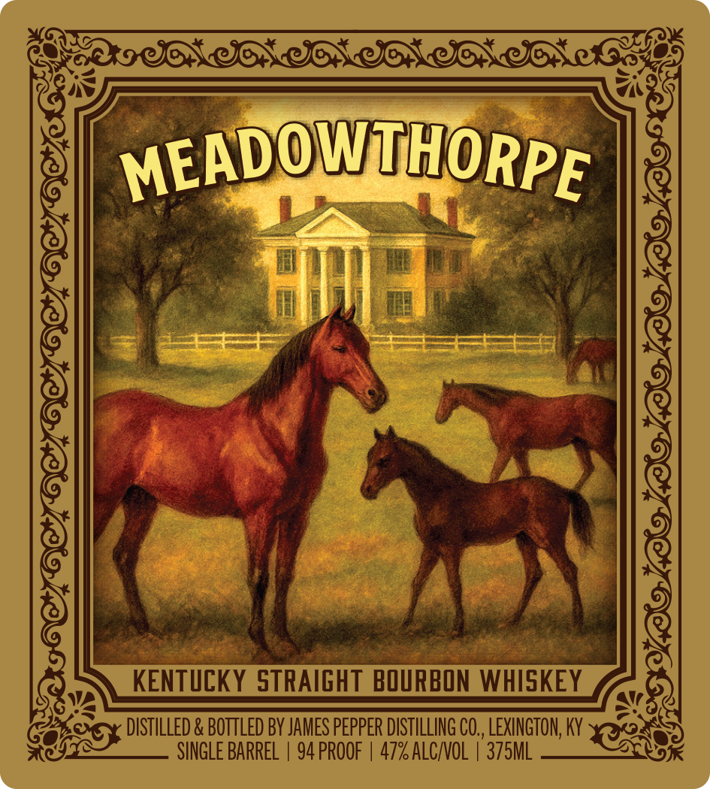
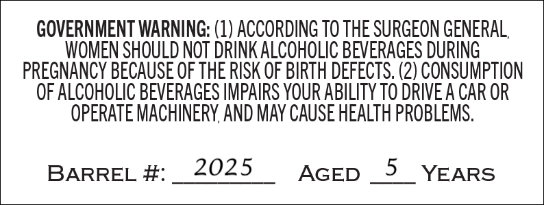

# TTB COLA Label Images - TTBID 26027001000577

**Brand Name:** MEADOWTHORPE

**Issue Date:** 01/28/2026

**Origin Code:** 22

**Product Class/Type:** 101

**Source:** [TTB Public COLA Registry](https://ttbonline.gov/colasonline/viewColaDetails.do?action=publicFormDisplay&ttbid=26027001000577)

## Label Images

### Label 1

### Label 2

## Extracted Label Text

*Text extracted via OCR - may contain errors*

### Label 1

SIR IRIS IRIAN GEE
Oe = TW}
of 7 ae

SK i i at ae
WEADOWALHORPE
* Cie hee ee
6 Ve i Sig
ee a i a: SS f oe ae =F od
{ff ȴ
Qw KENTUCKY STRAIGHT BOURBON WHISKEY ay)
o on DISTILLED & BOTTLED BY JAMES PEPPER DISTILLING CO., LEXINGTON, KY ans
Geren Os SINGLE BARREL | 94 PROOF | 47% ALC/VOL | 375ML VAY

### Label 2

GOVERNMENT WARNING: (1) ACCORDING TO THE SURGEON GENERAL,
WOMEN SHOULD NOT DRINK ALCOHOLIC BEVERAGES DURING
PREGNANCY BECAUSE OF THE RISK OF BIRTH DEFECTS. (2) CONSUMPTION
OF ALCOHOLIC BEVERAGES IMPAIRS YOUR ABILITY TO DRIVE A CAR OR
OPERATE MACHINERY, AND MAY CAUSE HEALTH PROBLEMS.

BARREL #:__2025 AGED _5_ YEARS
