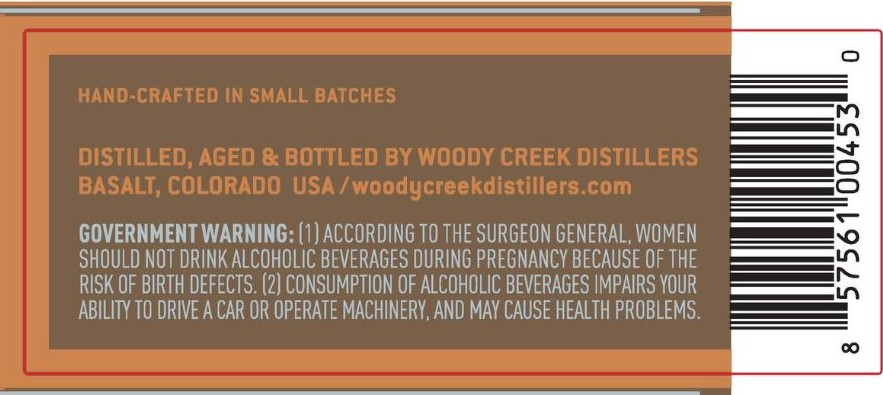
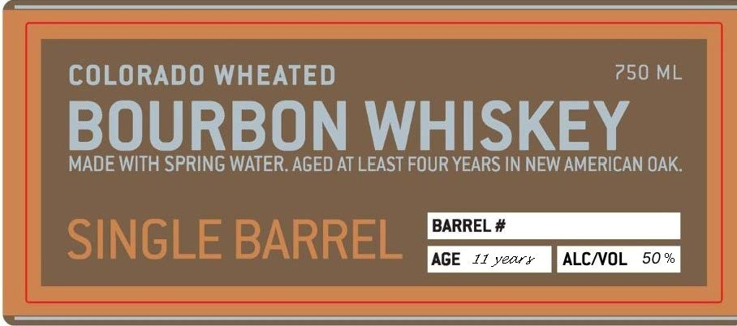

# TTB COLA Label Images - TTBID 26027001000715

**Brand Name:** COLORADO WHEATED

**Issue Date:** 02/04/2026

**Origin Code:** 13

**Product Class/Type:** 141

**Source:** [TTB Public COLA Registry](https://ttbonline.gov/colasonline/viewColaDetails.do?action=publicFormDisplay&ttbid=26027001000715)

## Label Images

### Back Label

### Front Label

## Extracted Label Text

*Text extracted via OCR - may contain errors*

### Back Label

GOVERNMENT WARNING: (1) ACCORDING TO THE SURGEON GENERAL, WOMEN

SHOULD NOT DRINK ALCOHOLIC BEVERAGES DURING PREGNANCY BECAUSE OF THE

RISK OF BIRTH DEFECTS. (2) CONSUMPTION OF ALCOHOLIC BEVERAGES IMPAIRS YOUR

ABILITY TO DRIVE A CAR OR OPERATE MACHINERY, AND MAY CAUSE HEALTH PROBLEMS.

### Front Label

COLORADO WHEATED

750 ML

BOURBON WHISKEY

MADE WITH SPRING WATER. AGED AT LEAST FOUR YEARS IN NEW AMERICAN OAK.

ALC/VOL 50%
