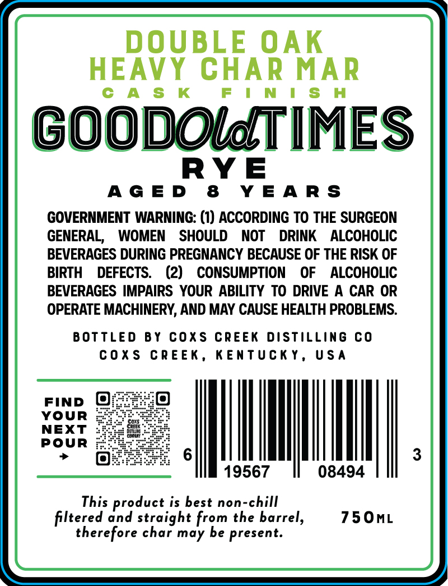
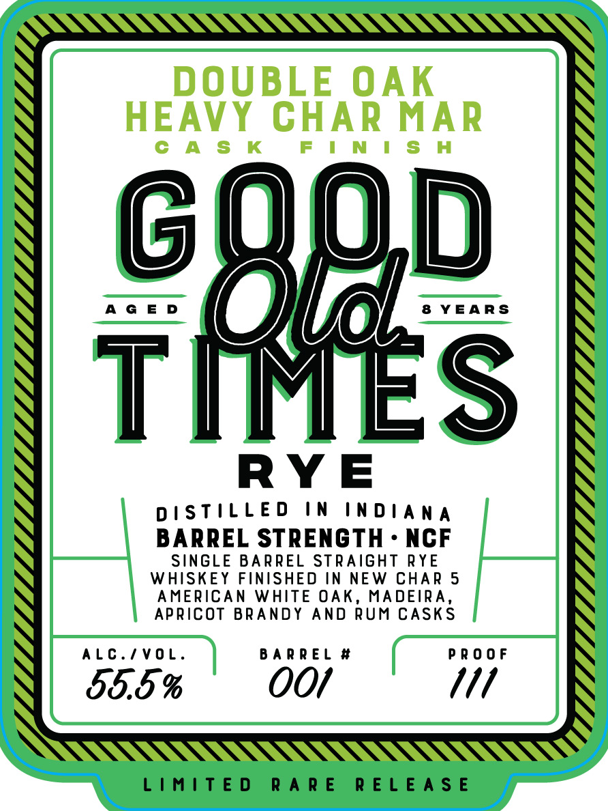

# TTB COLA Label Images - TTBID 26027001000716

**Brand Name:** GOOD OLD TIMES RYE

**Fanciful Name:** DOUBLE OAK HEAVY CHAR MAR CASK FINISH

**Issue Date:** 02/09/2026

**Origin Code:** 22

**Product Class/Type:** 102

**Source:** [TTB Public COLA Registry](https://ttbonline.gov/colasonline/viewColaDetails.do?action=publicFormDisplay&ttbid=26027001000716)

## Label Images

### Back Label

### Front Label

## Extracted Label Text

*Text extracted via OCR - may contain errors*

### Back Label

DOUBLE OAK

HEAVY CHAR MAR

CAS K

FIN IS H

GO

=

DOLATIMES

RYE

AGED 8 YEARS

GOVERNMENT WARNING: (1) ACCORDING TO THE SURGEON

GENERAL, WOMEN SHOULD NOT DRINK ALCOHOLIC

BEVERAGES DURING PREGNANCY BECAUSE OF THE RISK OF

BIRTH DEFECTS. (2) CONSUMPTION OF ALCOHOLIC

BEVERAGES IMPAIRS YOUR ABILITY TO DRIVE A CAR OR

OPERATE MACHINERY, AND MAY CAUSE HEALTH PROBLEMS.

BOTTLED BY COXS CREEK DISTILLING CO

COXS CREEK, KENTUCKY, USA

FIND @

YOUR

NEXT

POUR

LM

J

19567

08494

This product is best non-chill

750mL

filtered and straight from the barrel,

therefore char may be present.

### Front Label

N

GUOD

AGED

8 YEARS

YA |

RYE

DISTILLED IN INDIANA

BARREL STRENGTH - NCF

SINGLE BARREL STRAIGHT RYE

WHISKEY FINISHED IN NEW CHAR 5

AMERICAN WHITE OAK, MADEIRA,

APRICOT BRANDY AND RUM CASKS

ALC./VOL.

BARREL #

PROOF

55.5 %

O0O/

111

\

LIMITED RARE RELEASE
