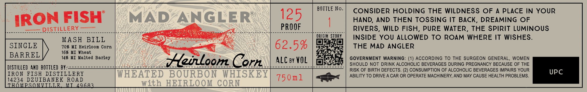

# TTB COLA Label Images - TTBID 26027001000722

**Brand Name:** MAD ANGLER

**Issue Date:** 02/04/2026

**Origin Code:** 06

**Product Class/Type:** 141

**Source:** [TTB Public COLA Registry](https://ttbonline.gov/colasonline/viewColaDetails.do?action=publicFormDisplay&ttbid=26027001000722)

## Label Images

### Label 1

## Extracted Label Text

*Text extracted via OCR - may contain errors*

### Label 1

BOTTLE No.

CONSIDER HOLDING THE WILDNESS OF A PLACE IN YOUR

125

IRON FISH

HAND, AND THEN TOSSING IT BACK, DREAMING OF

ener

= DISTILLERY

Shee eS i oeaeccecer noe CAIRN A

Sal

BEE NA Ne --ee be e

PROOF

RIVERS, WILD FISH, PURE WATER, THE SPIRIT LUMINOUS

ORIGIN: STORY

INSIDE YOU ALLOWED TO ROAM WHERE IT WISHES

MASH BILL

Sy)

¥

70% MI Heirloom Corn

16% MI Wheat

Ss

62.5%

a

THE MAD ANGLER

Ea)

14% MI Malted Barley

ALC ay VOL

Opps

SHOULD NOT DRINK ALCOHOLIC BEVERAGES DURING PREGNANCY BECAUSE OF THE

GOVERNMENT WARNING: (1) ACCORDING TO THE SURGEON GENERAL, WOMEN

DISTILLED AND BOTTLED BY:-

Saoeonnemacessoe MARES ares op OS™ (SS

i, | Orn.

esos lh

RISK OF BIRTH DEFECTS. (2) CONSUMPTION OF ALCOHOLIC BEVERAGES IMPAIRS YOUR

IRON FISH DISTILLERY

ABILITY TO DRIVE A CAR OR OPERATE MACHINERY, AND MAY CAUSE HEALTH PROBLEMS.

UPC

14234

ROAD

750m1

=<

HO}

Dg TE ANE

M
