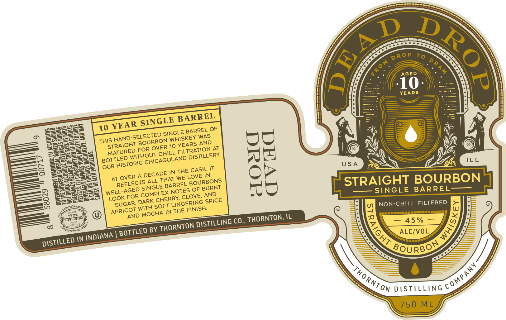

# TTB COLA Label Images - TTBID 26027001000875

**Brand Name:** DEAD DROP

**Issue Date:** 02/04/2026

**Origin Code:** 04

**Product Class/Type:** 101

**Source:** [TTB Public COLA Registry](https://ttbonline.gov/colasonline/viewColaDetails.do?action=publicFormDisplay&ttbid=26027001000875)

## Label Images

### Label 1

## Extracted Label Text

*Text extracted via OCR - may contain errors*

### Label 1

<s

=

Dp D

—

Ss

5a)

<

> P

To

RY

Yo

ae)

YEARS

—

—

=

———

——

Of

————

—

——

ARREL

I

id

23)

se

a=

10 YEA

R SINGLE

71

NK

Be

eS

Sa

si

NGLE BARREL OF

Besse

HIS HAN

[p-SELECTED

N WHISK!

EY WAS

See

saa

STRAIGHT

0 YEA

RS AND

wis

ys

LS)

2222

fos eee

er

MATURED

UT CHILL FILTR

TION AT

f @ y

eX

|

B25

BOTTLED W’

ITH!

CAGOLAND D!

ISTILLERY.

cr”

HEE

So'

oe

i

OUR HISTOR!

ic CHI

USA

Za

Se

as

es

E CASK, \T

s=a

Pater aed

JT OVER A

DECADE IN TH

LOVE IN

eo

=o

REFLECTS Al

L BOURBONS.

STRAIGHT BOURBON

on

eA

ELL

AGED SING!

TES OF BURNT

— SINGLE BARREL——

wea

FS)

fateh

ae

OOK FOR

E, AND.

mo

ee

UG:

Neral

NG SPICE

NON-CHILL FILTERED Bee

=

APRICOT

WITH SO!

\N THE FINISH.

AN

D MOCHA

a

THORNTON, IL

A = 45% = f

ISTILLING C

ae

TTLE

_—_——

p BY THORNTON D

Lae

RS

DISTILLED IN \N

80uRBO

Chg

(4 Py

ON TTT
