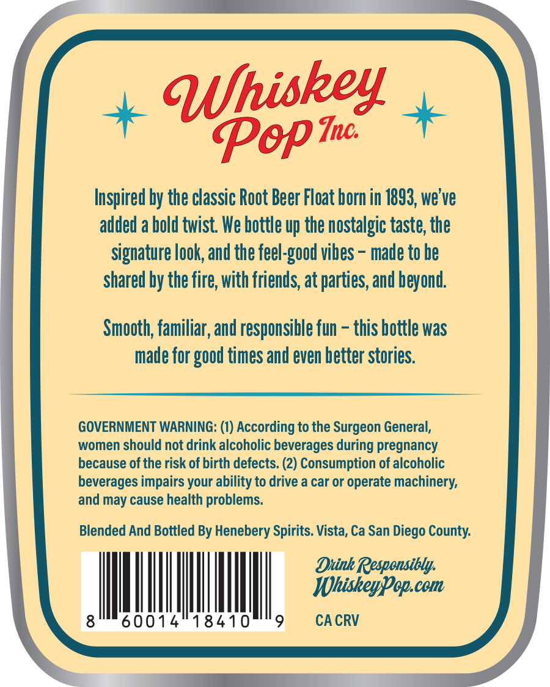
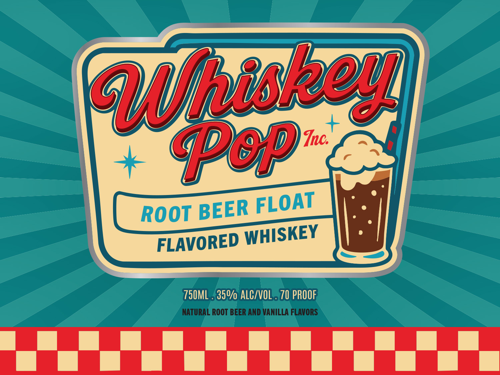

# TTB COLA Label Images - TTBID 26027001000943

**Brand Name:** WHISKEY POP

**Issue Date:** 03/03/2026

**Origin Code:** 01

**Product Class/Type:** 149

**Source:** [TTB Public COLA Registry](https://ttbonline.gov/colasonline/viewColaDetails.do?action=publicFormDisplay&ttbid=26027001000943)

## Label Images

### Back Label

### Front Label

## Extracted Label Text

*Text extracted via OCR - may contain errors*

### Back Label

+ Wpishey

Pop +

Inspired by the classic Root Beer Float born in 1893, we've

added a hold twist. We hottle up the nostalgic taste, the

signature look, and the feel-good vihes - made to he

shared hy the fire, with friends, at parties, and beyond

Smooth, familiar, and responsible fun - this bottle was

made for good times and even better stories

GOVERNMENT WARNING: (1) According to the Surgeon General,

women should not drink alcoholic beverages during pregnancy

because of the risk of birth defects. (2) Consumption of alcoholic

beverages impairs your ability to drive a car or operate machinery,

and may cause health problems.

Blended And Bottled By Henebery Spirits. Vista, Ca San Diego County.

iim

ll

I

|

|

I

18410

### Front Label

750ML {35% A

NATURAL ROOT BEER AND VANILLA FLAVORS
