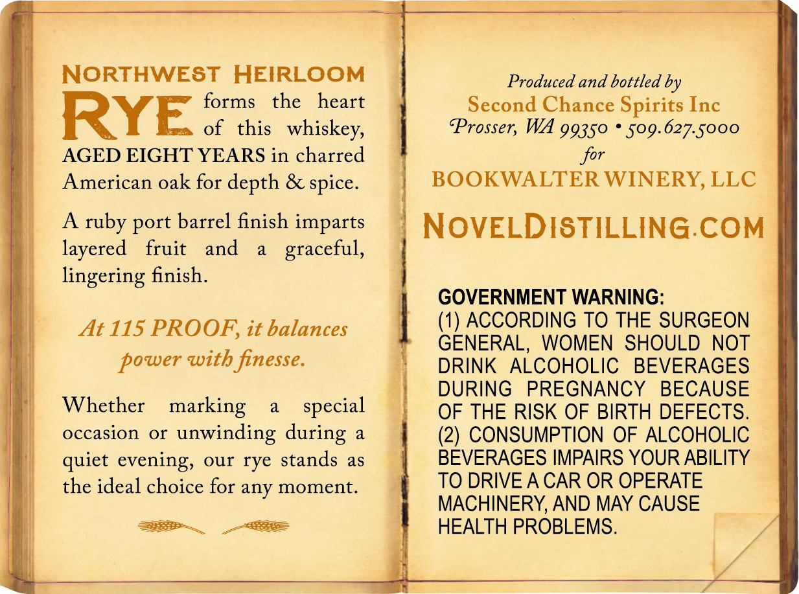
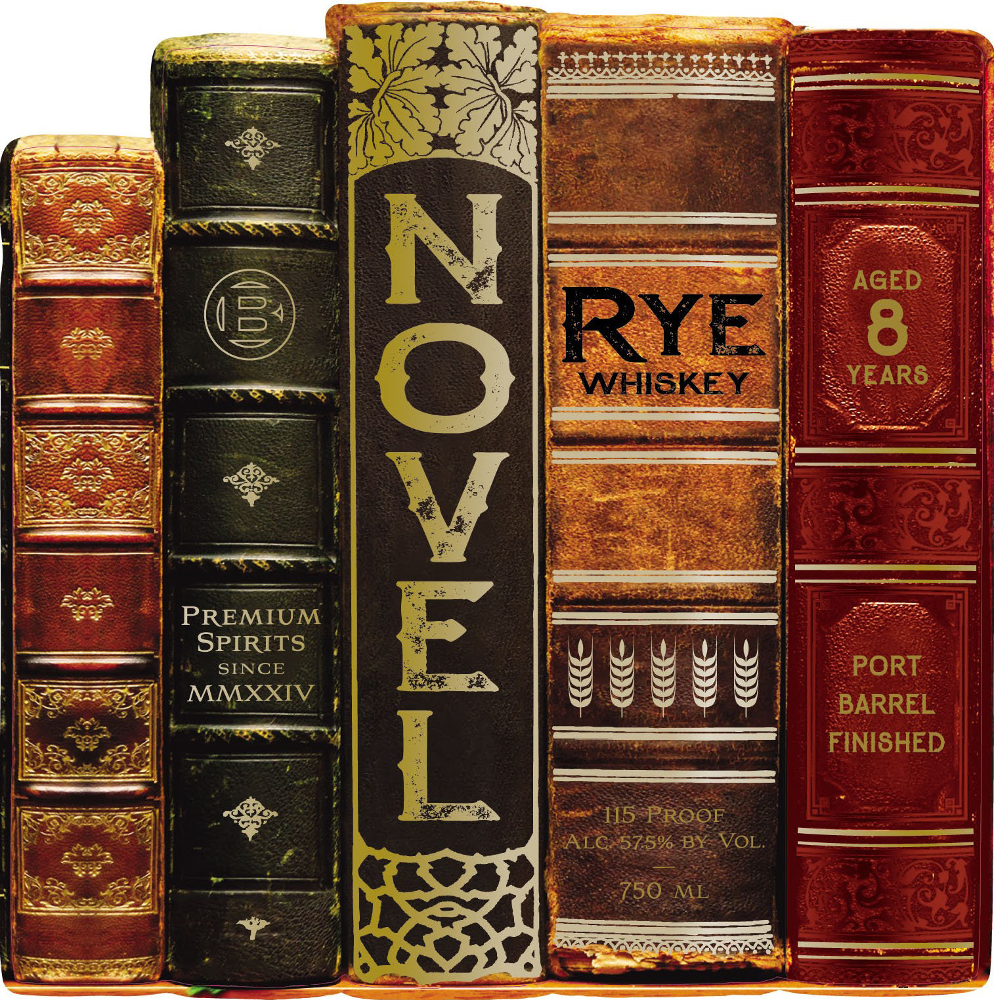

# TTB COLA Label Images - TTBID 26027001001032

**Brand Name:** NOVEL

**Issue Date:** 02/04/2026

**Origin Code:** 07

**Product Class/Type:** 142

**Source:** [TTB Public COLA Registry](https://ttbonline.gov/colasonline/viewColaDetails.do?action=publicFormDisplay&ttbid=26027001001032)

## Label Images

### Back Label

### Front Label

## Extracted Label Text

*Text extracted via OCR - may contain errors*

### Back Label

NORTHWEST HEIRLOOM
RYE. forms the heart

of this whiskey,
AGED EIGHT YEARS in charred
American oak for depth & spice.

A ruby port barrel finish imparts
layered fruit and a graceful,
lingering finish.

At 115 PROOF, it balances

power with finesse.

Whether marking a_ special
occasion or unwinding during a
quiet evening, our rye stands as
the ideal choice for any moment.

BaSS~_ OSES

Produced and bottled by
Second Chance Spirits Inc
Prosser, WA 99350 * 509.627.5000

for

BOOKWALTER WINERY, LLC
NOVELDISTILLING.COM

GOVERNMENT WARNING:
(1) ACCORDING TO THE SURGEON
GENERAL, WOMEN SHOULD NOT
DRINK ALCOHOLIC BEVERAGES
DURING PREGNANCY BECAUSE
OF THE RISK OF BIRTH DEFECTS.
(2) CONSUMPTION OF ALCOHOLIC
BEVERAGES IMPAIRS YOUR ABILITY
TO DRIVE ACAR OR OPERATE
MACHINERY, AND MAY CAUSE
HEALTH PROBLEMS.

### Front Label

ee Sr

LTE

is,

=,

Pett +

OR EB EY

CREAR CAS

vs

¥.

Satie

settt

a

x

fea

—

pa

La

)

SoS

oe

—

En

a

ee

Sea

a

ey

a coaercene

=

PREMIUM

>»

SPIRITS

SENCE

ek

MMXXIV

—*

eu EES

ec

So

tat

arama

oo

SOx = oe)

a

—

a,

aes
