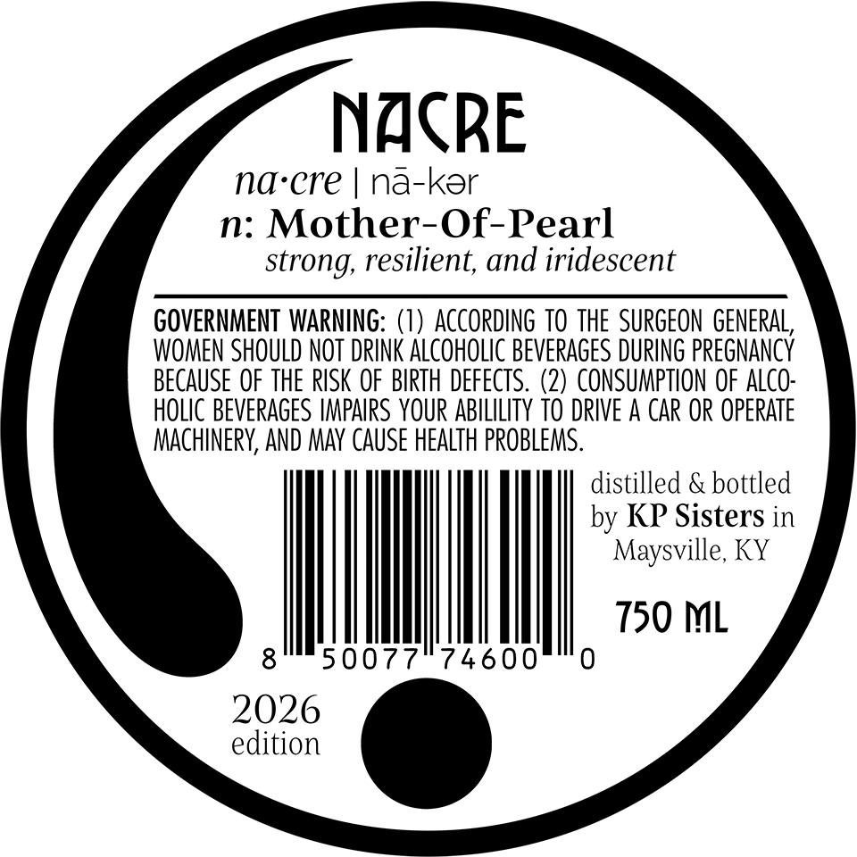
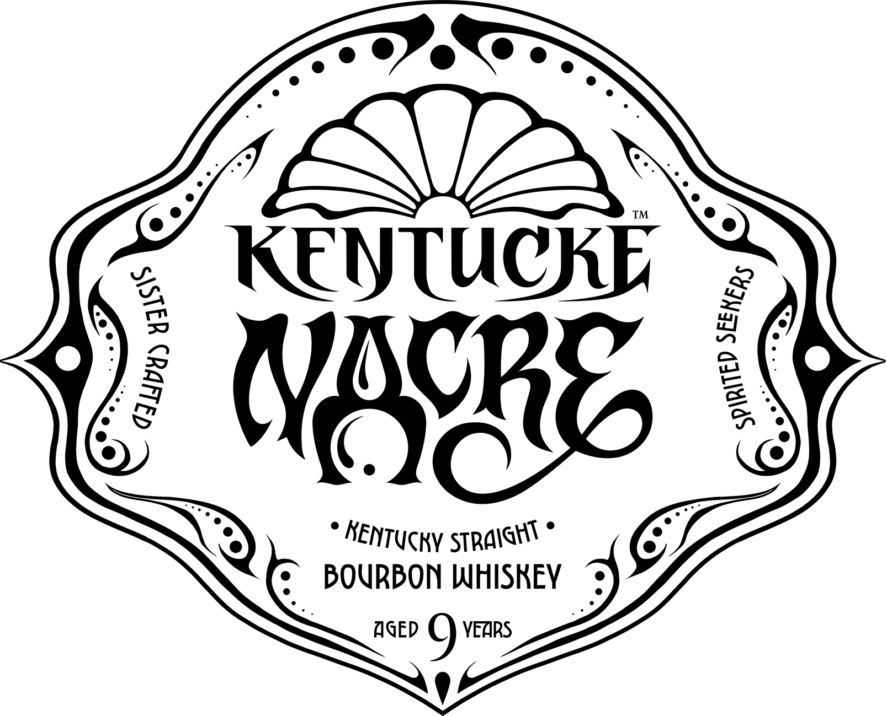
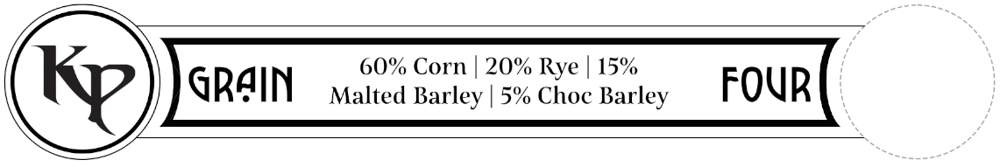
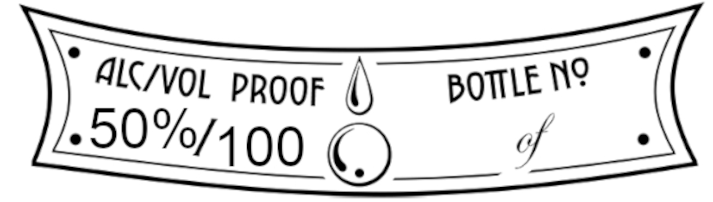
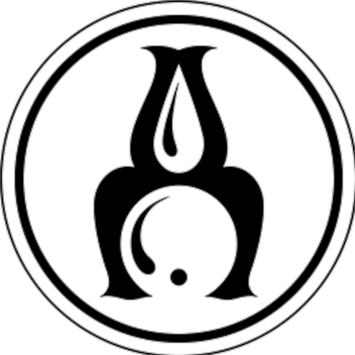
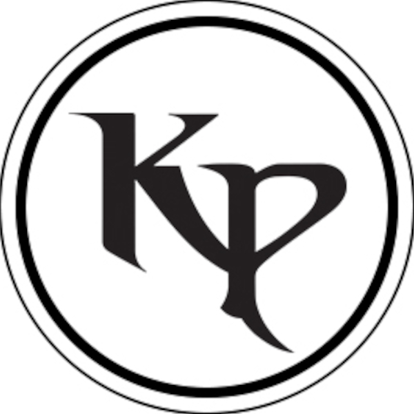

# TTB COLA Label Images - TTBID 26027001001097

**Brand Name:** KENTUCKY NACRE

**Fanciful Name:** KENTUCKY STRAIGHT BOURBON WHISKEY

**Issue Date:** 02/05/2026

**Origin Code:** 22

**Product Class/Type:** 101

**Source:** [TTB Public COLA Registry](https://ttbonline.gov/colasonline/viewColaDetails.do?action=publicFormDisplay&ttbid=26027001001097)

## Label Images

### Back Label

### Label 1

### Label 2

### Label 3

### Label 4

### Label 5

## Extracted Label Text

*Text extracted via OCR - may contain errors*

### Back Label

NACRE

na-cre | na-ker

n: Mother-Of-Pearl

strong, resilient, and iridescent

GOVERNMENT WARNING: (1) ACCORDING TO THE SURGEON GENERAL,

WOMEN SHOULD NOT DRINK ALCOHOLIC BEVERAGES DURING PREGNANCY

BECAUSE OF THE RISK OF BIRTH DEFECTS. (2) CONSUMPTION OF ALCO-

HOLIC BEVERAGES IMPAIRS YOUR ABILILITY TO DRIVE A CAR OR OPERATE

MACHINERY, AND MAY CAUSE HEALTH PROBLEMS

distilled & bottled

by KP Sisters in

Maysville, KY

|

150 ML

2026

edition

### Label 1

ONRBON WHISKEY

AGED 9 ven

### Label 2

60% Corn | 20% Rye | 15%

QR4IN x

alted Barley | 5% Choc Barley

FOUR

&

### Label 3

ALC/ VOL proor ()

BOTILE NP

-90%/100 oO”

of
