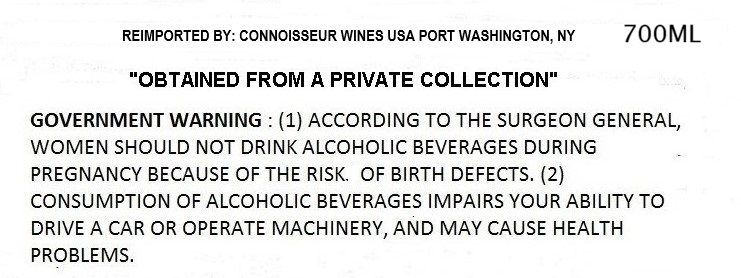
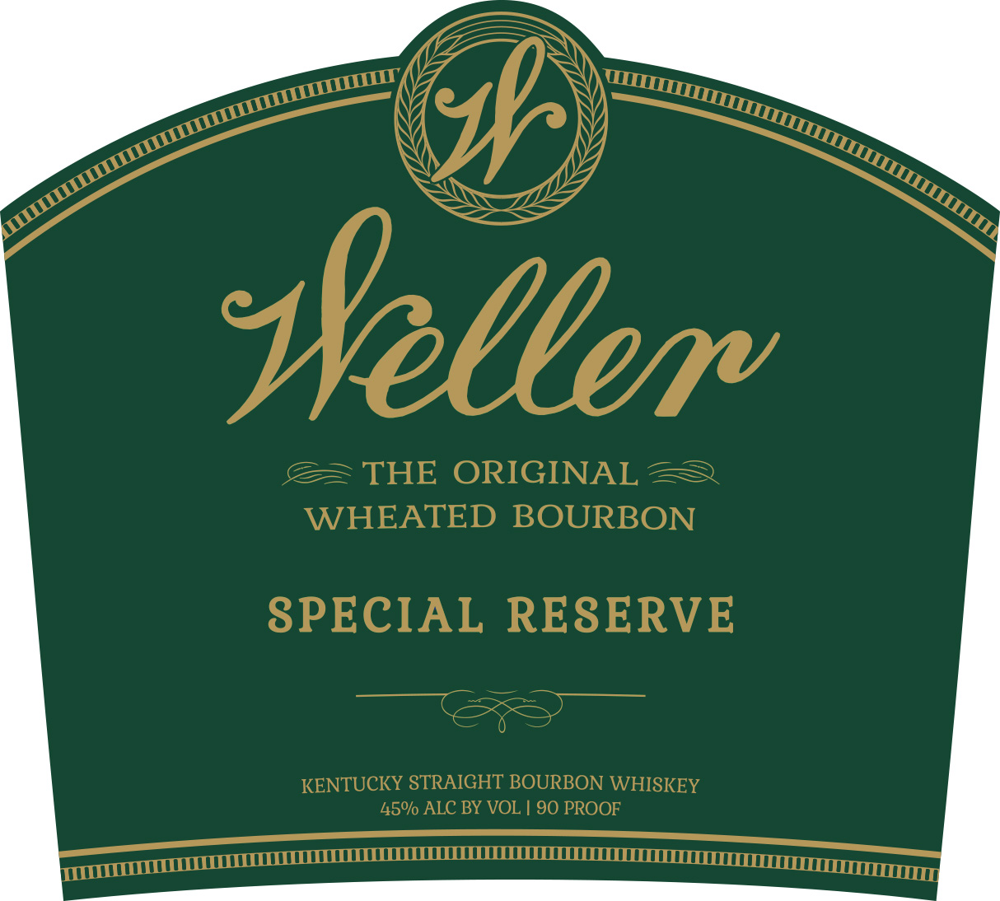

# TTB COLA Label Images - TTBID 26028001000165

**Brand Name:** WELLER

**Fanciful Name:** SPECIAL RESERVE

**Issue Date:** 01/28/2026

**Origin Code:** 22

**Product Class/Type:** 101

**Source:** [TTB Public COLA Registry](https://ttbonline.gov/colasonline/viewColaDetails.do?action=publicFormDisplay&ttbid=26028001000165)

## Label Images

### Back Label

### Label 1

## Extracted Label Text

*Text extracted via OCR - may contain errors*

### Back Label

REIMPORTED BY: CONNOISSEUR WINES USA PORT WASHINGTON, NY

700ML

“OBTAINED FROM A PRIVATE COLLECTION"

GOVERNMENT WARNING : (1) ACCORDING TO THE SURGEON GENERAL,

WOMEN SHOULD NOT DRINK ALCOHOLIC BEVERAGES DURING

PREGNANCY BECAUSE OF THE RISK. OF BIRTH DEFECTS. (2)

CONSUMPTION OF ALCOHOLIC BEVERAGES IMPAIRS YOUR ABILITY TO

DRIVE A CAR OR OPERATE MACHINERY, AND MAY CAUSE HEALTH

PROBLEMS.

### Label 1

oY
