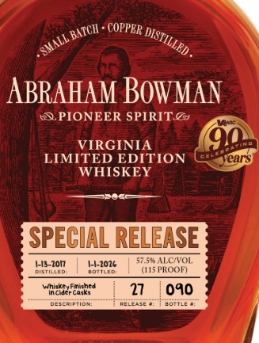

# TTB COLA Label Images - TTBID 26028001000169

**Brand Name:** ABRAHAM BOWMAN

**Fanciful Name:** WHISKEY FINISHED IN CIDER CASKS

**Issue Date:** 01/28/2026

**Origin Code:** 22

**Product Class/Type:** 140

**Source:** [TTB Public COLA Registry](https://ttbonline.gov/colasonline/viewColaDetails.do?action=publicFormDisplay&ttbid=26028001000169)

## Label Images

### Back Label

### Front Label

### Label 2

## Extracted Label Text

*Text extracted via OCR - may contain errors*

*1 image(s) excluded: text did not meet readability threshold*

### Back Label

ABRAHAM BOWMAN

S PIONEER SPIRIT. @&

SPECIAL RELEASE
WHISKEY

Colonel Abraham Bowman commanded the 8th Virginia
Regiment, one of the most outstanding fighting units in
the American Revolutionary War. He moved his family
to Kentucky in 1779 and was among its earliest settlers.

Bowman was active in politics and elected to the first bench
of justices in Lincoln County, Kentucky. Later he represented
Fayette County in the Kentucky constitutional convention.
Colonel Abraham Bowman was the great grandfather of
Abram Smith Bowman, founder of the A. Smith Bowman
Distillery. This limited edition whiskey honors
Colonel Abraham Bowman.

We love to hear from our customers! * 1-866-729-3722
abraham @asmithbowman.com * www.asmithbowman.com
PRODUCED BY A. SMITH BOWMAN DISTILLERY
SPOTSYLVANIA COUNTY, FREDERICKSBURG, VA

GOVERNMENT WARNING: (1) ACCORDING TO THE SURGEON GENERAL, WOMEN
SHOULD NOT DRINK ALCOHOLIC BEVERAGES DURING PREGNANCY BECAUSE
OF THE RISK OF BIRTH DEFECTS. (2) CONSUMPTION OF ALCOHOLIC BEVER-
AGES IMPAIRS YOUR ABILITY TO DRIVE A CAR OR OPERATE MACHINERY,

‘AND MAY CAUSE HEALTH PROBLEMS.

IAREF S¢
TT TT aT
750ML FPO 80% ida
| ll WNT Hill III t ||
0" "Q0000"000008"0

### Front Label

on “COPPER Mr, .
ABRAHAM BOWMAN
‘SS. PIONEER SPIRIT.@& E>
VIRGINIA
LIMITED EDITION pears
WHISKEY
ane
SPECIAL RELEASE
tsaon | Hame | SiisPoon:
wasereas? 1 040 }
