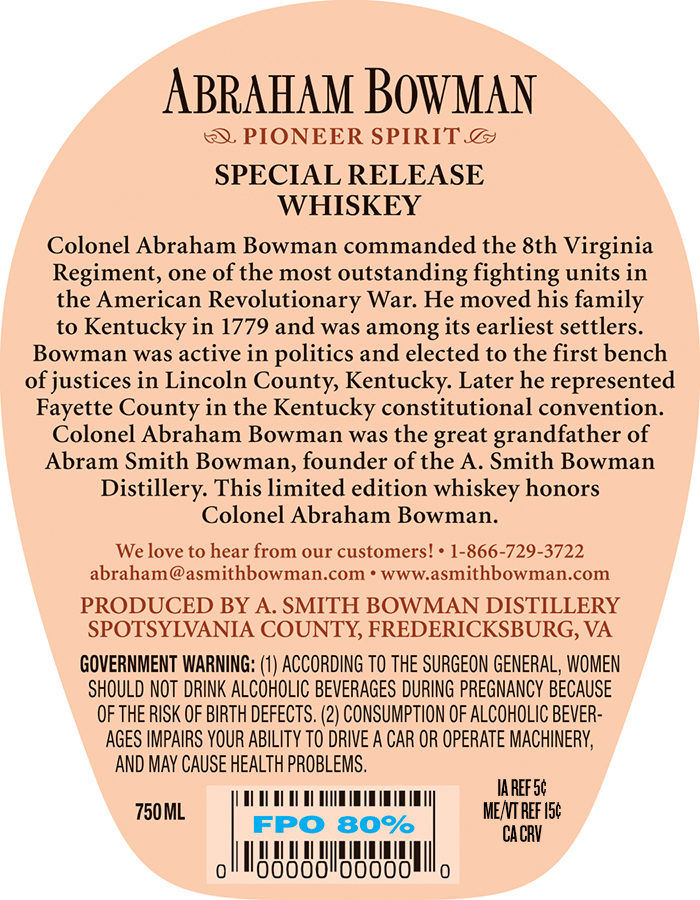
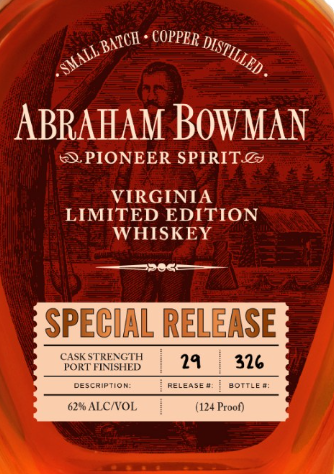

# TTB COLA Label Images - TTBID 26028001000175

**Brand Name:** ABRAHAM BOWMAN

**Fanciful Name:** CASK STRENGTH PORT FINISHED

**Issue Date:** 01/28/2026

**Origin Code:** 22

**Product Class/Type:** 140

**Source:** [TTB Public COLA Registry](https://ttbonline.gov/colasonline/viewColaDetails.do?action=publicFormDisplay&ttbid=26028001000175)

## Label Images

### Back Label

### Front Label

### Label 2

## Extracted Label Text

*Text extracted via OCR - may contain errors*

### Back Label

ABRAHAM BOWMAN

S PIONEER SPIRIT. @&

SPECIAL RELEASE

WHISKEY

Colonel Abraham Bowman commanded the 8th Virginia

Regiment, one of the most outstanding fighting units in

the American Revolutionary War. He moved his family

to Kentucky in 1779 and was among its earliest settlers.

Bowman was active in politics and elected to the first bench

of justices in Lincoln County, Kentucky. Later he represented

Fayette County in the Kentucky constitutional convention.

Colonel Abraham Bowman was the great grandfather of

Abram Smith Bowman, founder of the A. Smith Bowman

Distillery. This limited edition whiskey honors

Colonel Abraham Bowman.

We love to hear from our customers! * 1-866-729-3722

abraham @asmithbowman.com * www.asmithbowman.com

PRODUCED BY A. SMITH BOWMAN DISTILLERY

SPOTSYLVANIA COUNTY, FREDERICKSBURG, VA

GOVERNMENT WARNING: (1) ACCORDING TO THE SURGEON GENERAL, WOMEN

SHOULD NOT DRINK ALCOHOLIC BEVERAGES DURING PREGNANCY BECAUSE

OF THE RISK OF BIRTH DEFECTS. (2) CONSUMPTION OF ALCOHOLIC BEVER-

AGES IMPAIRS YOUR ABILITY TO DRIVE A CAR OR OPERATE MACHINERY,

‘AND MAY CAUSE HEALTH PROBLEMS.

UAT AY 00 OY UT YY

IAREF S¢

750ML

FPO 80%

MENTREF Ist

CACRY

0

I

00000

HMMA

|

A

00000

Il

0

### Front Label

XN

a patel: COPPER My

RS

ABRAHAM BOWMAN

PIONEER SPIRIT.@&

VIRGINIA

LIMITED EDITION

WHISKEY

SPE

CIAL RELEASE

24

326

Ol

### Label 2

a

366 80
