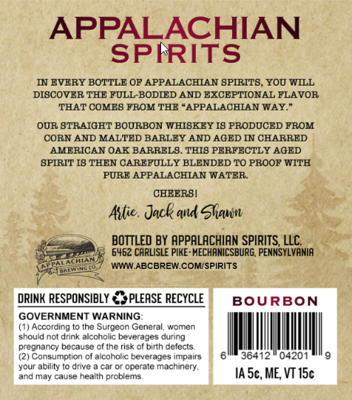
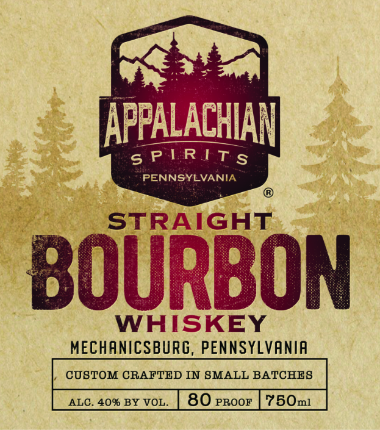

# TTB COLA Label Images - TTBID 26028001000719

**Brand Name:** APPALACHIAN SPIRITS

**Issue Date:** 02/05/2026

**Origin Code:** 39

**Product Class/Type:** 101

**Source:** [TTB Public COLA Registry](https://ttbonline.gov/colasonline/viewColaDetails.do?action=publicFormDisplay&ttbid=26028001000719)

## Label Images

### Back Label

### Front Label

## Extracted Label Text

*Text extracted via OCR - may contain errors*

### Back Label

IN EVERY BOTTLE OF APPALACHIAN SPIRITS, YOU WILL
DISCOVER THE FULL-BODIED AND EXCEPTIONAL FLAVOR
‘THAT COMES FROM THE “APPALACHIAN WAY.”

OUR STRAIGHT BOURBON WHISKEY IS PRODUCED FROM
CORN AND MALTED BARLEY AND AGED IN CHARRED
AMERICAN OAK BARRELS. THIS PERFECTLY AGED
SPIRIT IS THEN CAREFULLY BLENDED TO PROOF WITH
PURE APPALACHIAN WATER.

CHEERS!

Asie. Jack and Mave

Sscggm BOTTLED BY APPALACHIAN SPIRITS, LLC.
Seem fe 6462 CARLISLE PIKE-MECHANICSBURG, PENNSYLVANIA
ee WWW.ABCBREW.COM/SPIRITS
is :

DRINK RESPONSIBLY €%PLEASE RECYCL BOURBON

### Front Label

APPALACHIAN

PENNSYLVANIA

PIRITS

STRA IGHT

B

Al

WHISKEY

MECHANICSBURG, PENNSYLVANIA

| CUSTOM CRAFTED IN SMALL BATCHES
