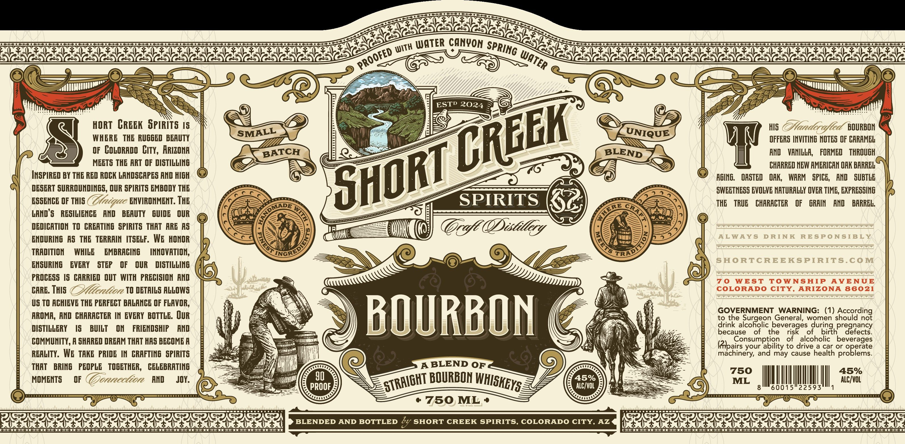
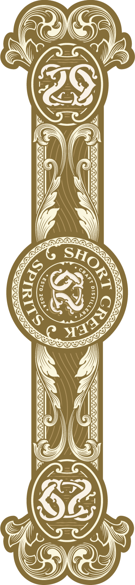

# TTB COLA Label Images - TTBID 26028001001114

**Brand Name:** SHORT CREEK SPIRITS

**Issue Date:** 03/02/2026

**Origin Code:** 11

**Product Class/Type:** 121

**Source:** [TTB Public COLA Registry](https://ttbonline.gov/colasonline/viewColaDetails.do?action=publicFormDisplay&ttbid=26028001001114)

## Label Images

### Label 1

### Label 2

## Extracted Label Text

*Text extracted via OCR - may contain errors*

*1 image(s) excluded: text did not meet readability threshold*

**Detected Proof:** 90

### Label 1

>

<eee

AKIN

vy, SS

WATER CANYON spp.

y

ISA SAISA SSA EA SASS BABES.

\\3

*) with

arith tes

bp

seen SA EEE

ye

&p

ae

ene

)

—<—_—__—

|

——©;:

Q

©)

ANTAL?

eur

=—S—

Sas

E30

ST

x

Sa

ee

aN

ESTP

YY),

ZB

Ag

Y,

On

SSN

WSN

ep

"

vcs

WY

{>

SS

“@

4Y

/

aT CREEK Tay I

Ws Andes

yf led

values

WHERE THE RUGGED BEAUTY

OFFERS INVITING NOTES OF CARAMEL

LM

a

OF CoLORADO City, ARIZONA

BLEND

AND VANILLA, FORMED THROUGH

MEETS THE ART OF DISTILLING

GF

\Z

CHARRED NEW AMERICAN OAK BARREL

INSPIRED BY THE RED ROCK LANDSCAPES AND HIGH

semeE

ERI

AGING. OASTED OAK, WARM SPICE, AND SUBTLE

DESERT SURROUNDINGS, OUR SPIRITS EMBODY THE

RI

SWEETNESS EVOLVE NATURALLY OVER TIME, EXPRESSING

ESSENCE OF THIS (Z

yee ENVIRONMENT. THE

sus 5

SPIRITS

eee

THE TRUE CHARACTER OF GRAIN AND BARREL.

<ADE

suo

LANDS RESILIENCE AND BEAUTY GUIDE OUR

Co

CIN,

Cr

SS

nn

‘ge CR

Chey

eS

a F

(@)

DEDICATION TO CREATING SPIRITS THAT ARE AS

41

(g

CM

(

KC

a

Ze

(Distiller;

(Wa

ENDURING AS THE TERRAIN ITSELF. WE HONOR

Wi

hi (

BS

ch

woe

ley)

TRADITION = WHILE EMBRACING

INNOVATION,

SF

ING!

or

TRAE

ENSURING EVERY STEP OF OUR DISTILLING

ANS

©

=

yy

la

b

PROCESS 15 CARRIED OUT WITH PRECISION AND

CARE. THIS (2c TO DETAILS ALLOWS

US TO ACHIEVE THE PERFECT BALANCE OF FLAVOR,

ti

is

AROMA, AND CHARACTER IN EVERY BOTTLE. OUR

\

GOVERNMENT WARNING: (1) According

not

to the Surgeon General, women shou

drink alcoholic bevera

ring pregnancy

DISTILLERY 1& BUILT ON FRIENDSHIP AND

BUURBON

NS

cause of the ris

me

birt!

lefects.

COMMUNITY, A SHARED OREAM THAT HAS BECOME A

|

Vy

Consumption of alcoholic beverages

Ah

(fp

airs your ability to drive a car or o}

erate

lems.

REALITY. WE TAKE PRIDE IN GRAFTING SPIRITS

i

Hy

|

\)

\

%

machinery, and may cause healt

h prob

BBLEND OF

‘We

THAT BRING PEOPLE TOGETHER, CELEBRATING

90

e@

%

750

45%

MOMENTS OF

orereectécte, WN SOY.

ROO

\

SS

CG

p

C/V

ML |

ll

0

l

22

|

|

3

|

eiRAIGHT BD

URBON WHlsHEy.

~ oyyery

«750, ML *

n>) ee (em

===

=====

IAG AAG AAG AGPAGS PF AGAGS AGS FAGSAGS AGS

SIAGr

SIG AIAGAAG AAG PAS AAGSAAGS ASG FAGSAGSPAGSAGSPAGSe

SSS See eS ee ee Ee ee eS eS ee ee ee ee eee eee

Se ee ee ee ee ee ee ee ee eee ee
