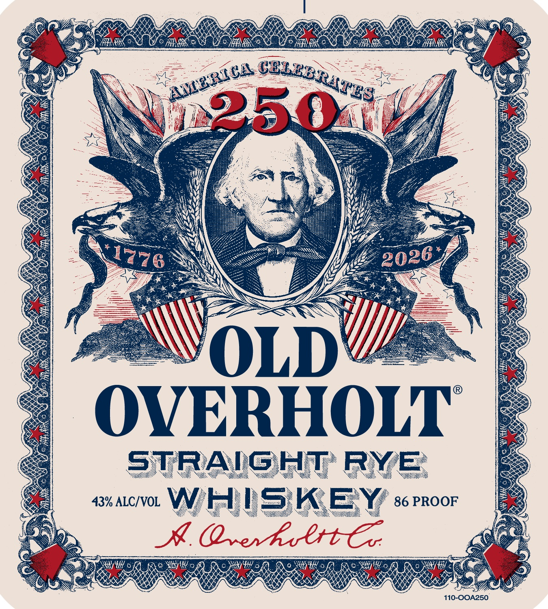
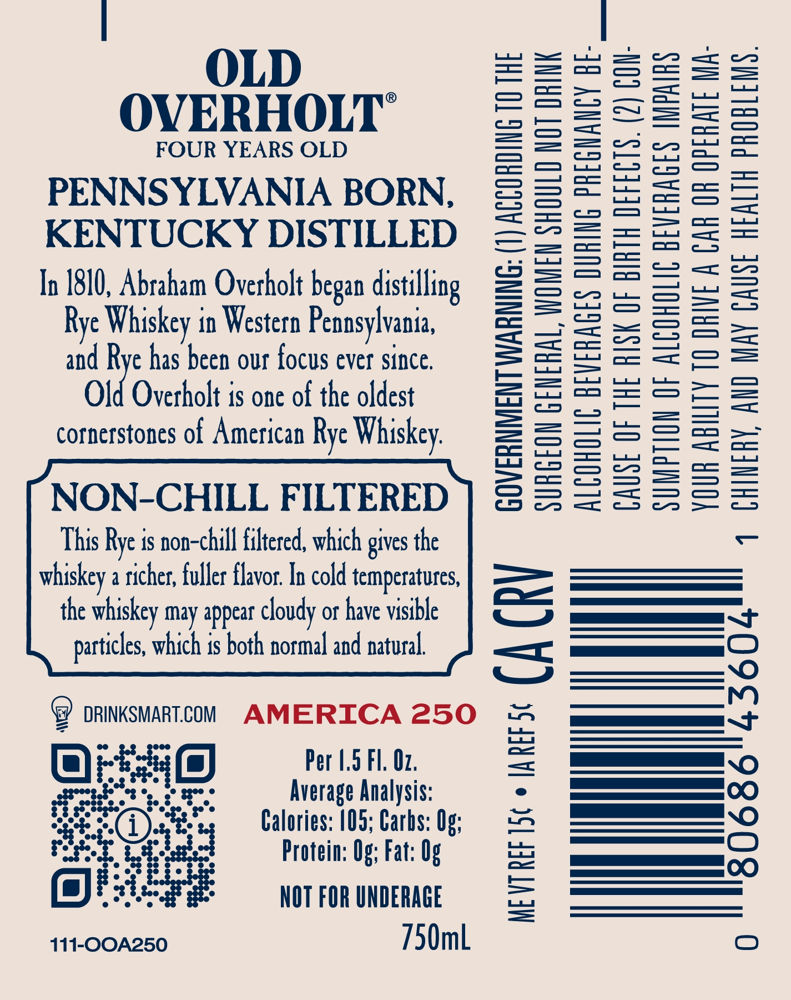
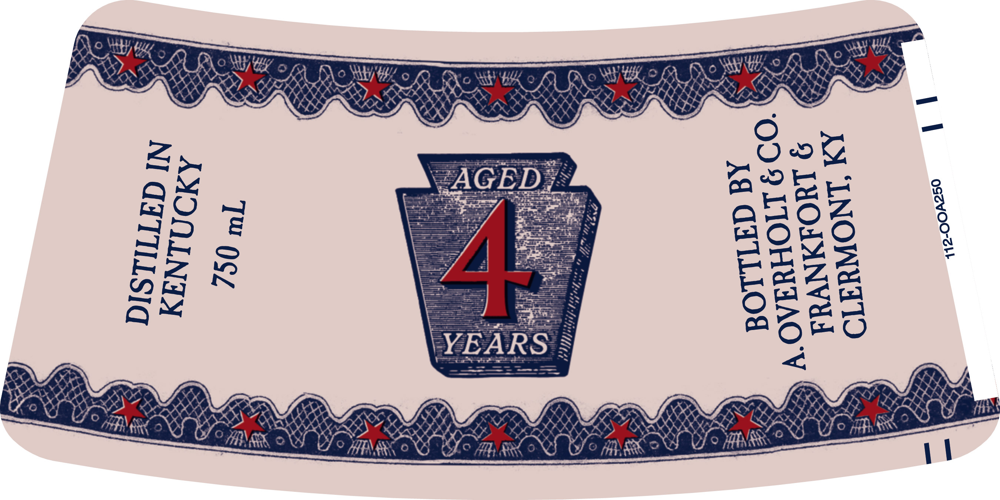

# TTB COLA Label Images - TTBID 26029001000238

**Brand Name:** OLD OVERHOLT

**Issue Date:** 02/06/2026

**Origin Code:** 22

**Product Class/Type:** 102

**Source:** [TTB Public COLA Registry](https://ttbonline.gov/colasonline/viewColaDetails.do?action=publicFormDisplay&ttbid=26029001000238)

## Label Images

### Label 1

### Label 2

### Label 3

## Extracted Label Text

*Text extracted via OCR - may contain errors*

### Label 1

‘i

SA

Se,

Senge

OV

oye,

fe

We

HARE

NS

° HR

2h

a.

oS

Ea!

x

&

S)

~ .

ty

aS

Uy

CS)

e

iS

ly

ne

wh

3)

£4

a

ie

eo

os

a

(

SP

€

sa)

pil

Dio

5

Te

Sey

=

th

a

Vo

wae

oon

AS

aS

Seces

ses,

LE

9

BS

soos,

€

>

4)

——

——

oy

LD!

>

S

<

See

eee

Sy

he,

OVERHOLT

ae

rk

,

o

N

\

\

\

N

N

\

\

Ayo

tee

\

AN

S

eek

&

N\

<

)

\

A

N

.

\

\

oe

Qn

W

N

&

\\

SONS

WS

NI

QW Oy

\

=

\

WN

\

\

\

CG

\

>

ES

43% ALC/VOL W.

NX

\

\

Ne

Ww

a

WW

x

NY

? 86 PROOF

Ny

oY

tH

Q

HH Of. fe

WHoA x

os

ae

Ds

s

ae

iN

a

ONS

ys

se Ny Ne

IN

ewan

### Label 2

OLD

—_— —

o & =>

ee Se SS

OVERHOLT

— _

oe STS =

FOUR YEARS OLD

— ee —— ee

oa =

el

a. oo

onal eH

——— ee |

PENNSYLVANIA BORN,

a ) SH

ae S=| S])

=—< coc

KENTUCKY DISTILLED

ao Sa =| =

a ae SS

ee

—

ws = &

— — i a — — ee)

In 1810, Abraham Overholt began distilling

S OP HD SE

SS —

S=  &

Rye Whiskey in Western Pennsylvania,

==

ae ma

and Rye has been our focus ever since.

a

Sere Se laos

> =

Old Overholt is one of the oldest

=e

= —

— —

— —

—— i —

= _— —

—s——

cornerstones of American Rye Whiskey.

LUI cs oS

co ou = wu,

eo

os

= —

= >= «eS =

NON-CHILL FILTERED

(fs Se

This Rye is non-chill filtered, which gives the

whiskey a richer, fuller flavor. In cold temperatures

the whiskey May appear cloudy ot have visible

es ~ |

particles, which is both normal and natural.

_———— a)

GS) DRINKSMART.COM AMERICA 250

es

Olea)

Per 1.5 Fl. 02.

WN)

te

Average Analysis:

OWN)

Calories: 105; Carbs: Og;

r

0

Protein: Og; Fat: Og

)

aie

NOT FOR UNDERAGE

111-OOA250

/50mL

### Label 3

Dio

AH tue

Witt

e

ay

a

Se Ht

Dw

of

4

ns

Wie

i

ee Se

Owe

a

Aa

moO &

i

eZ

=e

=

DA ky

Ao

tl <O px

a

\

EY

Ss

=

“ed

i‘m

La

rd

i"

AK

m4

aK

a

a

1
