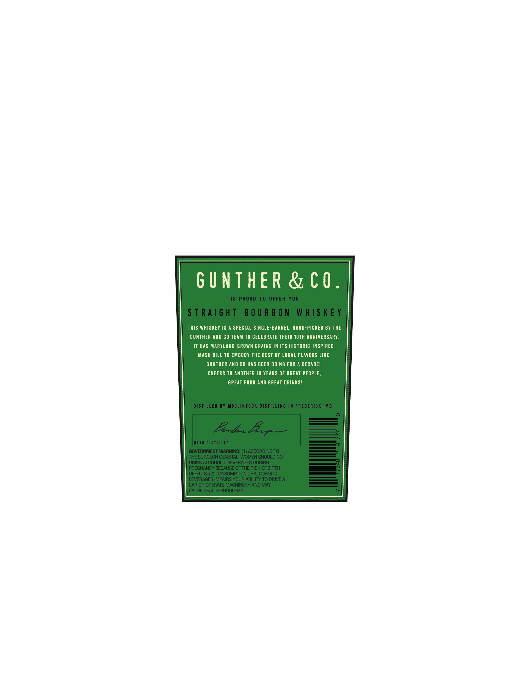
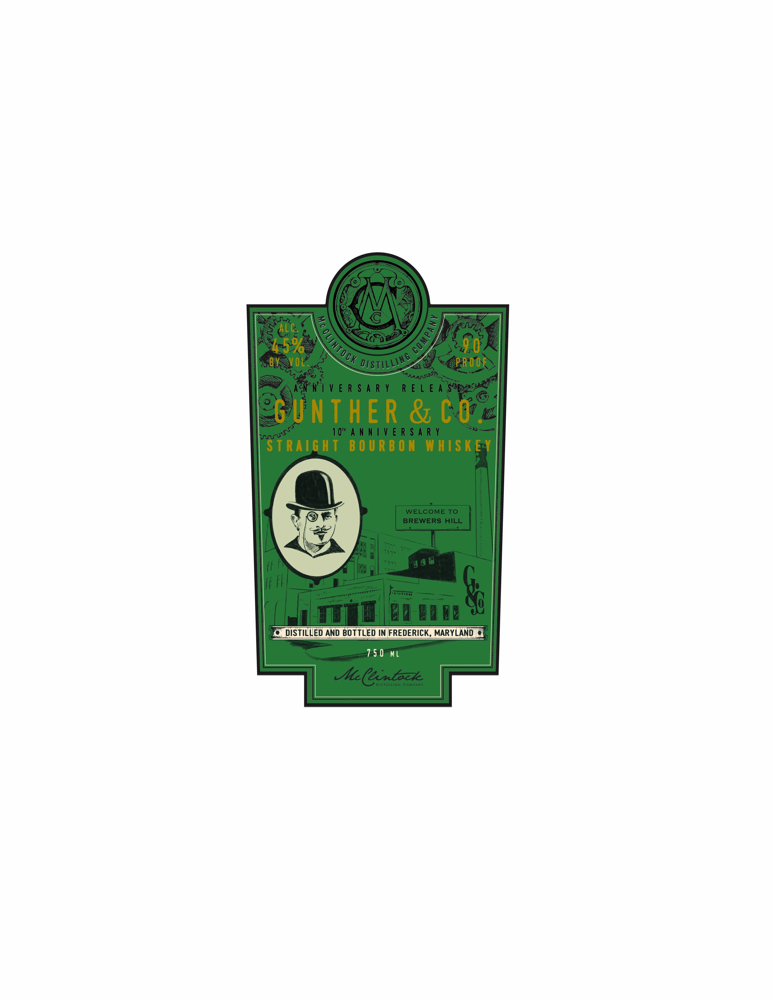
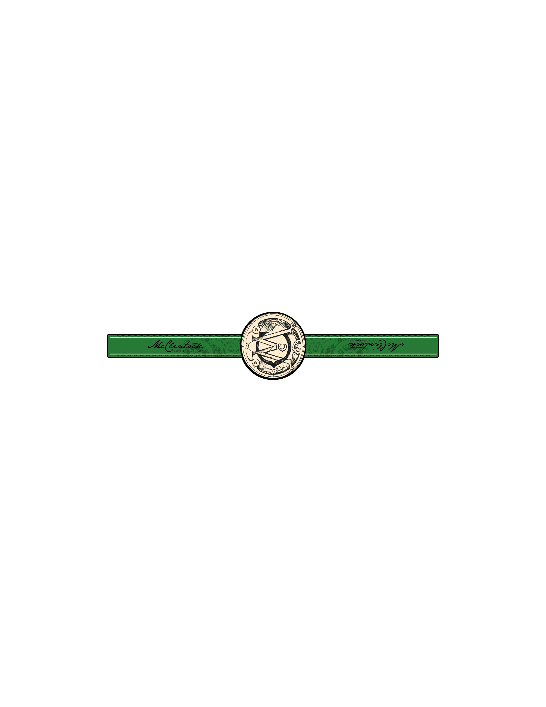

# TTB COLA Label Images - TTBID 26029001000337

**Brand Name:** GUNTHER & CO.

**Issue Date:** 02/09/2026

**Origin Code:** 25

**Product Class/Type:** 101

**Source:** [TTB Public COLA Registry](https://ttbonline.gov/colasonline/viewColaDetails.do?action=publicFormDisplay&ttbid=26029001000337)

## Label Images

### Back Label

### Front Label

### Label 3

## Extracted Label Text

*Text extracted via OCR - may contain errors*

### Back Label

GUNTHER & CO.

THIS WHISKEY IS A SPECIAL SINGLE-BARREL, HAND-PICKED BY THE

GUNTHER AND CO TEAM TO CELEBRATE THEIR 10TH ANNIVERSARY.

IT HAS MARYLAND-GROWN GRAINS IN ITS HISTORIC-INSPIRED

MASH BILL TO EMBODY THE BEST OF LOCAL FLAVORS LIKE

GUNTHER AND CO HAS BEEN DOING FOR A DECADE!

CHEERS TO ANOTHER 10 YEARS OF GREAT PEOPLE,

GREAT FOOD AND GREAT DRINKS!

### Front Label

HEA

Fe)

DISTILUED AND BOTTLED IN FREDERICK, MARYLA\

i

750 ML

### Label 3

we

ee

}

\

a8

Ww
