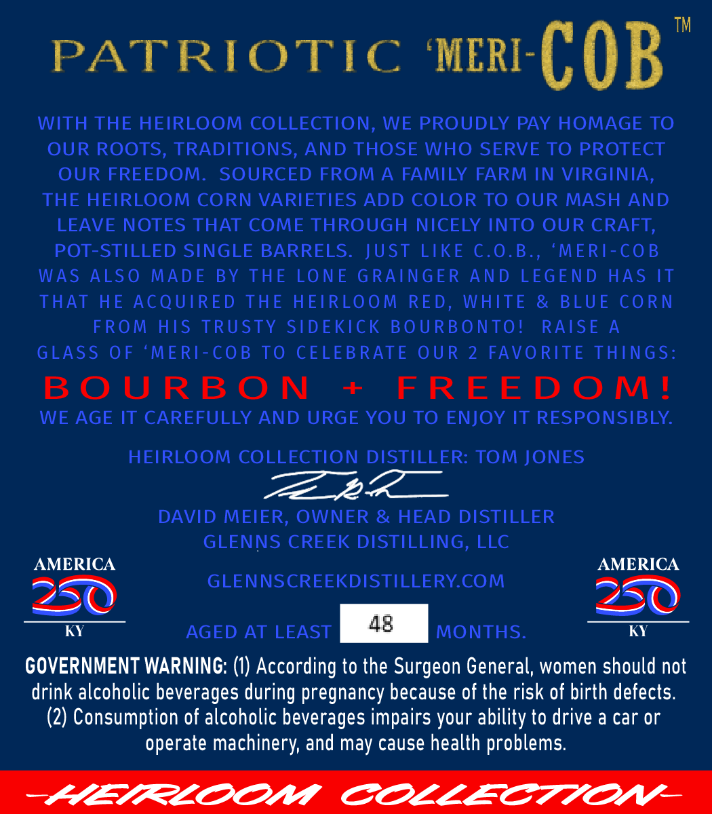
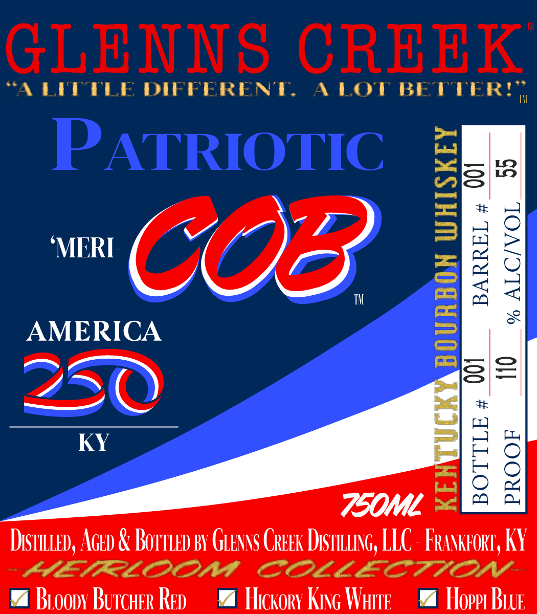

# TTB COLA Label Images - TTBID 26029001000346

**Brand Name:** GLENNS CREEK

**Fanciful Name:** PATRIOTIC 'MERI COB

**Issue Date:** 02/04/2026

**Origin Code:** 22

**Product Class/Type:** 101

**Source:** [TTB Public COLA Registry](https://ttbonline.gov/colasonline/viewColaDetails.do?action=publicFormDisplay&ttbid=26029001000346)

## Label Images

### Back Label

### Front Label

## Extracted Label Text

*Text extracted via OCR - may contain errors*

### Back Label

PATRIOTIC ‘MER-C QB.

WITH THE HEIRLOOM COLLECTION, WE PROUDLY PAY HOMAGE TO

OUR ROOTS, TRADITIONS, AND THOSE WHO SERVE TO PROTECT

OUR FREEDOM. SOURCED FROM A FAMILY FARM IN VIRGINIA,

THE HEIRLOOM CORN VARIETIES ADD COLOR TO OUR MASH AND

LEAVE NOTES THAT COME THROUGH NICELY INTO OUR CRAFT,

POT-STILLED SINGLE BARRELS. JUST LIKE C.0.B., ‘MERI-COB

WAS ALSO MADE BY THE LONE GRAINGER AND LEGEND HAS IT

THAT HE ACQUIRED THE HEIRLOOM RED, WHITE & BLUE CORN

FROM HIS TRUSTY SIDEKICK BOURBONTO!

RAISE A

GLASS OF ‘MERI-COB TO CELEBRATE OUR 2 FAVORITE THINGS

BOURBON + FREEDOM!

WE AGE IT CAREFULLY AND URGE YOU TO ENJOY IT RESPONSIBLY.

HEIRLOOM COLLECTION DISTILLER: TOM JONES

“a_ 2

DAVID MEIER, OWNER & HEAD DISTILLER

GLENNS CREEK DISTILLING, LLC

AMERICA

AMERICA

GLENNSCREEKDISTILLERY.COM

2

Q

KY

AGED AT LEAST MONTHS.

KY

GOVERNMENT WARNING: (1) According to the Surgeon General, women should not

drink alcoholic beverages during pregnancy because of the risk of birth defects.

(2) Consumption of alcoholic beverages impairs your ability to drive a car or

operate machinery, and may cause health problems.

ALELFLOONA COLLECTION

### Front Label

“A LEDPPLI

DIFFERENT,

L LOT BETTER!

=e bes

IERE 1, 4?

MV

&

AMERICA

=i

—_

74,

sO

O

KY

7OOML ~-

Distu.tep, AceD & Borrien BY GueNNS Creek DistittinG, LLC - FRakrort, KY

COOL LE CFIA OCOSY

% Bioopy Burcuer Rep

4 Hickory King Warte

4 Hopp Bue
