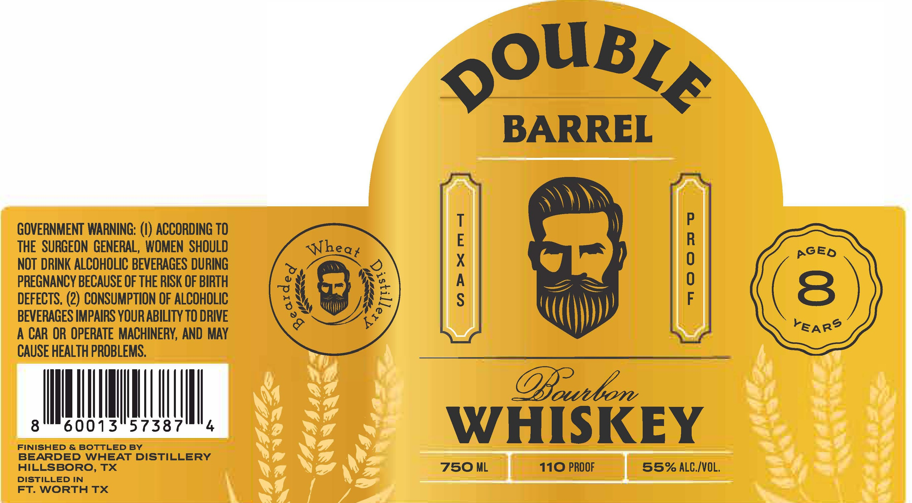

# TTB COLA Label Images - TTBID 26029001000350

**Brand Name:** DOUBLE BARREL 8 YEAR

**Issue Date:** 02/04/2026

**Origin Code:** 44

**Product Class/Type:** 101

**Source:** [TTB Public COLA Registry](https://ttbonline.gov/colasonline/viewColaDetails.do?action=publicFormDisplay&ttbid=26029001000350)

## Label Images

### Label 1

## Extracted Label Text

*Text extracted via OCR - may contain errors*

### Label 1

ouB,

BARREL

)\)\)

ay)

GOVERNMENT WARNING: (I) ACCORDING TO

)

THE SURGEON GENERAL, WOMEN SHOULD

+O

pGEo

NOT DRINK ALCOHOLIC BEVERAGES DURING

PREGNANCY BECAUSE OF THE RISK OF BIRTH

DEFECTS. (2) CONSUMPTION OF ALCOHOLIC

. AS

BEVERAGES IMPAIRS YOUR ABILITY TO DRIVE

)

A CAR OR OPERATE MACHINERY, AND MAY

“(i

rear?

CAUSE HEALTH PROBLEMS

Lfeaston

NIL

WIM

FINISHED & BOTTLED BY

WHISKEY

HILLSBORO, TX

BEARDED WHEAT DISTILLERY

750 ML

110 PROOF

DISTILLED IN

55% ALc/VOL

FT. WORTH TX
