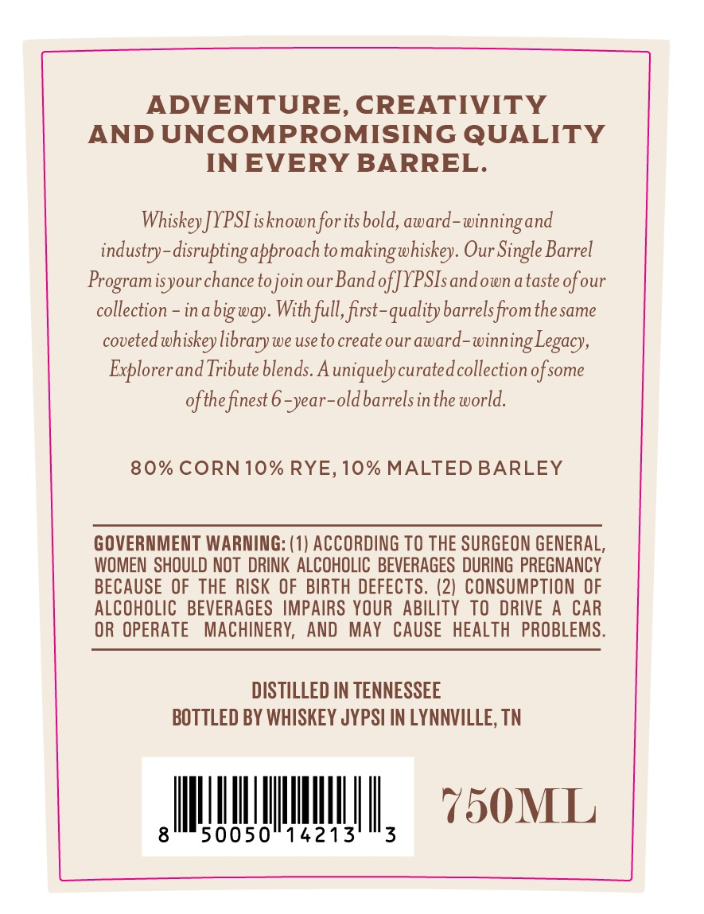
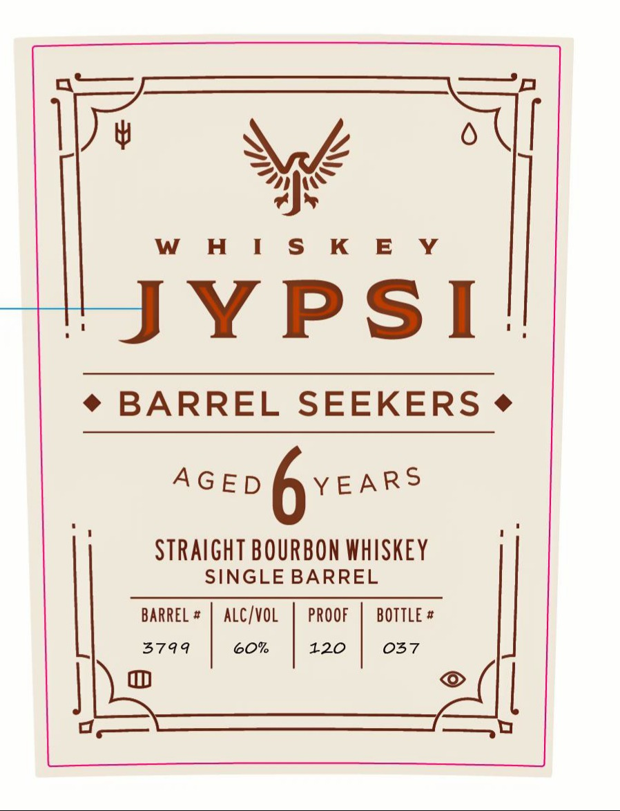

# TTB COLA Label Images - TTBID 26029001000354

**Brand Name:** WHISKEY JYPSI

**Fanciful Name:** BARREL SEEKERS

**Issue Date:** 02/04/2026

**Origin Code:** 43

**Product Class/Type:** 101

**Source:** [TTB Public COLA Registry](https://ttbonline.gov/colasonline/viewColaDetails.do?action=publicFormDisplay&ttbid=26029001000354)

## Label Images

### Back Label

### Front Label

### Label 3

## Extracted Label Text

*Text extracted via OCR - may contain errors*

### Back Label

ADVENTURE, CREATIVITY

AND UNCOMPROMISING QUALITY

IN EVERY BARREL.

Whiskey JYPSIisknown for its bold, award-winning and

industry-disrupting approach to making whiskey. Our Single Barrel

Program isyour chance to join our Band of JYPSIs and own a taste of our

collection - ina big way. With full, first-quality barrels from the same

coveted whiskey library we use to create our award-winning Legacy,

Explorer and Tribute blends. A uniquely curated collection of some

of the finest 6 -year-old barrels in the world.

80% CORN 10% RYE, 10% MALTED BARLEY

GOVERNMENT WARNING: (1) ACCORDING TO THE SURGEON GENERAL

WOMEN SHOULD NOT DRINK ALCOHOLIC BEVERAGES DURING PREGNANCY

BECAUSE OF THE RISK OF BIRTH DEFECTS. (2) CONSUMPTION OF

ALCOHOLIC BEVERAGES IMPAIRS YOUR ABILITY TO DRIVE A CAR

OR OPERATE MACHINERY, AND MAY CAUSE HEALTH PROBLEMS.

DISTILLED IN TENNESSEE

BOTTLED BY WHISKEY JYPSI IN LYNNVILLE, TN

AUINIVMUINY, 250000

### Front Label

Ww,

a ec

H I S K E Y

Texted

YPS

i

« * BARREL SEEKERS - SEEKERS

Acep fyvears

STRAIGHT BOURBON WHISKEY

SINGLE BARREL

BARREL #

ALC/VOL

PROOF

BOTTLE #

S44

60%

120

O37

|

==

=~

ee

### Label 3

FOUND BY

John Johnson

\L

As
