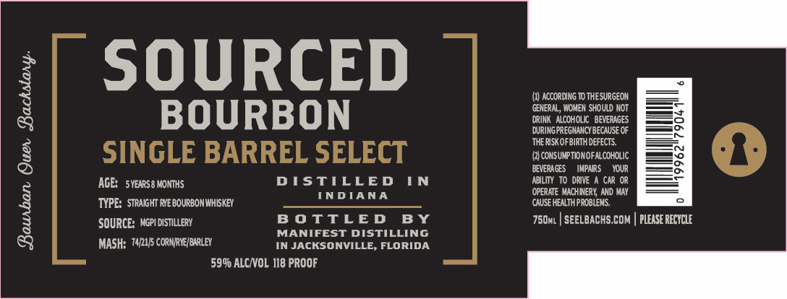

# TTB COLA Label Images - TTBID 26029001000685

**Brand Name:** SOURCED

**Issue Date:** 02/20/2026

**Origin Code:** 16

**Product Class/Type:** 101

**Source:** [TTB Public COLA Registry](https://ttbonline.gov/colasonline/viewColaDetails.do?action=publicFormDisplay&ttbid=26029001000685)

## Label Images

### Label 1

## Extracted Label Text

*Text extracted via OCR - may contain errors*

### Label 1

SOURCED

(0) ACCORDING TO THESURGEON

‘GENERAL, WOMEN SHOULD NOT

DRINK ALCOHOLIC. BEVERAGES

gS

BOURBON

DURING PREGNANCY BECAUSE OF

THERISKOFBIRTH DEFECTS,

(2) CONSUMPTION OFALCOHOLIC

BEVERAGES

IMPARS YOUR

‘AGE: sYEaRs@ MONTHS

DISTILLED

IN

ABILITY TO. DRIVE A CAR OR

INDIANA

(OPERATE MACHINERY, AND MAY

‘TYPE: STRAIGHT RYEBOURBON WHISKEY

‘CAUSE HEALTH PROBLEMS,

BOTTLED BY

SOURCE: MGPIDISTILERY

750. | SEELBACHS.COM | PLEASE RECYCLE

MANIFEST DISTILLING

MASH: 7421/5 CORNRVE/BARLEY

IN JACKSONVILLE, FLORIDA

59% ALC/VOL 118 PROOF
