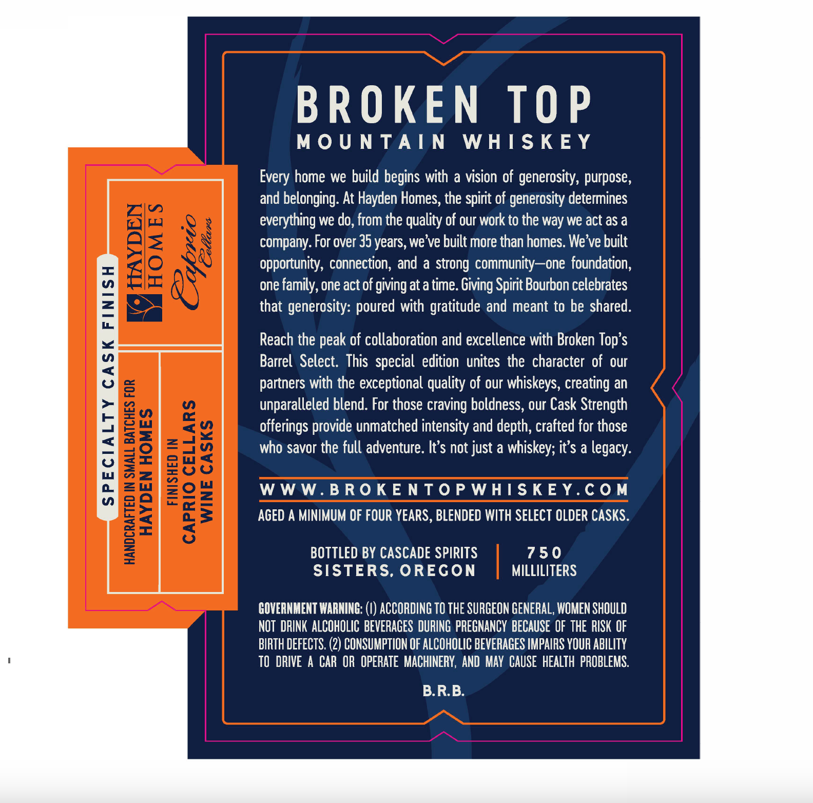
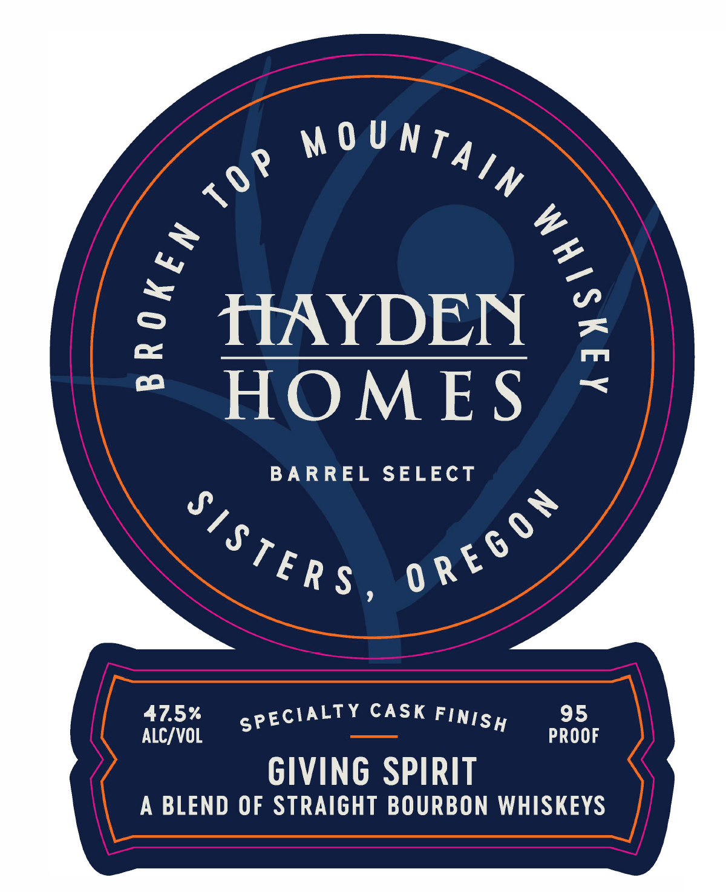
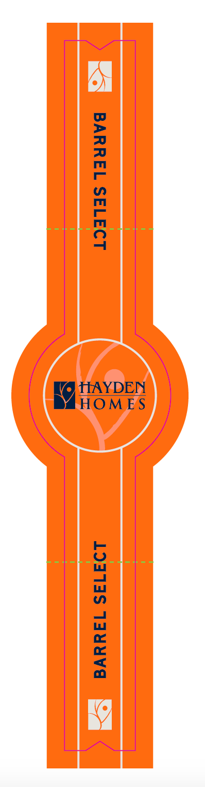

# TTB COLA Label Images - TTBID 26029001000739

**Brand Name:** BROKEN TOP MOUNTAIN WHISKEY

**Fanciful Name:** HAYDEN HOMES BARREL SELECT

**Issue Date:** 02/04/2026

**Origin Code:** 38

**Product Class/Type:** 121

**Source:** [TTB Public COLA Registry](https://ttbonline.gov/colasonline/viewColaDetails.do?action=publicFormDisplay&ttbid=26029001000739)

## Label Images

### Back Label

### Front Label

### Label 3

## Extracted Label Text

*Text extracted via OCR - may contain errors*

### Back Label

BROKEN TOP

MOUNTAIN WHISKEY

Every home we build begins with a vision of generosity, purpose,

and belonging. At Hayden Homes, the spirit of generosity determines

everything we do, from the quality of our work to the way we act as a

company. For over 35 years, we've built more than homes. We've built

opportunity, connection, and a strong community—one foundation,

one family, one act of giving at a time. Giving Spirit Bourbon celebrates

that generosity: poured with gratitude and meant to be shared

Reach the peak of collaboration and excellence with Broken Top’s

Barrel Select. This special edition unites the character of our

partners with the exceptional quality of our whiskeys, creating an

unparalleled blend. For those craving boldness, our Cask Strength

offerings provide unmatched intensity and depth, crafted for those

who savor the full adventure. It’s not just a whiskey; it’s a legacy

WWW.BROKENTOPWHISKEY.COM

AGED A MINIMUM OF FOUR YEARS, BLENDED WITH SELECT OLDER CASKS.

BOTTLED BY CASCADE SPIRITS

750

SISTERS, OREGON

MILLILITERS

I

GOVERNMENT WARNING: (I) ACCORDING TO THE SURGEON GENERAL, WOMEN SHOULD

NOT DRINK ALCOHOLIC BEVERAGES DURING PREGNANCY BECAUSE OF THE RISK OF

BIRTH DEFECTS. (2) CONSUMPTION OF ALCOHOLIC BEVERAGES IMPAIRS YOUR ABILITY

TO DRIVE A CAR OR OPERATE MACHINERY, AND MAY CAUSE HEALTH PROBLEMS.

B.R.B.

### Front Label

9 MOUNT,

“

N

5 HAYDEN

co

HOMES

BARREL SELECT

7

“TERS grt

ALC/VOL

47.5%

PROOF

9

GIVING SPIRIT

A BLEND OF STRAIGHT BOURBON WHISKEYS

### Label 3

TIAYDEN

i

HOMES
