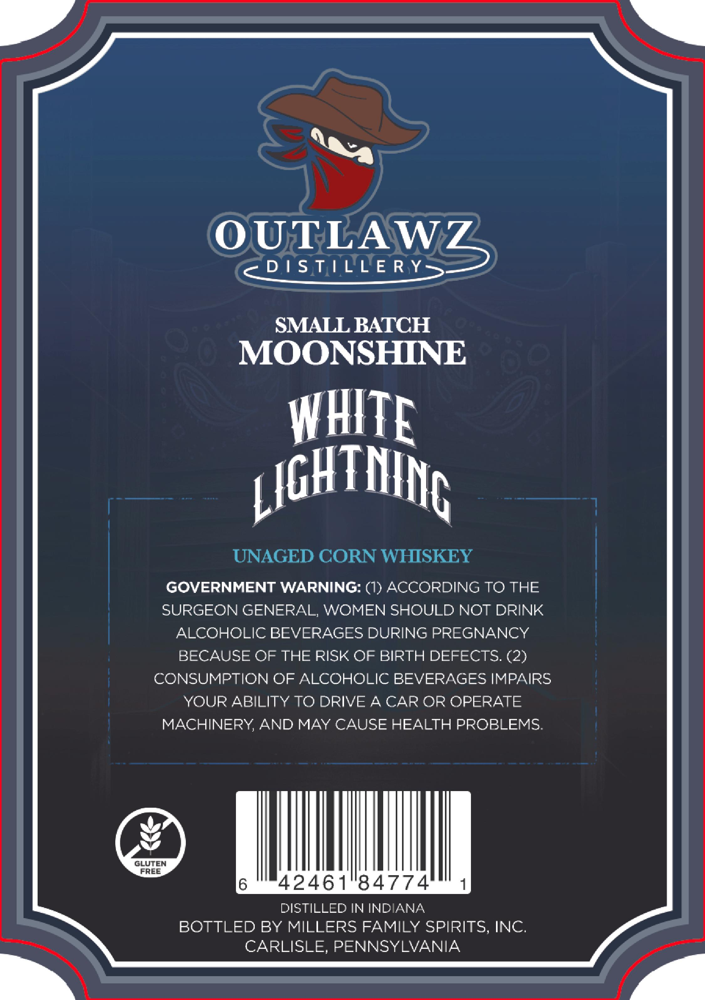
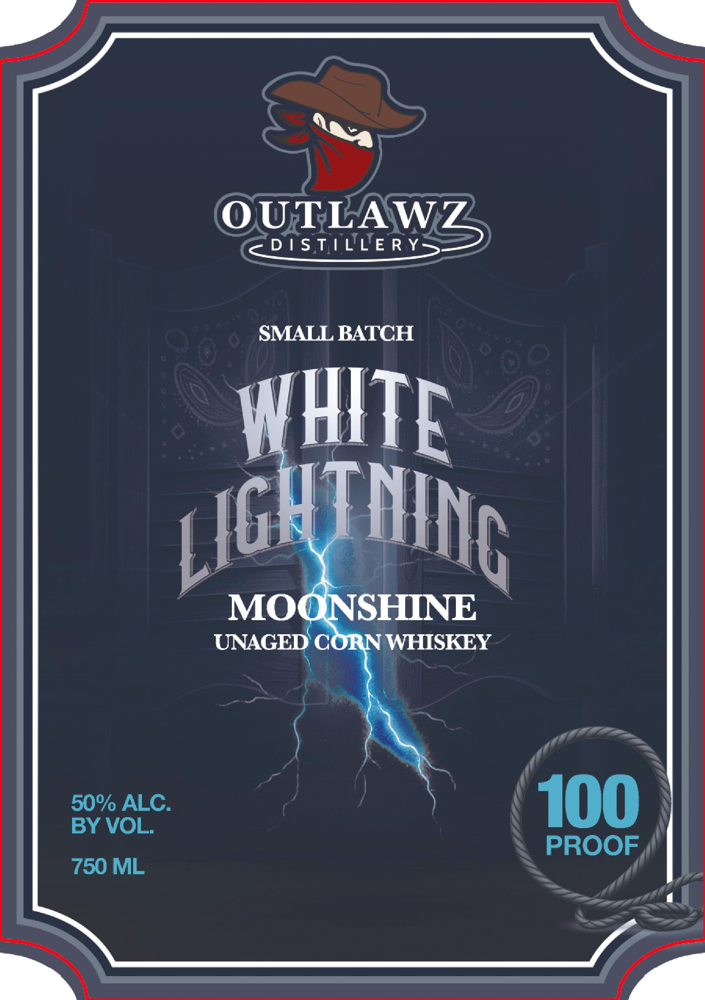

# TTB COLA Label Images - TTBID 26029001000816

**Brand Name:** OUTLAWZ DISTILLERY

**Fanciful Name:** WHITE LIGHTNING MOONSHINE

**Issue Date:** 02/26/2026

**Origin Code:** 39

**Product Class/Type:** 143

**Source:** [TTB Public COLA Registry](https://ttbonline.gov/colasonline/viewColaDetails.do?action=publicFormDisplay&ttbid=26029001000816)

## Label Images

### Back Label

### Front Label

## Extracted Label Text

*Text extracted via OCR - may contain errors*

**Detected Proof:** 100

### Back Label

is

Tak

Efe

OUTLAW

cq DISTILLERY

SMALL BATCH

MOONSHINE

a i |

T

pa

h

THN

UNAGED CORN WHISKEY

GOVERNMENT WARNING: (1) ACCORDING TO THE

SURGEON GENERAL, WOMEN SHOULD NOT DRINK

ALCOHOLIC BEVERAGES DURING PREGNANCY

BECAUSE OF THE RISK OF BIRTH DEFECTS. (2)

CONSUMPTION OF ALCOHOLIC BEVERAGES IMPAIRS

YOUR ABILITY TO DRIVE A CAR OR OPERATE

MACHINERY, AND MAY CAUSE HEALTH PROBLEMS.

GLUTEN

FREE

6

4246184774

1

DISTILLED IN INDIANA

BOTTLED BY MILLERS FAMILY SPIRITS, INC.

CARLISLE, PENNSYLVANIA

### Front Label

y

OUTLAW

c< DISTILLERYS

SMALL BATCH

|

v4

| |

——

I

| |e

INe

(|

MOt

SHINE

UNAGED

WHISKEY

50% ALC.

100

BY VOL.

PROOF

750 ML
