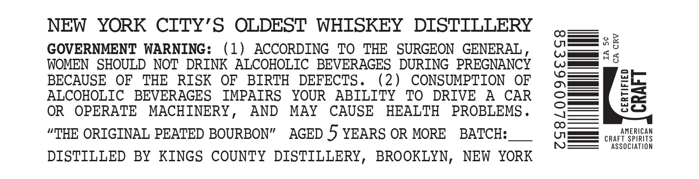
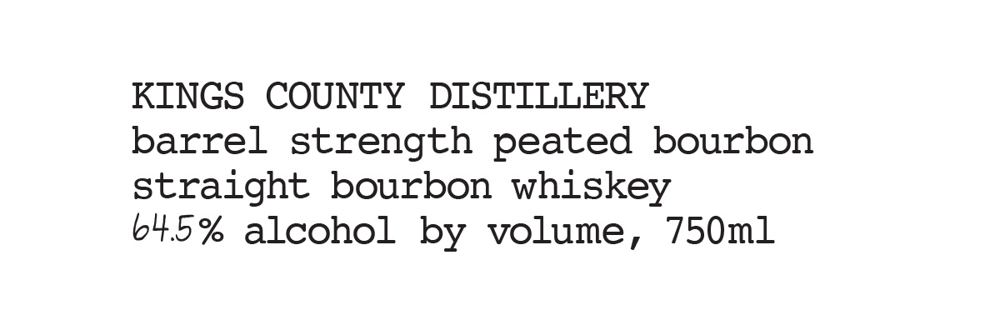

# TTB COLA Label Images - TTBID 26029001000846

**Brand Name:** KINGS COUNTY DISTILLERY

**Issue Date:** 02/12/2026

**Origin Code:** 02

**Product Class/Type:** 101

**Source:** [TTB Public COLA Registry](https://ttbonline.gov/colasonline/viewColaDetails.do?action=publicFormDisplay&ttbid=26029001000846)

## Label Images

### Back Label

### Label 1

## Extracted Label Text

*Text extracted via OCR - may contain errors*

### Back Label

NEW YORK CITY’S OLDEST WHISKEY DISTILLERY ,— .
GOVERNMENT WARNING: (1) ACCORDING TO THE SURGEON GENERAL, (omer <°
WOMEN SHOULD NOT DRINK ALCOHOLIC BEVERAGES DURING PREGNANCY amet
BECAUSE OF THE RISK OF BIRTH DEFECTS. (2) CONSUMPTION OF Qo co.
ALCOHOLIC BEVERAGES IMPAIRS YOUR ABILITY TO DRIVE A CAR C==[ eS
OR OPERATE MACHINERY, AND MAY CAUSE HEALTH PROBLEMS. QG==—sO
“THE ORIGINAL PEATED BOURBON” AGED 5 YEARS OR MORE BATCH:__ = cae eet

—=———_—SE ASSOCIATION
DISTILLED BY KINGS COUNTY DISTILLERY, BROOKLYN, NEW YORK

### Label 1

KINGS COUNTY DISTILLERY

barrel strength peated bourbon

straight bourbon whiskey

64.5% alcohol by volume, 750m1
