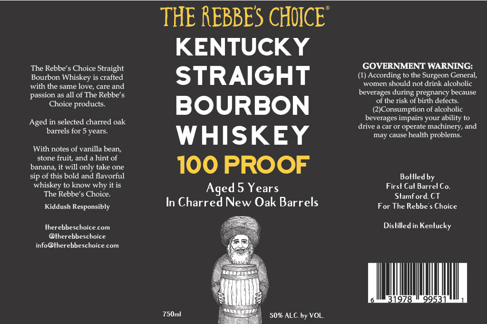

# TTB COLA Label Images - TTBID 26029001000904

**Brand Name:** THE REBBE'S CHOICE

**Issue Date:** 02/10/2026

**Origin Code:** 14

**Product Class/Type:** 101

**Source:** [TTB Public COLA Registry](https://ttbonline.gov/colasonline/viewColaDetails.do?action=publicFormDisplay&ttbid=26029001000904)

## Label Images

### Label 1

## Extracted Label Text

*Text extracted via OCR - may contain errors*

### Label 1

THE REBBES CHOICE

KENTUCKY

The Rebbe’s Choice Straight

GOVERNMENT WARNING:

Bourbon Whiskey is crafted

(1) According to the Surgeon General,

STRAIGHT

women should not drink alcoholic

with the same love, care and

passion as all of The Rebbe’s

beverages during pregnancy because

of the risk of birth defects.

Choice products.

BOURBON

(2)Consumption of alcoholic

beverages impairs your ability to

Aged in selected charred oak

drive a car or operate machinery, and

barrels for 5 years.

WHISKEY

may cause health problems.

With notes of vanilla bean,

stone fruit, and a hint of

banana, it will only take one

100 PROOF

sip of this bold and flavorful

Bottled by

whiskey to know why it is

Aged 5 Years

First Cut Barrel Co,

The Rebbe’s Choice.

Stamford. CT

In Charred New Oak Barrels

For The Rebbe’s Choice

Kiddush Responsibly

therebbeschoice.com

Distilled in Kentucky

@therebbeschoice

info

lherebbeschoice.com

—

q

99

750m

—

50% ALC. by VOL.
