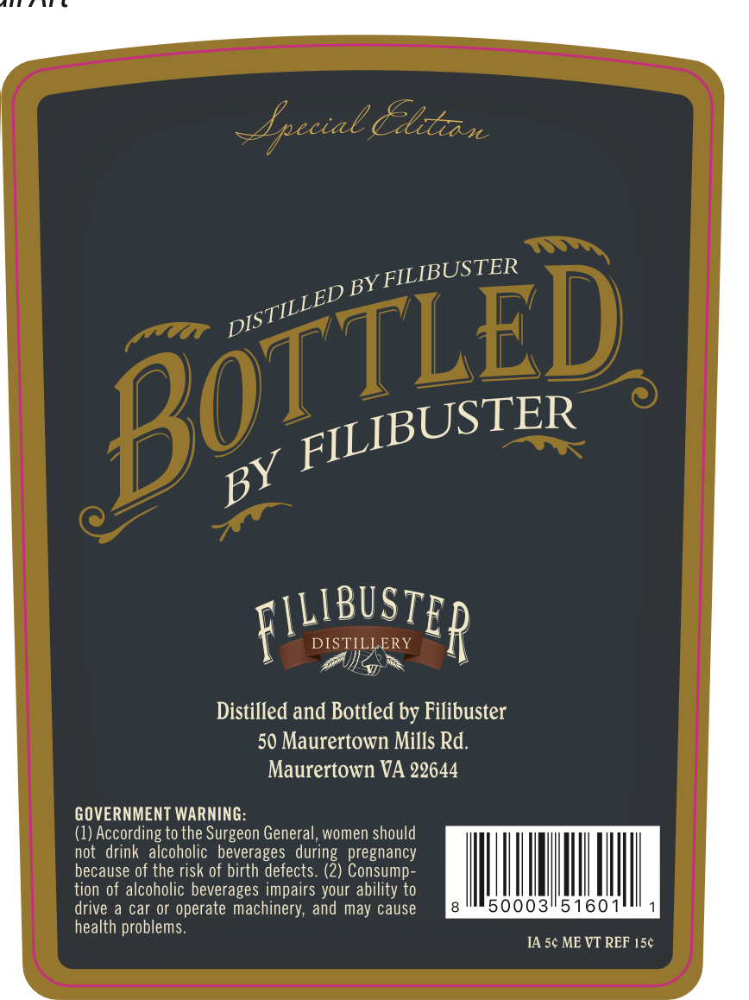
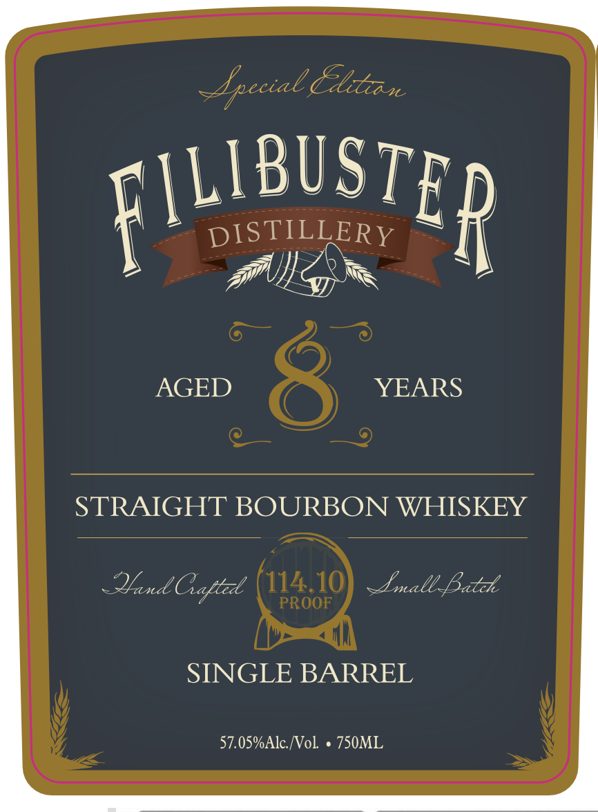

# TTB COLA Label Images - TTBID 26029001000912

**Brand Name:** FILIBUSTER DISTILLERY

**Fanciful Name:** 8 YEAR SINGLE BARREL

**Issue Date:** 02/05/2026

**Origin Code:** 05

**Product Class/Type:** 101

**Source:** [TTB Public COLA Registry](https://ttbonline.gov/colasonline/viewColaDetails.do?action=publicFormDisplay&ttbid=26029001000912)

## Label Images

### Back Label

### Front Label

## Extracted Label Text

*Text extracted via OCR - may contain errors*

### Back Label

— 4 ectal CATA 0
y FILIBUSTER
gDB
ott
pr
c\LIBUSTP
DISTILLERY ~~ J]
> Pilg “FP
Distilled and Bottled by Filibuster
50 Maurertown Mills Rd.
Maurertown VA 22644
GOVERNMENT WARNING:
(1) According to the Surgeon General, women should
not drink alcoholic beverages during pregnancy
because of the risk of birth defects. (2) Consump-
tion of alcoholic beverages impairs your ability to
drive a car or operate machinery, and may cause  iaaiahoOXOXOK MESH haa
health problems
IA 5¢ ME VT REF 15¢

### Front Label

LA

Ly

celal LO

Lil CB. Wt

LBU ST

» pis TILLERY >

f

A

aN

AGED

YEARS

STRAIGHT BOURBON WHISKEY

Lrall, Lith

Mend afte

SINGLE BARREL

57.05%Alc./Vol. « 750ML
