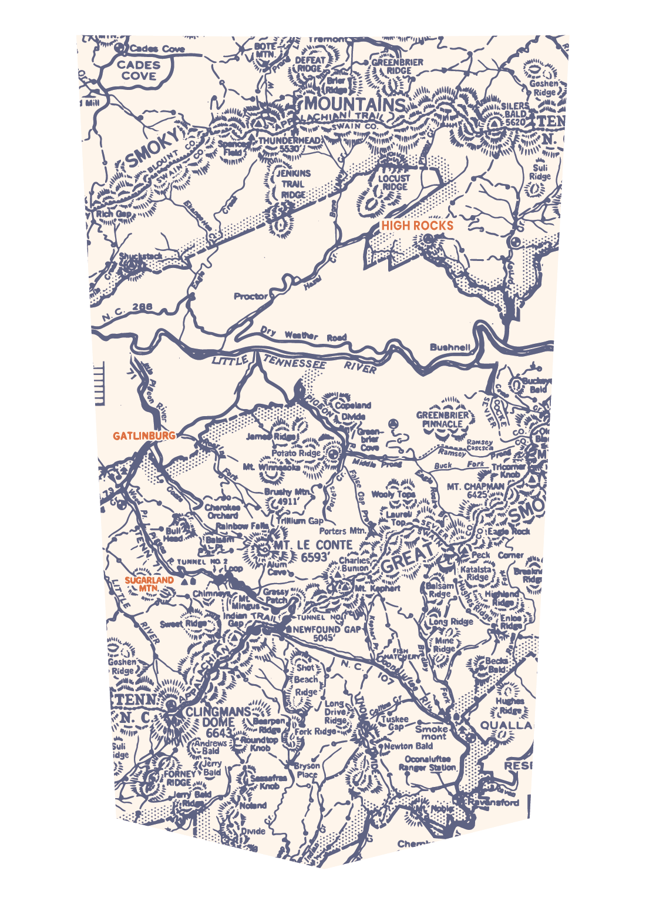
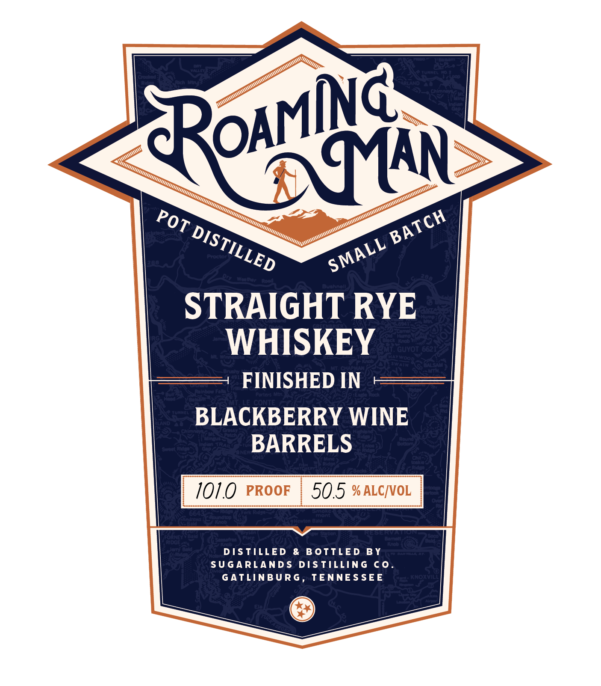

# TTB COLA Label Images - TTBID 26030001000052

**Brand Name:** ROAMING MAN

**Fanciful Name:** POT DISTILLED - SMALL BATCH

**Issue Date:** 02/05/2026

**Origin Code:** 43

**Product Class/Type:** 102

**Source:** [TTB Public COLA Registry](https://ttbonline.gov/colasonline/viewColaDetails.do?action=publicFormDisplay&ttbid=26030001000052)

## Label Images

### Back Label

### Front Label

## Extracted Label Text

*Text extracted via OCR - may contain errors*

### Back Label

~ 37,

Tre

PCa

TEI su

lp at A

“i

a

7

DEFEAI

0G

att

2

GREENBRIER:

Nosy,

WS Pe

IEE ye

$.RIDGE | —

"mee

Goshen™

of

Ce)

isn

be

WET Wi

Ridge Jy

TPN

QO.

Vv.

Os

Mod

MOUNTAI

Sue

ais.

oor

my

TEN

Pr,

S

Niet meSWAIN CO.

ot

WO

A

=

wt

ray

Ms

a oe

NJ

th

ree sm

pe

“

NI

~

\ re

et

Noun

wl

SY

"ite

r

3

Si

2 JENKUNS:

LOCUST

/

Suli

“7G

SP isla

TRAL

RIDGE

Qo

eS

Pent a

AR

Cru

we 33

care

mans

7A

me

OCKS &

Sal

bs

o£

hie

ed

XY_Weather

overnas NNG ==

LITTLE,

TENE:

RIVER

—V,

=

S

ir’

te

fer

:

eS Copeland

a

ae

RY.

We

ey

GREENBRIER’S

PINNACLE 4

A

GATLINBURG

Ercan 2

9

ou

~~

=

Vi

“O",,.

20

|

6 Be mer

Midtty

alas

Fi

(Asi

~~ a

wi

Sani.

J

ANS

Buck

pha Dey

Aw

MT. CHAPMAN

NS

Io Wooly Tope

try

\ a

~ abo:

oid

oh

aks

Av

ox

inbow

Fata L Yeitham Gap

»

fk

SS

if

bad

WR

a

eausrr es

an)

Zs

SCT. LE CONTE

S&F 6593"

at

Le:

aN

an,

X wees oan

ONS

/Bumon.G|

Katalsta

Peck Comer gus,

‘Breslow

ta

Isam|

OR

i 7

Chim

Re

Sie

—s

NS?

A

Pach?)

a

hE /

te,

Gap ~s-an

ARai

TONNEL

4

JAN

Se,

'Enioe j)

wie,

Lya3

ete GAP}

as |

Zot

Ae

= Maney

Goshen:

Any 2

$:

e"

PN

2 Shot)

RE

Ridge Jy

‘Beach,

> \

ais

ita ll

We?

*

wh

VIC

Mee

TENN:

ey =

tH

S Ridge]

& 4)

3SER

IANS

Y Brive

y FT Pier,

yee

oun,

$00

Sez

Wi Rdgesed

g” G2°— Smoke

QUALLA

az

ys. 66

Newton Bald

mont

\~ Bald

Oconaluttse

INEY

4Gery

S

hey

RESI

ce

DGE,

fie

oat

Xo ‘Staion,

BT)

jerry Bald

‘ae

OD

SY Notand

pean |

47

yaa

7

cr

Cher

pS

### Front Label

IN

AN

ot

yo

ak

Or 2157 1 LEp

one

STRAIGHT RYE

WHISKEY

FINISHED IN

BLACKBERRY WINE

BARRELS

SUGARLANDS DISTILLING CO.

DISTILLED & BOTTLED BY

GATLINBURG, TENNESSEE

©
