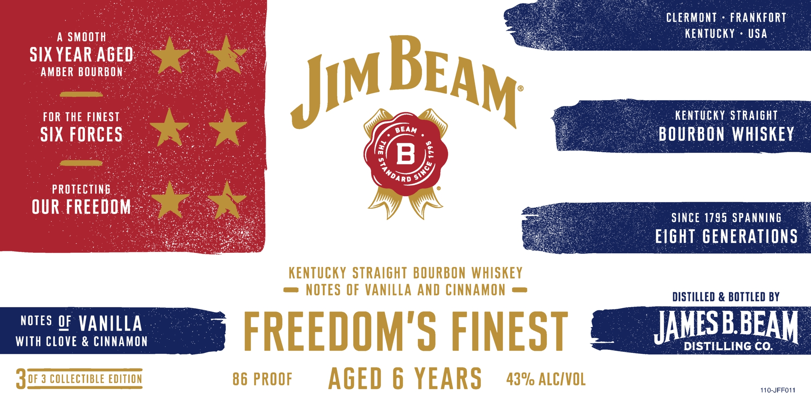
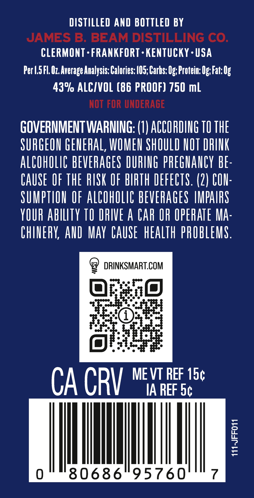
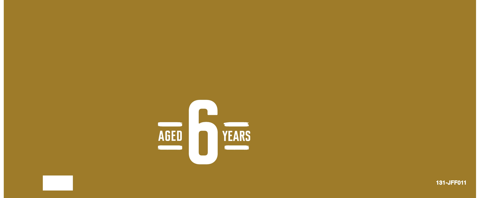

# TTB COLA Label Images - TTBID 26030001000208

**Brand Name:** JIM BEAM

**Issue Date:** 02/05/2026

**Origin Code:** 22

**Product Class/Type:** 101

**Source:** [TTB Public COLA Registry](https://ttbonline.gov/colasonline/viewColaDetails.do?action=publicFormDisplay&ttbid=26030001000208)

## Label Images

### Label 1

### Label 2

### Label 3

## Extracted Label Text

*Text extracted via OCR - may contain errors*

*1 image(s) excluded: text did not meet readability threshold*

### Label 1

SS 20>” S CLERMONT + FRANKFORT
; SunoTi My KENTUCKY - USA
sy HEAR RaES oo. 5
FOR THE FINES / Pao oe’. KENTUCKY STRAIGHT. -
IX FORCES Oe BOURBON WHISKEY
sel aca : R= SINCE 1795 SPANNING
Ps ee EIGHT GENERATIONS
DISTILLED & BOTTLED BY
NOTES OF VANILLA : JAMES B.BEAM
WITH CLOVE & CINNAMON : MBISTILLING te oe
110-JFFO11

### Label 2

DISTILLED AND BOTTLED BY
JAMES B. BEAM DISTILLING CO.
CLERMONT-FRANKFORT-KENTUCKY-USA
Per .5 Fl. Oz. Average Analysis: Calories: 105; Carbs: Og; Protein: Og; Fat: 0g
43% ALC/VOL (86 PROOF) 750 ml
NOT FOR UNDERAGE
GOVERNMENT WARNING: (1) ACCORDING TO THE
SURGEON GENERAL, WOMEN SHOULD NOT DRINK
ALCOHOLIC BEVERAGES DURING PREGNANCY BE-
CAUSE OF THE RISK OF BIRTH DEFECTS. (2) CON-
SUMPTION OF ALCOHOLIC BEVERAGES IMPAIRS
YOUR ABILITY 10 DRIVE A CAR OR OPERATE MA-
CHINERY, AND MAY CAUSE HEALTH PROBLEMS.
9 DRINKSMART.COM
BFie)
“Fee Rte :
Lae
(s) pee
CA CRI ME VT REF 15¢
IA REF 5¢
0 | IMI | 7
