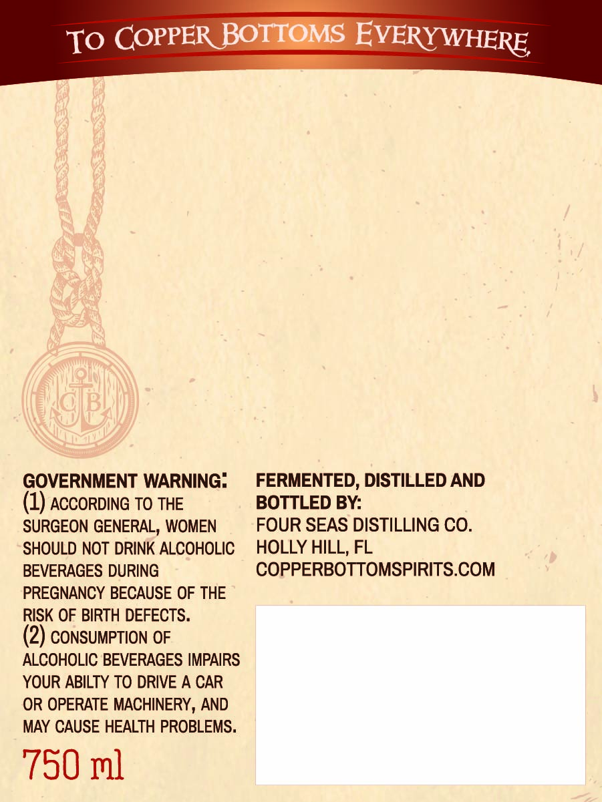
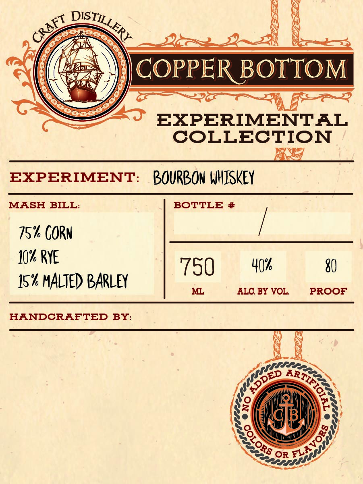

# TTB COLA Label Images - TTBID 26030001000268

**Brand Name:** EXPERIMENTAL COLLECTION

**Fanciful Name:** BOURBON WHISKEY

**Issue Date:** 02/06/2026

**Origin Code:** 16

**Product Class/Type:** 141

**Source:** [TTB Public COLA Registry](https://ttbonline.gov/colasonline/viewColaDetails.do?action=publicFormDisplay&ttbid=26030001000268)

## Label Images

### Back Label

### Front Label

## Extracted Label Text

*Text extracted via OCR - may contain errors*

### Back Label

TO COPPER BOTEOMS EVERY WHERE

GOVERNMENT WARNING:

FERMENTED, DISTILLED AND

(1) ACCORDING TO THE

BOTTLED BY:

SURGEON GENERAL, WOMEN

FOUR SEAS DISTILLING CO.

SHOULD NOT DRINK ALCOHOLIC

HOLLY HILL, FL

COPPERBOTTOMSPIRITS.COM

BEVERAGES DURING

PREGNANCY BECAUSE OF THE

RISK OF BIRTH DEFECTS.

(2) CONSUMPTION OF

ALCOHOLIC BEVERAGES IMPAIRS

YOUR ABILTY TO DRIVE A CAR

OR OPERATE MACHINERY, AND

MAY CAUSE HEALTH PROBLEMS.

750 ml

### Front Label

FILE EIS

N NG bee
‘Q)) COPPER BOTTOM

EXPERIMENTAL
COLLECTION

EXPERIMENT: BOURBON WHISKEY

78% CORN RE
10% RYE Y

750 40% 80
bh MALTED BARLEY ML ALC. BY VOL. PROOF

HANDCRAFTED BY:

plite
IED ART.
f Ss

ey OSS

A ay
$ ry

Ng ev’
kYXo\
SS a

6)
S283 on evi
Sos
